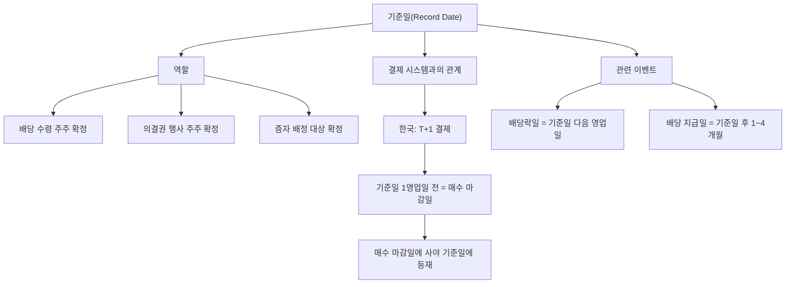

# 기준일 뜻 — 배당받을 주주를 확정하는 날

## 한 줄 정의

기준일(Record Date)은 배당·증자·의결권 등 주주 권리를 행사할 수 있는 주주를 확정하는 날짜로, 이 날 주주명부에 등재된 주주만 해당 권리를 갖습니다.

## 아주 쉽게 말하면

학교에서 "수학여행 참가 신청은 금요일까지. 금요일 명단에 있는 사람만 갈 수 있습니다." 이 금요일이 기준일입니다. 주식도 마찬가지로, "이 날 기준 주주명부에 이름이 있는 사람에게 배당을 줍니다."

중요한 점은 **결제일** 개념입니다. 한국은 T+1 결제(매수 후 1영업일 뒤 소유권 이전)이므로, 기준일 전 영업일까지 매수해야 기준일에 주주명부에 등재됩니다. 기준일 당일에 사면 늦습니다.

## 왜 중요한가

기준일을 정확히 이해하지 못하면 세 가지 실수가 발생합니다.

첫째, **배당을 놓칩니다**. 기준일 당일에 매수하면 결제가 다음 날 완료되어 주주명부에서 빠집니다.

둘째, **불필요한 매매를 합니다**. 기준일 이후에 팔아도 배당은 받습니다(이미 명부에 등재). 불안해서 기준일까지 들고 있을 필요 없이, 매수 마감일만 지키면 됩니다.

셋째, **분기배당 기업의 기준일을 놓칩니다**. 연 4회 배당 기업은 3·6·9·12월 각각 기준일이 다르므로, 캘린더 관리가 필수입니다.

## 그림으로 이해하기

## 숫자로 보는 예시

> ⚠️ 아래 숫자는 개념 설명을 위한 **가상 예시**이며, 실제 투자 데이터가 아닙니다.

가상 기업 '한국식음료'의 2025년 배당 캘린더입니다.

**연말 결산배당 타임라인**

| 날짜 | 이벤트 | 투자자 행동 |
|------|--------|-----------|
| 12/29(월) | **매수 마감일** | 이 날까지 매수 완료 |
| 12/30(화) | **기준일** | 주주명부 확정(결제 완료) |
| 12/31(수) | **배당락일** | 이 날부터 산 사람은 배당 못 받음 |
| 3/25(화) | 정기주총 | 배당안 의결 |
| 4/15(화) | **배당금 지급** | 계좌에 현금 입금 |

**분기배당 기업의 연간 캘린더 예시**

| 분기 | 기준일 | 매수 마감일 | 배당락일 | 예상 DPS |
|------|--------|-----------|---------|---------|
| 1Q | 3/31(월) | 3/28(금) | 3/31(월) | 500원 |
| 2Q | 6/30(월) | 6/27(금) | 6/30(월) | 700원 |
| 3Q | 9/30(화) | 9/29(월) | 9/30(화) | 500원 |
| 4Q | 12/30(화) | 12/29(월) | 12/30(화) | 1,300원 |

→ 분기배당 기업은 기준일이 연 4회. 각 기준일 전 1영업일까지 보유해야 해당 분기 배당 수령.

**흔한 실수 시나리오**
- 투자자 A: 12/30(기준일) 오전에 매수 → T+1 결제로 12/31에 등재 → **배당 못 받음**
- 투자자 B: 12/29(매수 마감일)에 매수 → 12/30에 결제 완료 → **배당 수령 가능**
- 투자자 C: 12/29에 매수 후 12/31에 매도 → 기준일에 명부 등재됨 → **배당 수령 가능**

## 표로 비교하기

| 구분 | 매수 마감일 | 기준일 | 배당락일 | 지급일 |
|------|-----------|--------|---------|--------|
| 시점 순서 | 1번째 | 2번째 | 3번째 | 4번째 |
| 의미 | 매수 최종 기한 | 주주명부 확정 | 권리 소멸 | 현금 입금 |
| 주가 영향 | 매수 수요 ↑ | 없음 | 배당금만큼 ↓ | 없음 |
| 투자자 행동 | 이 날까지 매수 | 보유 확인 | 매도해도 배당 OK | 계좌 확인 |
| T+1과 관계 | 기준일-1영업일 | 결제 완료일 | 기준일+1영업일 | 주총 후 |

> ⚠️ 밸류에이션 지표는 투자 판단의 **참고 자료**일 뿐, 특정 수치가 매수·매도 시점을 의미하지 않습니다. 반드시 다른 지표·정성 분석과 함께 종합적으로 판단하세요.

## 초보자가 자주 하는 오해

1. **"기준일에 주식을 사면 배당받을 수 있다"**
   → T+1 결제이므로, 기준일 당일 매수하면 결제가 기준일 다음 날에 완료되어 배당을 못 받습니다. 반드시 1영업일 전(매수 마감일)에 매수해야 합니다.

2. **"기준일 다음 날 바로 배당금이 들어온다"**
   → 결산배당은 정기주총(보통 3월) 의결 후 1개월 내 지급됩니다. 12월 기준일이면 실제 입금은 이듬해 4월경입니다. 분기배당은 이사회 결의 후 비교적 빠르게(1~2개월 내) 지급됩니다.

3. **"기준일까지 주식을 계속 들고 있어야 한다"**
   → 매수 마감일에 사서 기준일에 명부에 등재되면, 배당락일에 바로 매도해도 배당은 받습니다. "등재" 순간만 중요합니다.

4. **"기준일은 항상 12월 31일이다"**
   → 기업마다 사업연도가 다를 수 있고, 분기배당 기업은 3·6·9·12월에 각각 기준일이 있습니다. 반드시 개별 기업 공시를 확인하세요.

## 고수는 이렇게 봅니다

숙련된 투자자는 **배당 캘린더**를 체계적으로 관리합니다.

첫째, 보유 종목의 분기별 기준일을 정리하고, 매수 마감일 알림을 설정합니다.

둘째, 기준일 변경 공시를 모니터링합니다. "결산배당 → 분기배당 전환" 공시가 나오면 기준일이 연 1회에서 4회로 바뀌므로 캘린더 업데이트가 필요합니다.

셋째, 기준일 전후 수급 패턴을 활용합니다. 매수 마감일 직전에는 배당 매수 수요로 주가가 소폭 상승하고, 배당락일에는 하락하는 패턴이 반복됩니다.

## 기업분석에서는 이렇게 씁니다

배당 캘린더를 작성해 포트폴리오 내 종목별 기준일을 정리하고, 분기마다 배당 현금흐름이 얼마나 들어오는지 예측합니다. 특히 은퇴 후 생활비 목적의 인컴 투자에서는 "매달 배당이 들어오는 포트폴리오"를 기준일 분산으로 구성합니다.

## 함께 보면 좋은 용어

- [배당락](./ex-dividend.md) — 기준일 다음 영업일에 발생
- [배당](./dividend.md) — 기준일의 목적
- [권리락](./ex-rights.md) — 증자 기준일 이후 발생
- [중간배당](./interim-dividend.md) — 반기·분기 기준일
- [배당수익률](./dividend-yield.md) — 기준일 전 매수 판단 기준

## 정리

기준일은 배당·증자 등 주주 권리를 행사할 주주를 확정하는 날입니다. T+1 결제를 고려해 1영업일 전까지 매수해야 하며, 기준일에 등재만 되면 이후 매도해도 권리는 유지됩니다. 분기배당 확대 시대에서 캘린더 관리는 배당 투자의 기본입니다.

## 한 줄 요약

> 기준일은 '이 날 주주명부에 있는 사람에게 권리를 준다'는 마감일이며, T+1 결제를 감안해 1영업일 전까지 매수하세요.

---

이 글은 투자 권유가 아니라 주식 용어와 기업분석 방법을 설명하기 위한 교육 콘텐츠입니다. 특정 종목의 매수·매도 판단은 독자 본인의 책임입니다.

Tags: 기준일, 배당기준일, 주주명부, 권리확정, 결제일
