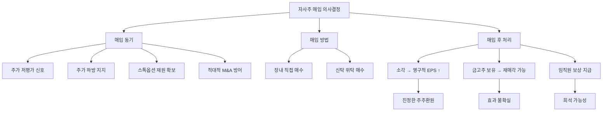

# 자사주 매입 뜻 — 회사가 자기 주식을 사들이는 것

## 한 줄 정의

자사주 매입은 기업이 시장에서 자기 회사 주식을 사들이는 행위로, 배당과 함께 대표적인 주주환원 방법입니다.

## 아주 쉽게 말하면

피자 8조각을 8명이 나눠 먹고 있는데, 가게 주인이 "2조각은 내가 다시 가져갈게"라고 합니다. 이제 남은 6명이 6조각을 먹지만, 주인이 가져간 2조각을 아예 버리면(소각) 앞으로도 6명이 영원히 더 큰 몫을 가집니다. 반면 주인이 냉장고에 보관해두면, 언제든 다시 꺼내 나눠줄 수 있어 "진짜로 줄었는지" 불확실합니다.

## 왜 중요한가

자사주 매입은 유통 주식수를 줄여 EPS(주당순이익)를 높이고, 시장에서 매수 수요를 만들어 주가에 하방 지지력을 제공합니다. 배당과 달리 주주가 배당소득세(15.4%)를 내지 않아도 되므로 세금 효율이 좋습니다. 또한 기업 입장에서는 "우리 주가가 저평가돼 있다"는 시그널을 보낼 수 있고, 배당처럼 한번 올리면 삭감하기 어려운 경직성도 없어 재무 유연성을 유지할 수 있습니다.

다만 매입만 하고 소각하지 않으면 효과가 일시적이므로, 매입 후 처리 방식까지 확인하는 것이 핵심입니다.

## 그림으로 이해하기

## 숫자로 보는 예시

> ⚠️ 아래 숫자는 개념 설명을 위한 **가상 예시**이며, 실제 투자 데이터가 아닙니다.

가상의 CC전자가 자사주 매입을 공시한 상황을 단계별로 추적합니다.

**매입 전 상황:**
- 시가총액: 4조 원 / 발행주식: 1억 주 / 주가: 40,000원
- 순이익: 4,000억 원 → EPS: 4,000원 / PER: 10배

**매입 공시 내용:**
- 매입 규모: 2,000억 원 (시총의 5%)
- 매입 기간: 3개월 / 매입 주식수: 약 500만 주

**매입 완료 후 (소각 가정):**
- 유통주식: 9,500만 주
- 새 EPS: 4,000억 ÷ 9,500만 = **4,211원 (+5.3%)**
- 동일 PER 10배 적용 시 적정 주가: 42,110원 (+5.3%)

**매입 완료 후 (금고주 보유):**
- 회계상 EPS는 동일하게 증가하지만, 언제든 시장 재매각 가능
- 시장은 소각 대비 할인된 효과만 인정 (보통 50~70% 수준)

## 표로 비교하기

| 구분 | 자사주 매입 | 현금배당 | 자사주 소각 |
|------|-----------|---------|-----------|
| 현금 흐름 | 주주에게 간접 환원 | 주주에게 직접 지급 | 매입 선행 필요 |
| 세금 | 없음 (매도 시 양도세) | 배당소득세 15.4% | 없음 |
| EPS 효과 | 증가 (주식수↓) | 변화 없음 | 영구 증가 |
| 주가 효과 | 매수 수요 + EPS↑ | 배당락으로 하락 | 가장 강한 호재 |
| 유연성 | 시기·규모 조절 가능 | 삭감 시 신뢰↓ | 비가역적 |
| 시장 신뢰 | 중간 | 높음 (예측 가능) | 매우 높음 |

## 초보자가 자주 하는 오해

1. **"자사주 매입 공시가 나오면 무조건 주가가 오른다"**
   → 시장이 이미 예상했다면 '소문에 사서 뉴스에 파는' 패턴이 나타날 수 있습니다. 또한 매입 규모가 시총 대비 1~2%에 불과하면 실질 효과가 미미합니다. 매입 기간(보통 3~6개월)에 걸쳐 분산 매수하므로 단기 급등보다는 점진적 지지력으로 작용합니다.

2. **"자사주 매입 = 주가가 저평가라는 확실한 증거다"**
   → 경영진이 주가 하락을 막기 위한 방어적 매입을 할 수도 있습니다. 실적 악화가 예상되는데 주가를 관리하려는 '화장'일 수 있으므로, 매입 동기를 IR 자료와 실적 추이에서 교차 검증해야 합니다.

3. **"자사주를 많이 살수록 좋다"**
   → 자사주 매입 재원이 차입금(부채)이라면 재무건전성이 악화됩니다. FCF(잉여현금흐름) 범위 내에서 매입하는지, 부채비율이 과도하게 올라가지 않는지 확인해야 합니다.

4. **"매입 공시만 보면 된다, 소각 여부는 중요하지 않다"**
   → 매입 후 금고주로 보유하면 언제든 시장에 재매각할 수 있습니다. 실제로 주가가 오른 뒤 자사주를 되파는 기업이 있으며, 이 경우 주주가치가 오히려 훼손됩니다.

## 고수는 이렇게 봅니다

숙련된 투자자는 자사주 매입을 볼 때 세 가지를 동시에 확인합니다.

첫째, **매입 후 소각 여부**입니다. "매입+소각"을 정관에 명시하거나, 과거 매입분을 실제로 소각한 이력이 있는 기업을 높이 평가합니다.

둘째, **FCF 대비 매입 비율**입니다. 잉여현금흐름의 30~50%를 주주환원(배당+자사주)에 사용하면 건전하다고 봅니다. 100%를 초과하면 차입 매입 가능성을 의심합니다.

셋째, **타이밍**입니다. 주가가 저점 근처에서 매입하면 진정한 저평가 신호이지만, 고점에서 매입하면 비효율적 자본배분으로 봅니다. 경영진의 과거 매입 타이밍 대비 이후 주가 흐름을 추적합니다.

## 기업분석에서는 이렇게 씁니다

총주주환원율(TSR Policy) = (배당 + 자사주 매입) ÷ 순이익으로 종합 주주환원 강도를 측정합니다. 글로벌 우량기업은 이 비율이 70~100%에 달하며, 한국도 밸류업 프로그램으로 확대 추세입니다.

분석 시 3년 평균 TSR을 산출하고, 동종업계 평균과 비교합니다. 또한 자사주 매입이 ROE에 미치는 영향도 중요합니다 — 자본이 줄어들면 ROE가 기계적으로 올라가므로, "진짜 수익성 개선인지 자본축소 효과인지"를 구분해야 합니다.

## 함께 보면 좋은 용어

- [자사주 소각](./share-cancellation.md) — 매입 후 소멸시켜 영구 효과
- [배당](./dividend.md) — 또 다른 주주환원 수단
- [EPS](../level-05-valuation/eps.md) — 자사주 매입으로 증가하는 지표
- [FCF](../level-03-financial-statements/fcf.md) — 자사주 매입 재원
- [배당성향](./payout-ratio.md) — 자사주 포함 총환원 비교

## 정리

자사주 매입은 유통 주식수를 줄여 EPS를 높이는 주주환원 방법입니다. 세금 효율이 좋고 유연성이 높지만, 소각까지 이어져야 영구적 가치 증대입니다. 매입 규모(FCF 대비), 소각 여부, 타이밍을 종합적으로 판단해야 진정한 주주환원인지 주가 관리인지 구분할 수 있습니다.

## 한 줄 요약

> 자사주 매입은 '회사가 자기 주식을 사서 남은 주주의 몫을 키우는 것'이며, 소각까지 해야 진짜입니다.

---

이 글은 투자 권유가 아니라 주식 용어와 기업분석 방법을 설명하기 위한 교육 콘텐츠입니다. 특정 종목의 매수·매도 판단은 독자 본인의 책임입니다.

Tags: 자사주매입, 자기주식, 주주환원, 주당순이익, 소각
