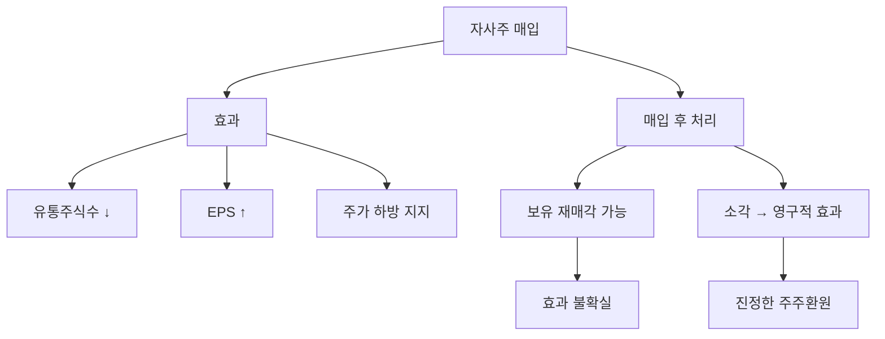

# 자사주 매입 뜻 — 회사가 자기 주식을 사들이는 것

## 한 줄 정의

자사주 매입은 기업이 시장에서 자기 회사 주식을 사들이는 행위로, 배당과 함께 대표적인 주주환원 방법입니다.

## 아주 쉽게 말하면

피자 8조각을 8명이 나눠 먹다가, 2명이 나가면 6명이 더 큰 조각을 먹을 수 있습니다. 회사가 주식을 사들이면 남은 주주의 몫(지분)이 커지는 효과입니다.

## 왜 중요한가

자사주 매입은 유통 주식수를 줄여 EPS를 높이고, 주가에 하방 지지력을 제공합니다. 배당과 달리 배당소득세가 부과되지 않아 세금 효율적인 주주환원이며, 소각까지 이어지면 영구적 가치 증대입니다.

## 그림으로 이해하기

## 숫자로 보는 예시

> ⚠️ 아래 숫자는 개념 설명을 위한 **가상 예시**이며, 실제 투자 데이터가 아닙니다.

CC기업 자사주 매입 공시:
- 매입 규모: 2,000억 원 (시총의 5%)
- 현재 주가: 50,000원
- 매입 주식수: 2,000억 ÷ 50,000 = 400만 주
- 기존 주식수: 1억 주 → 유통 주식수: 9,600만 주
- **EPS 증가 효과: 약 +4.2%**
- 소각 시 영구적 효과, 미소각 시 일시적 효과

## 표로 비교하기

| 구분 | 자사주 매입 | 현금배당 |
|------|-----------|---------|
| 현금 흐름 | 주주에게 간접 환원 | 주주에게 직접 지급 |
| 세금 | 없음 (매도 시 양도세) | 배당소득세 15.4% |
| EPS 효과 | 증가 (주식수↓) | 변화 없음 |
| 주가 효과 | 매수 수요 + EPS↑ | 배당락으로 하락 |
| 유연성 | 시기·규모 조절 가능 | 한번 올리면 삭감 어려움 |

## 초보자가 자주 하는 오해

1. **"자사주 매입 공시 나오면 주가가 무조건 오른다"**
   → 시장이 이미 예상했거나, 매입 규모가 작으면 효과가 미미합니다. 또한 자사주를 매입만 하고 소각하지 않으면 나중에 재매각할 수 있어 효과가 반감됩니다.

2. **"자사주 매입 = 주가가 저평가라는 뜻이다"**
   → 주가 방어 목적(하락 방지)으로 매입하는 경우도 있습니다. 진짜 저평가 신호인지, 단순 주가 관리인지는 경영진의 과거 행적과 기업 펀더멘털을 확인해야 합니다.

## 고수는 이렇게 봅니다

숙련된 투자자는 '매입 후 소각' 여부를 핵심으로 봅니다. 소각하면 주식수가 영구히 줄어 EPS가 구조적으로 올라갑니다. 또한 자사주 매입을 FCF 대비 비율로 봐서, 무리한 차입 매입(부채 증가)이 아닌지 확인합니다.

## 기업분석에서는 이렇게 씁니다

총주주환원율(TSR Policy) = (배당 + 자사주 매입) ÷ 순이익으로 종합 주주환원 강도를 측정합니다. 글로벌 우량기업은 이 비율이 70~100%에 달하며, 한국도 밸류업 프로그램으로 확대 추세입니다.

## 함께 보면 좋은 용어

- [자사주 소각](./share-cancellation.md) — 매입 후 소멸시켜 영구 효과
- [배당](./dividend.md) — 또 다른 주주환원 수단
- [EPS](../level-05-valuation/eps.md) — 자사주 매입으로 증가하는 지표
- [FCF](../level-03-financial-statements/fcf.md) — 자사주 매입 재원
- [배당성향](./payout-ratio.md) — 자사주 포함 총환원 비교

## 정리

자사주 매입은 유통 주식수를 줄여 EPS를 높이는 주주환원 방법입니다. 소각까지 이어져야 영구적 가치 증대이며, 배당 대비 세금 효율이 좋아 글로벌 트렌드로 확대 중입니다.

## 한 줄 요약

> 자사주 매입은 '회사가 자기 주식을 사서 남은 주주의 몫을 키우는 것'이며, 소각까지 해야 진짜입니다.

---

이 글은 투자 권유가 아니라 주식 용어와 기업분석 방법을 설명하기 위한 교육 콘텐츠입니다. 특정 종목의 매수·매도 판단은 독자 본인의 책임입니다.

Tags: 자사주매입, 자기주식, 주주환원, 주당순이익, 소각
