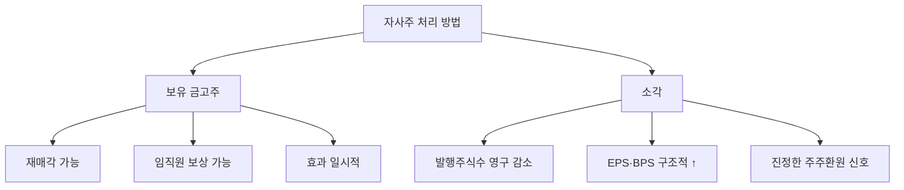

# 자사주 소각 뜻 — 주식을 영구히 없애는 것

## 한 줄 정의

자사주 소각은 기업이 매입한 자기주식을 영구히 소멸시켜 발행주식수를 줄이는 행위로, 남은 주주의 지분 가치를 높이는 가장 확실한 주주환원 방법입니다.

## 아주 쉽게 말하면

케이크 8조각 중 2조각을 버리면, 남은 6조각이 전체의 1/6이 아닌 1/6씩 됩니다. 즉 남은 사람의 몫이 영구히 커집니다. 자사주를 "소각"하면 그 주식은 다시는 시장에 나올 수 없습니다.

## 왜 중요한가

자사주를 매입만 하면 나중에 재매각하거나 임직원에게 줄 수 있어 효과가 불확실합니다. 소각하면 주식수가 영구히 줄어 EPS·BPS가 구조적으로 올라가며, 경영진의 진정한 주주환원 의지를 보여줍니다.

## 그림으로 이해하기

## 숫자로 보는 예시

> ⚠️ 아래 숫자는 개념 설명을 위한 **가상 예시**이며, 실제 투자 데이터가 아닙니다.

DD기업:
- 기존 발행주식: 1억 주
- 자사주 매입: 1,000만 주 (10%)
- **소각 후 발행주식: 9,000만 주**
- 순이익 900억 원 기준:
  - 소각 전 EPS: 900억 ÷ 1억 = 9,000원
  - 소각 후 EPS: 900억 ÷ 9,000만 = **10,000원 (+11.1%)**

## 표로 비교하기

| 구분 | 자사주 보유 | 자사주 소각 |
|------|-----------|-----------|
| 주식수 | 불변 (금고주 제외) | 영구 감소 |
| EPS 효과 | 일시적 | 영구적 |
| 재매각 가능 | ○ (시장 악재) | × (불가능) |
| 회계 처리 | 자본 차감 항목 | 자본금 감소 |
| 시장 신뢰도 | 보통 | 매우 높음 |

## 초보자가 자주 하는 오해

1. **"자사주 매입과 소각은 같은 것이다"**
   → 매입은 '사서 보관', 소각은 '사서 태움'입니다. 매입만 하면 언제든 다시 팔 수 있어 주가 하락 요인이 될 수 있습니다.

2. **"소각하면 시가총액이 줄어든다"**
   → 소각 후 주당 가치가 올라가므로, 시가총액(주가 × 주식수)은 이론적으로 동일합니다. 실제로는 시장 호감으로 시총이 오히려 증가하는 경우가 많습니다.

## 고수는 이렇게 봅니다

숙련된 투자자는 '정기적 소각 프로그램'을 가진 기업을 선호합니다. 매년 FCF의 일정 비율을 자사주 매입+소각에 사용하겠다고 공시한 기업은 장기적으로 EPS가 복리로 증가합니다. 애플, 삼성전자 등이 대표적입니다.

## 기업분석에서는 이렇게 씁니다

자사주 소각 공시 후 '향후 3년 EPS 추정'을 상향 조정합니다. 매년 2% 소각 시 EPS는 연간 약 2% 추가 성장하는 효과이며, 이를 PER에 반영하면 목표주가가 상향됩니다.

## 함께 보면 좋은 용어

- [자사주 매입](./share-buyback.md) — 소각의 전 단계
- [EPS](../level-05-valuation/eps.md) — 소각으로 증가하는 핵심 지표
- [BPS](../level-05-valuation/bps.md) — 소각 시 주당순자산도 증가
- [배당](./dividend.md) — 소각과 함께 쓰는 주주환원 수단
- [감자](../level-07-earnings/capital-reduction.md) — 소각도 넓은 의미의 감자에 해당

## 정리

자사주 소각은 주식을 영구히 없애 발행주식수를 줄이는 가장 확실한 주주환원입니다. 매입만으로는 불완전하며, 소각까지 이어져야 EPS·BPS의 구조적 상승과 주가 재평가로 연결됩니다.

## 한 줄 요약

> 자사주 소각은 '주식을 영구히 태워 남은 주주의 몫을 키우는 것'이며, 가장 확실한 주주환원입니다.

---

*면책 조항: 이 글은 투자 권유가 아니라 주식 용어와 기업분석 방법을 설명하기 위한 교육 콘텐츠입니다. 특정 종목의 매수·매도 판단은 독자 본인의 책임입니다.*

Tags: 자사주소각, 주식소각, 주주환원, 주식수감소, EPS
