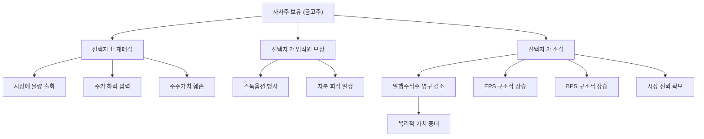

# 자사주 소각 뜻 — 주식을 영구히 없애는 것

## 한 줄 정의

자사주 소각은 기업이 매입한 자기주식을 영구히 소멸시켜 발행주식수를 줄이는 행위로, 남은 주주의 지분 가치를 높이는 가장 확실한 주주환원 방법입니다.

## 아주 쉽게 말하면

케이크 8조각 중 2조각을 그냥 버리는 겁니다. 냉장고에 넣어두는 게 아니라 완전히 폐기합니다. 이제 세상에는 6조각만 존재하고, 남은 사람의 몫이 영구히 커집니다. 자사주를 "소각"하면 그 주식은 회사 금고에서도, 시장에서도 영원히 사라집니다.

## 왜 중요한가

자사주를 매입만 하면 회사 금고에 보관됩니다. 금고주는 언제든 시장에 재매각하거나, 임직원 스톡옵션으로 줄 수 있어 "주식수가 진짜로 줄었는지" 불확실합니다. 소각하면 발행주식수 자체가 영구히 줄어 EPS·BPS가 구조적으로 올라가며, 경영진이 "보유한 자사주를 되팔지 않겠다"는 확실한 의지를 보여줍니다.

특히 한국 시장에서는 2024년 밸류업 프로그램 이후 "자사주 매입+소각" 공시가 급증하며, 투자자들의 관심 지표로 떠올랐습니다.

## 그림으로 이해하기

## 숫자로 보는 예시

> ⚠️ 아래 숫자는 개념 설명을 위한 **가상 예시**이며, 실제 투자 데이터가 아닙니다.

가상의 DD제약이 자사주 소각을 공시한 상황입니다.

**소각 전 상태:**
- 발행주식: 1억 주 (자사주 1,000만 주 보유 중)
- 유통주식: 9,000만 주
- 순이익: 900억 원 → EPS: 9,000원 (유통주식 기준)
- 순자산: 1조 8,000억 원 → BPS: 18,000원

**소각 공시 — 1,000만 주 전량 소각:**
- 새 발행주식: 9,000만 주 (10% 감소)
- 새 EPS: 900억 ÷ 9,000만 = **10,000원 (+11.1%)**
- 새 BPS: 1조 8,000억 ÷ 9,000만 = **20,000원 (+11.1%)**

**3년 연속 매년 3% 소각 시 복리 효과:**
- 1년차: EPS +3.1% / 2년차: 누적 +6.3% / 3년차: 누적 +9.6%
- 이익 성장 없이도 EPS가 연 3%씩 성장하는 효과

**시장 반응 비교:**
- 매입만 공시: 평균 주가 반응 +2~3%
- 매입+소각 동시 공시: 평균 주가 반응 +5~8%

## 표로 비교하기

| 구분 | 자사주 보유 (금고주) | 자사주 소각 |
|------|-------------------|-----------|
| 주식수 | 불변 (금고주 제외 계산) | 영구 감소 |
| EPS 효과 | 일시적 (재매각 시 원복) | 영구적 |
| 재매각 가능 | ○ (시장 악재) | × (불가능) |
| 회계 처리 | 자본 차감 항목 | 자본금 감소 등기 |
| 시장 신뢰도 | 보통 | 매우 높음 |
| 법적 절차 | 없음 | 이사회 결의 + 채권자 보호 절차 |

## 초보자가 자주 하는 오해

1. **"자사주 매입과 소각은 같은 것이다"**
   → 매입은 '사서 보관', 소각은 '사서 태움'입니다. 매입만 하면 금고주로 남아 언제든 재매각 가능합니다. 실제로 많은 기업이 매입 후 소각 없이 수년간 금고주로 보유하다 시장에 되파는 경우가 있습니다.

2. **"소각하면 시가총액이 줄어든다"**
   → 소각 후 주당 가치가 올라가므로, 이론적으로 시가총액(주가 × 주식수)은 동일하게 유지됩니다. 실제로는 시장이 소각을 호재로 평가해 시총이 오히려 증가하는 경우가 많습니다.

3. **"소각은 무조건 좋다"**
   → 기업이 성장 투자 기회가 풍부한데 소각에 현금을 쓰면, 미래 성장을 포기하는 것일 수 있습니다. 성숙기 기업에게는 최적의 선택이지만, 고성장 기업에게는 자본 배분의 비효율일 수 있습니다.

4. **"소각 공시 나오면 바로 사야 한다"**
   → 소각 규모가 발행주식의 1% 미만이면 EPS 영향이 미미합니다. 또한 공시 직후 주가가 급등하면 이미 효과가 반영된 것이므로, 소각 비율과 밸류에이션을 냉정하게 따져야 합니다.

## 고수는 이렇게 봅니다

숙련된 투자자는 '정기적 소각 프로그램'을 가진 기업을 높이 평가합니다. 매년 FCF의 일정 비율을 자사주 매입+소각에 사용하겠다고 공시한 기업은 장기적으로 EPS가 복리로 증가합니다.

핵심 체크리스트는 다음과 같습니다:
- **소각 빈도**: 일회성인지, 매년 정기적인지
- **소각 비율**: 연간 발행주식의 2~3% 이상이면 유의미
- **재원 건전성**: FCF 범위 내인지, 차입으로 하는지
- **경영진 이력**: 과거에도 소각을 실행했는지 (말만 하고 안 하는 기업 구분)

## 기업분석에서는 이렇게 씁니다

자사주 소각 공시 후 '향후 3년 EPS 추정'을 상향 조정합니다. 매년 2% 소각 시 EPS는 연간 약 2% 추가 성장하는 효과이며, 이를 PER에 반영하면 적정 주가 수준이 상향됩니다.

또한 자사주 소각은 ROE 개선 효과도 있습니다. 자본이 줄어들면 ROE = 순이익 ÷ 자본이므로, 수익성 지표가 올라갑니다. 다만 이는 "진짜 경영 효율 개선"이 아닌 "자본축소에 의한 기계적 개선"이므로, 분석 시 소각 효과를 분리해서 봐야 합니다.

## 함께 보면 좋은 용어

- [자사주 매입](./share-buyback.md) — 소각의 전 단계
- [EPS](../level-05-valuation/eps.md) — 소각으로 증가하는 핵심 지표
- [BPS](../level-05-valuation/bps.md) — 소각 시 주당순자산도 증가
- [배당](./dividend.md) — 소각과 함께 쓰는 주주환원 수단
- [감자](../level-07-earnings/capital-reduction.md) — 소각도 넓은 의미의 감자에 해당

## 정리

자사주 소각은 주식을 영구히 없애 발행주식수를 줄이는 가장 확실한 주주환원입니다. 매입만으로는 불완전하며, 소각까지 이어져야 EPS·BPS의 구조적 상승과 주가 재평가로 연결됩니다. 정기적 소각 프로그램을 운영하는 기업은 복리적 가치 증대를 만들어냅니다.

## 한 줄 요약

> 자사주 소각은 '주식을 영구히 태워 남은 주주의 몫을 키우는 것'이며, 가장 확실한 주주환원입니다.

---

이 글은 투자 권유가 아니라 주식 용어와 기업분석 방법을 설명하기 위한 교육 콘텐츠입니다. 특정 종목의 매수·매도 판단은 독자 본인의 책임입니다.

Tags: 자사주소각, 주식소각, 주주환원, 주식수감소, 주당순이익
