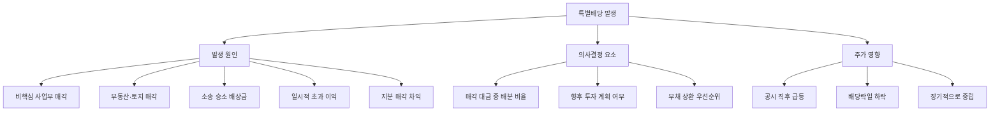

# 특별배당 뜻 — 일회성으로 크게 주는 배당

## 한 줄 정의

특별배당은 정기배당 외에 일회성으로 추가 지급하는 배당으로, 대규모 자산 매각이나 일시적 초과 이익 발생 시 주주에게 환원하는 방법입니다.

## 아주 쉽게 말하면

매달 용돈 10만 원을 받는 학생이 있습니다. 어느 날 부모님이 땅을 팔아서 큰돈이 생겼습니다. "이번 한 번만 특별히 100만 원 줄게. 다음 달부터는 다시 10만 원이야." 이게 특별배당입니다. 정기적이지 않고, 특별한 이유가 있을 때 한 번 크게 지급합니다.

## 왜 중요한가

특별배당은 기업에 예상치 못한 대규모 현금이 생겼을 때 주주에게 돌려주는 행위입니다. 정기배당과 달리 다음 해 유지 의무가 없어 기업 부담이 적으면서도, 주주에게 즉각적인 현금 환원을 제공합니다.

투자자 입장에서는 특별배당 가능성을 미리 포착하면 이벤트 투자 수익을 얻을 수 있습니다. 반면 특별배당을 정기배당으로 착각하고 "배당수익률 높은 주식"으로 오판하면 다음 해 실망할 수 있어, 정확한 구분이 필수입니다.

## 그림으로 이해하기

## 숫자로 보는 예시

> ⚠️ 아래 숫자는 개념 설명을 위한 **가상 예시**이며, 실제 투자 데이터가 아닙니다.

가상의 FF홀딩스가 비핵심 자회사를 매각한 상황입니다.

**매각 전 상황:**
- 주가: 50,000원 / 발행주식: 1억 주
- 정기배당: 주당 2,000원 (배당수익률 4%)
- 비핵심 자회사 장부가: 3,000억 원

**매각 공시:**
- 매각가: 5,000억 원 (장부가 대비 67% 프리미엄)
- 매각차익: 2,000억 원 (세후)
- 경영진 결정: 매각 대금의 60%를 특별배당으로 환원

**특별배당 규모:**
- 특별배당 총액: 5,000억 × 60% = 3,000억 원
- 주당 특별배당: 3,000억 ÷ 1억 주 = **3,000원**
- 올해 총 배당: 정기 2,000 + 특별 3,000 = **5,000원 (수익률 10%)**
- 내년 배당: 다시 정기 2,000원만 (수익률 4%)

**주가 흐름 시나리오:**
- 매각 공시일: +5% (매각 차익 기대)
- 특별배당 공시일: +3% (확정 호재)
- 배당락일: -3,000원 (특별배당분 하락)
- 6개월 후: 매각 전 수준으로 회귀

## 표로 비교하기

| 구분 | 정기배당 | 특별배당 | 중간배당 |
|------|---------|---------|---------|
| 빈도 | 매년 (예측 가능) | 일회성 (비정기) | 반기·분기 (정기적) |
| 기대 형성 | 유지·증가 기대 | 반복 기대 없음 | 연간 배당의 분할 |
| 재원 | 영업이익 | 자산매각·초과이익 | 영업이익 |
| 기업 부담 | 삭감 시 신뢰↓ | 1회로 종료 | 삭감 부담 있음 |
| 주가 반응 | 점진적 반영 | 공시 후 급등 가능 | 완만한 반영 |
| 배당수익률 포함 | ○ (정상) | 제외해야 정확 | ○ (정상) |

## 초보자가 자주 하는 오해

1. **"특별배당이 나왔으니 내년에도 이 수준으로 배당한다"**
   → '특별'이라는 이름 그대로 1회성입니다. 과거 특별배당을 포함한 배당수익률로 종목을 선정하면 다음 해 수익률이 급락합니다. 증권사 리포트에서도 특별배당을 제외한 "경상 배당수익률"을 별도 표기합니다.

2. **"특별배당은 기업 상황이 좋다는 증거다"**
   → 현금이 풍부해서 주는 경우는 긍정적이지만, 핵심 사업부를 매각하고 그 대금으로 주는 경우는 "성장 포기 신호"일 수 있습니다. 항상 재원의 출처와 매각 자산의 성격을 확인해야 합니다.

3. **"특별배당 공시 후에 사면 배당을 받을 수 있다"**
   → 배당기준일 이전에 매수해야 배당을 받습니다. 공시 후 주가가 이미 특별배당분만큼 올랐다면, 배당을 받더라도 배당락으로 원점 회귀하므로 실익이 없습니다.

4. **"특별배당 대신 자사주 매입이 더 좋다"**
   → 일률적으로 비교할 수 없습니다. 일시적 대규모 현금(자산 매각)의 경우 특별배당이 효율적이고, 지속적 잉여현금은 자사주 매입+소각이 세금 면에서 유리합니다. 상황에 따라 최적 수단이 다릅니다.

## 고수는 이렇게 봅니다

숙련된 투자자는 특별배당의 '시그널 효과'와 '이벤트 투자' 두 축으로 접근합니다.

**시그널 해석:**
- "이 이상 효율적인 투자처가 없다"는 경영진의 판단을 의미합니다
- 성장 기업이 특별배당하면 "성장 둔화" 시그널 → 부정적
- 성숙 기업이 특별배당하면 "주주 친화" 시그널 → 긍정적

**이벤트 투자 전략:**
- 대규모 자산 매각 공시 → "특별배당 가능성" 선반영 매수
- 과거 유사 사례에서 매각 대금의 몇 %를 환원했는지 추정
- 특별배당 확정 공시 전에 진입, 배당락 전에 차익실현하는 패턴

## 기업분석에서는 이렇게 씁니다

자산 매각 공시 후 "매각 대금의 몇 %를 특별배당할 것인가"를 추정하는 것이 핵심입니다. 경영진 성향, 재무 상태(부채비율), 향후 투자 계획을 종합적으로 고려합니다.

분석 프레임워크:
- 매각 대금 중 부채 상환 필요분을 먼저 차감
- 잔여 금액 중 향후 설비투자 계획분을 차감
- 나머지를 주주환원 가용 재원으로 추정
- 과거 경영진의 환원 성향(30~70%)을 적용하여 특별배당 규모 산출

## 함께 보면 좋은 용어

- [배당](./dividend.md) — 특별배당의 상위 개념
- [배당성향](./payout-ratio.md) — 특별배당 제외 시 정상 배당성향
- [중간배당](./interim-dividend.md) — 정기적 분할 배당 (특별배당과 구분)
- [자사주 매입](./share-buyback.md) — 특별배당 대안으로 선택 가능
- [FCF](../level-03-financial-statements/fcf.md) — 특별배당 재원 확인

## 정리

특별배당은 일회성 초과 현금을 주주에게 환원하는 비정기 배당입니다. 정기배당과 반드시 구분해야 하며, 재원 출처(비핵심 자산 매각 vs 핵심 사업 매각)에 따라 긍정·부정 해석이 갈립니다. 배당수익률 계산 시 특별배당을 제외하고, 이벤트 투자 시에는 매각 공시 단계에서 선제적으로 접근해야 합니다.

## 한 줄 요약

> 특별배당은 '한 번 크게 주는 보너스 배당'이며, 반복을 기대하지 말고 재원 출처를 확인하세요.

---

이 글은 투자 권유가 아니라 주식 용어와 기업분석 방법을 설명하기 위한 교육 콘텐츠입니다. 특정 종목의 매수·매도 판단은 독자 본인의 책임입니다.

Tags: 특별배당, 일회성배당, 주주환원, 잉여현금, 배당
