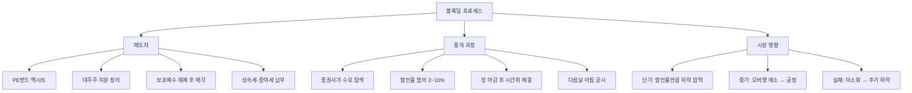

# 블록딜 뜻 — 대량의 주식을 한꺼번에 거래하는 것

## 한 줄 정의

블록딜은 대규모 주식 물량을 장외 또는 시간외에서 한 번에 매매하는 거래 방식으로, 장내 매도 시 발생할 주가 충격을 최소화하기 위해 사용합니다.

## 아주 쉽게 말하면

대주주가 "100만 주를 팔고 싶은데 장중에 조금씩 팔면 며칠에 걸쳐 주가가 폭락할 것 같으니, 증권사에 부탁해서 밤에 살 사람을 모아 한 번에 넘기는 것"입니다. 살 사람에게는 할인 가격을 제시하고, 양측이 합의하면 다음날 아침에 거래가 공시됩니다.

## 왜 중요한가

블록딜은 대량 물량이 시장에 한꺼번에 쏟아졌다는 의미이므로 단기적으로 하락 요인입니다. 하지만 장내에서 며칠간 연속 매도하는 것보다는 충격이 제한적입니다. 투자자가 봐야 할 핵심은 세 가지입니다: ① 매도자가 누구인지(사유), ② 할인율이 얼마인지(급한 정도), ③ 물량이 빠르게 소화됐는지(수요 강도).

보호예수 해제 후 PE펀드나 초기 투자자가 엑시트하는 경로로 블록딜이 자주 활용되며, 오버행(잠재 매도 물량) 해소 측면에서는 오히려 긍정적으로 해석되기도 합니다.

## 그림으로 이해하기

## 숫자로 보는 예시

> ⚠️ 아래 숫자는 개념 설명을 위한 **가상 예시**이며, 실제 투자 데이터가 아닙니다.

가상의 FF바이오에 투자한 PE펀드가 보호예수 해제 후 블록딜로 엑시트하는 상황입니다.

**블록딜 전 상황:**
- 전일 종가: 50,000원 / 시가총액: 1조 원
- 일평균 거래대금: 100억 원 / 일평균 거래량: 20만 주
- PE펀드 보유 물량: 200만 주 (발행주식의 10%)

**블록딜 조건:**
- 할인율: 5% → 체결가: 47,500원
- 거래 규모: 200만 주 × 47,500 = **950억 원**
- 물량 비율: 일평균 거래량의 10일분

**체결 후 시나리오 비교:**

| 시나리오 | 다음날 주가 | 1주 후 | 해석 |
|---------|-----------|--------|------|
| 수요 강함 (즉시 소화) | 49,000원 (-2%) | 50,000원 (회복) | 펀더멘털 건전 |
| 수요 보통 (일부 재매도) | 47,500원 (-5%) | 48,500원 (점진 회복) | 시간 필요 |
| 수요 약함 (물량 출회) | 46,000원 (-8%) | 45,000원 (추가 하락) | 부정적 신호 |

## 표로 비교하기

| 항목 | 블록딜 | 장내 분할 매도 | 공개매수 (역방향) |
|------|--------|---------------|-----------------|
| 거래 방식 | 시간외·장외 협의 | 장중 호가 매도 | 공개 매수 제안 |
| 시장 충격 | 중간 (일시적) | 크다 (지속적) | 없음 (프리미엄) |
| 할인율 | 2~10% | 없음 (시장가) | 반대로 프리미엄 |
| 체결 속도 | 1일 내 일괄 | 수일~수주 | 20~40일 |
| 투명성 | 사후 공시 | 실시간 확인 | 사전 공시 |
| 적합 상황 | 대규모 엑시트 | 소규모 매도 | 경영권 확보 |

## 초보자가 자주 하는 오해

1. **"블록딜이 나왔다면 회사에 심각한 문제가 있는 것이다"**
   → 매도 사유는 다양합니다. PE펀드의 만기 도래, 포트폴리오 리밸런싱, 상속세 납부 자금 마련 등 회사 자체 문제와 무관한 경우가 많습니다. 매도자가 "왜" 파는지를 확인하세요.

2. **"블록딜 할인율만큼 주가가 무조건 빠진다"**
   → 매수 기관이 펀더멘털에 대한 확신을 가지고 빠르게 소화하면, 주가는 1~2일 내에 회복됩니다. 할인율은 "매도자의 급한 정도"를 반영하는 것이지 "기업 가치 하락분"이 아닙니다.

3. **"블록딜 소식이 나오면 같이 팔아야 한다"**
   → 블록딜 후 오버행(잠재 매도 물량)이 해소되면, 그동안 주가를 눌렀던 매도 압력이 사라져 오히려 주가가 상승하는 경우도 있습니다. 남은 오버행 물량을 확인하세요.

4. **"할인율이 높을수록 나에게 유리하다"**
   → 할인율이 10%를 넘으면 매도자가 매우 급하다는 뜻입니다. 이는 기업에 대해 알려지지 않은 부정적 정보가 있을 가능성을 시사합니다. 높은 할인율은 경계 신호입니다.

## 고수는 이렇게 봅니다

숙련된 투자자는 블록딜을 단순한 악재가 아닌 "오버행 해소 이벤트"로 접근합니다.

첫째, **소화 속도**를 봅니다. 블록딜 물량을 받은 기관이 2~3일 내에 재매도하지 않으면, 해당 가격대에서 수요가 있다는 의미입니다.

둘째, **잔여 오버행**을 계산합니다. "이번 블록딜로 PE펀드가 전량 매각했는가, 아직 남은 물량이 있는가?"를 확인합니다. 전량 매각이면 오버행이 완전히 해소된 것이므로 긍정적입니다.

셋째, **블록딜 매수자**를 추적합니다. 매수자가 장기 투자 성격의 기관(연기금, 자산운용사)이면 긍정적, 단기 차익을 노리는 트레이더면 재매도 위험이 있습니다.

## 기업분석에서는 이렇게 씁니다

블록딜 후 잔여 보호예수 물량을 재계산하여 추가 오버행을 측정합니다. 오버행 소멸 비율 = (이번 블록딜 물량 ÷ 총 잠재 매도 물량) × 100으로 계산하며, 50% 이상 해소되면 주가 부담이 크게 줄어든다고 봅니다.

또한 블록딜 빈도가 높은 종목(연 2~3회)은 수급 불안정 리스크를 밸류에이션 할인율에 반영합니다. 반대로 마지막 대형 주주의 엑시트가 완료되면, "오버행 프리 종목"으로 재평가하는 리포트를 작성합니다.

## 함께 보면 좋은 용어

- [보호예수](./lock-up.md) — 블록딜의 전 단계, 매도 제한 기간
- [공개매수](./tender-offer.md) — 대량 매수의 또 다른 방식
- [유상증자](./paid-in-capital-increase.md) — 주식 수 증가의 다른 원인
- [시가총액](../level-01-basic/market-cap.md) — 블록딜 규모와 비교할 기준
- [거래량](../level-01-basic/trading-volume.md) — 블록딜 소화 가능성 판단 지표

## 정리

블록딜은 대량 주식을 시간외·장외에서 할인가로 한꺼번에 매매하는 방식입니다. 단기적으로 주가 하락 요인이지만, 오버행 해소 측면에서는 긍정적일 수 있습니다. 매도 사유, 할인율, 소화 속도, 잔여 오버행을 종합적으로 판단하는 것이 핵심입니다.

## 한 줄 요약

> 블록딜은 대량 주식을 할인가에 일괄 매도하는 거래이며, 단기 하락 요인이지만 오버행 해소의 계기가 됩니다.

---

이 글은 투자 권유가 아니라 주식 용어와 기업분석 방법을 설명하기 위한 교육 콘텐츠입니다. 특정 종목의 매수·매도 판단은 독자 본인의 책임입니다.

Tags: 블록딜, 대량매매, 시간외거래, 할인율, 오버행
