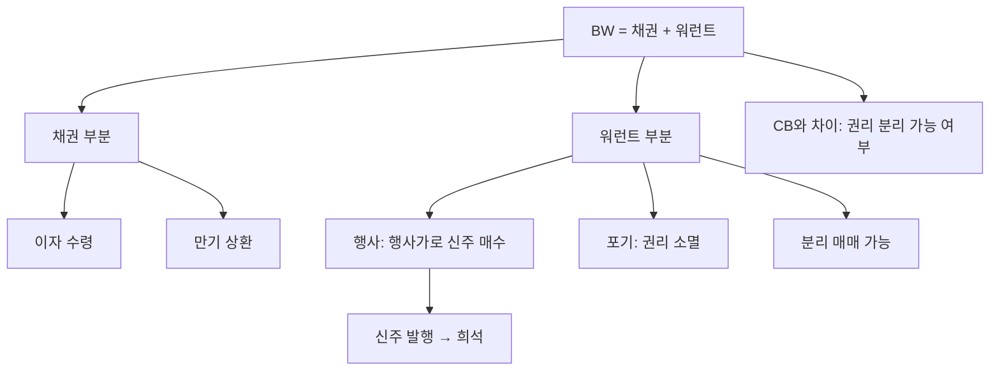

# 신주인수권부사채 BW 뜻 — 새 주식을 살 권리가 붙은 채권

## 한 줄 정의

신주인수권부사채(BW)는 일정 가격에 새 주식을 살 수 있는 권리(워런트)가 붙은 채권입니다.

## 아주 쉽게 말하면

"돈을 빌려주면 이자도 주고, 나중에 약속한 가격에 주식도 살 수 있는 쿠폰도 줄게"라는 채권입니다. CB와 비슷하지만 권리를 따로 떼어서 팔 수 있다는 차이가 있습니다.

## 왜 중요한가

- 워런트 행사 시 신주가 발행되어 기존 주주 지분이 희석됩니다
- CB와 달리 워런트를 분리하여 별도 매매할 수 있습니다
- 워런트 행사 시점에 추가 자금이 회사에 유입됩니다
- 분리형 BW는 채권 상환 + 워런트 행사가 독립적으로 진행됩니다

## 그림으로 이해하기

## 숫자로 보는 예시

> ⚠️ 아래 숫자는 개념 설명을 위한 **가상 예시**이며, 실제 투자 데이터가 아닙니다.

D기업이 BW 50억 원(행사가 8,000원)을 발행합니다.

- 워런트 전량 행사 시 신주: 50억 ÷ 8,000원 = 62.5만 주
- 기존 발행주식: 300만 주
- 행사 후 총 주식: 362.5만 주 (희석률 약 21%)
- 기업에 유입되는 추가 자금: 50억 원

현재 주가 12,000원이면, 워런트 1주당 차익 = 12,000 − 8,000 = 4,000원.

## 표로 비교하기

| 항목 | CB (전환사채) | BW (신주인수권부사채) |
|------|-------------|---------------------|
| 주식 취득 방식 | 채권을 주식으로 전환 | 별도 대금 납입 후 신주 수령 |
| 분리 매매 | 불가 | 가능 (분리형) |
| 채권 상환 | 전환 시 소멸 | 워런트와 무관하게 상환 |
| 추가 자금 유입 | 없음 | 행사 시 유입 |
| 희석 시점 | 전환 시 | 워런트 행사 시 |

## 초보자가 자주 하는 오해

**오해 1: "BW는 CB와 똑같다"**

CB는 채권 자체가 주식이 되지만, BW는 채권은 그대로 두고 별도 돈을 내고 주식을 삽니다. 구조가 다릅니다.

**오해 2: "워런트 행사는 주가에 좋은 것 아닌가?"**

행사 시 회사에 돈이 들어오지만, 동시에 신주가 발행되어 기존 주주의 지분이 희석됩니다. 순효과를 따져봐야 합니다.

## 고수는 이렇게 봅니다

- 미행사 워런트 수량과 행사가 대비 현재 주가 괴리를 확인합니다
- 워런트 행사 가능 기간이 임박하면 매도 물량 출회를 경계합니다
- 분리형 BW의 워런트가 시장에서 거래될 때 프리미엄을 분석합니다
- 행사 자금의 용도(부채 상환, 투자)에 따라 긍정·부정을 판단합니다

## 기업분석에서는 이렇게 씁니다

- 희석 EPS 계산 시 미행사 워런트 물량을 반영합니다
- BW 잔액을 "잠재 발행주식"으로 표기하여 밸류에이션에 반영합니다
- 행사 일정표를 만들어 향후 유통주식 증가 시점을 예측합니다

## 함께 보면 좋은 용어

- [전환사채 CB](./convertible-bond.md): 유사하지만 분리 불가한 구조
- [유상증자](./paid-in-capital-increase.md): 직접 신주 발행
- [EPS](../level-05-valuation/eps.md): 워런트 행사 시 희석되는 지표
- [보호예수](./lock-up.md): 행사 후 매도 제한
- [액면분할](./stock-split.md): 주식 수가 늘어나는 또 다른 이벤트

## 정리

신주인수권부사채(BW)는 채권에 워런트(주식 매수 권리)가 붙어 있는 증권입니다. CB와 달리 권리를 분리하여 매매할 수 있고, 행사 시 별도 자금을 납입합니다. 미행사 워런트는 잠재적 희석 요인이므로 기업분석 시 반드시 반영해야 합니다.

## 한 줄 요약

> BW는 채권 + 주식 매수 권리(워런트)이며, 행사 시 신주가 발행되어 기존 주주 지분이 희석됩니다.

---

이 글은 투자 권유가 아니라 주식 용어와 기업분석 방법을 설명하기 위한 교육 콘텐츠입니다. 특정 종목의 매수·매도 판단은 독자 본인의 책임입니다.

Tags: 신주인수권부사채, 신주인수권, 자금조달, 희석효과, 채권투자
