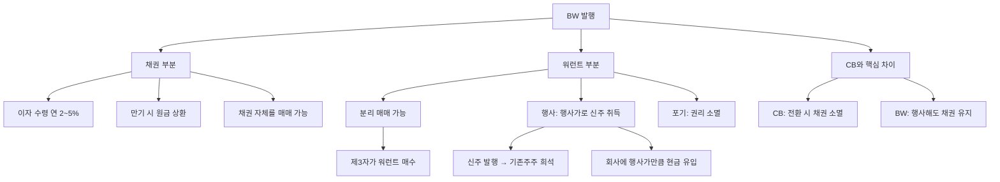

# 신주인수권부사채 BW 뜻 — 새 주식을 살 권리가 붙은 채권

## 한 줄 정의

신주인수권부사채(BW)는 일정 가격에 새 주식을 살 수 있는 권리(워런트)가 붙은 채권으로, CB와 달리 채권과 워런트를 분리하여 별도 거래할 수 있습니다.

## 아주 쉽게 말하면

"돈을 빌려주면 이자도 주고, 나중에 약속한 가격에 우리 주식을 살 수 있는 쿠폰도 줄게"라는 채권입니다. 이 쿠폰(워런트)은 따로 떼어서 다른 사람에게 팔 수도 있습니다. CB는 채권 자체가 주식으로 변하지만, BW는 채권은 그대로 두고 별도 돈을 내야 주식을 받을 수 있다는 점이 다릅니다.

## 왜 중요한가

BW의 워런트가 행사되면 신주가 발행되어 기존 주주 지분이 희석됩니다. CB와 비슷한 효과이지만, BW만의 독특한 구조가 있습니다:

- **분리 매매**: 워런트를 따로 사고 팔 수 있어, 원래 BW 인수자가 아닌 제3자도 워런트를 행사할 수 있습니다
- **이중 효과**: 채권 만기에 원금을 상환받으면서, 동시에 워런트도 행사할 수 있어 투자자에게 유리합니다
- **추가 자금 유입**: CB는 전환 시 회사에 추가 현금이 안 들어오지만, BW는 워런트 행사 시 행사가만큼 회사에 현금이 유입됩니다

## 그림으로 이해하기

## 숫자로 보는 예시

> ⚠️ 아래 숫자는 개념 설명을 위한 **가상 예시**이며, 실제 투자 데이터가 아닙니다.

가상의 DD테크가 설비투자 목적으로 BW를 발행한 상황입니다.

**BW 발행 조건:**
- 발행 규모: 50억 원 / 표면이율: 연 2% / 만기: 3년
- 워런트 행사가: 8,000원
- 기존 발행주식: 300만 주 / 현재 주가: 12,000원

**워런트 전량 행사 시:**
- 신주 발행: 50억 ÷ 8,000원 = **62.5만 주**
- 총 주식: 300만 + 62.5만 = 362.5만 주 (희석률 약 21%)
- 회사 유입 현금: 50억 원 (설비투자 재원)
- 워런트 1주당 내재가치: 12,000 - 8,000 = **4,000원**

**투자자 수익 구조:**
- 채권 보유 수익: 50억 × 2% × 3년 = 3억 원 (이자)
- 워런트 행사 차익: 62.5만 주 × 4,000원 = **25억 원**
- 총 수익: 이자 3억 + 주식차익 25억 = 28억 원 (원금 대비 56%)

**기존 주주 입장:**
- 희석 전 EPS(순이익 30억 기준): 30억 ÷ 300만 = 1,000원
- 희석 후 EPS: 30억 ÷ 362.5만 = **828원 (-17.2%)**

## 표로 비교하기

| 항목 | CB (전환사채) | BW (신주인수권부사채) | 일반 채권 |
|------|-------------|---------------------|----------|
| 주식 취득 방식 | 채권을 주식으로 전환 | 별도 대금 납입 후 신주 | 불가 |
| 분리 매매 | 불가 | 가능 (분리형) | 해당 없음 |
| 전환/행사 후 채권 | 소멸 | 유지 (만기 상환) | 해당 없음 |
| 추가 자금 유입 | 없음 | 행사가만큼 유입 | 없음 |
| 희석 시점 | 전환 시 | 워런트 행사 시 | 없음 |
| 이자율 | 낮음 | 더 낮음 | 높음 |

## 초보자가 자주 하는 오해

1. **"BW와 CB는 같은 것이다"**
   → 구조가 근본적으로 다릅니다. CB는 채권이 주식으로 '변신'하지만, BW는 채권은 그대로 살아있고 별도로 돈을 내고 주식을 삽니다. 투자자는 BW에서 이자도 받고 주식 차익도 얻을 수 있어 더 유리합니다.

2. **"워런트 행사는 회사에 좋은 것 아닌가?"**
   → 회사에 현금이 유입되는 건 맞지만, 동시에 신주가 발행되어 EPS가 희석됩니다. 유입된 자금으로 희석분 이상의 이익을 창출해야 기존 주주에게도 긍정적입니다.

3. **"분리형 BW의 워런트는 공짜다"**
   → 워런트에도 시장 가격이 있습니다. 분리 매매가 가능하므로 주식시장에서 거래되며, 주가가 행사가보다 높을수록 워런트 가격도 오릅니다.

4. **"행사 기간이 지나면 자동으로 행사된다"**
   → 워런트는 보유자가 직접 행사 의사를 밝혀야 합니다. 행사 기간 내에 행사하지 않으면 권리가 소멸합니다. 주가가 행사가 이하면 행사하지 않는 것이 합리적입니다.

## 고수는 이렇게 봅니다

숙련된 투자자는 BW 발행 종목을 분석할 때 다음을 체크합니다:

- **미행사 워런트 물량과 행사가**: 현재 주가 대비 행사가가 낮으면 언제든 행사 → 희석 위험
- **행사 가능 기간**: 행사 시작일이 임박하면 매도 물량 출회 대비
- **워런트 분리 매매 현황**: 누가 워런트를 보유하고 있는지 — 투기 세력이면 급작스런 행사 가능
- **자금 용도의 적절성**: BW로 조달한 자금이 실제 성장 투자에 쓰이는지, 운영자금 보전인지

## 기업분석에서는 이렇게 씁니다

희석 EPS 계산 시 미행사 워런트 물량을 전량 반영합니다. "만약 모든 워런트가 오늘 행사되면 EPS가 얼마가 되는가?"를 최악 시나리오로 제시합니다.

또한 BW 잔액을 "잠재 발행주식"으로 표기하여 밸류에이션에 반영합니다. PER을 계산할 때 현재 주식수가 아닌 "완전 희석 주식수(fully diluted)"를 사용하면 보수적이지만 정확한 가치 평가가 가능합니다.

## 함께 보면 좋은 용어

- [전환사채 CB](./convertible-bond.md) — 유사하지만 분리 불가한 구조
- [유상증자](./paid-in-capital-increase.md) — 직접 신주 발행
- [EPS](../level-05-valuation/eps.md) — 워런트 행사 시 희석되는 지표
- [보호예수](./lock-up.md) — 행사 후 매도 제한
- [액면분할](./stock-split.md) — 주식 수가 늘어나는 또 다른 이벤트

## 정리

신주인수권부사채(BW)는 채권에 워런트(주식 매수 권리)가 붙어 있는 증권입니다. CB와 달리 권리를 분리하여 매매할 수 있고, 행사 시 별도 자금을 납입합니다. 투자자에게는 이자+주식차익의 이중 수익 기회이지만, 기존 주주에게는 희석 리스크입니다. 미행사 워런트는 잠재적 희석 요인이므로 기업분석 시 반드시 반영해야 합니다.

## 한 줄 요약

> BW는 채권 + 주식 매수 권리(워런트)이며, 행사 시 신주가 발행되어 기존 주주 지분이 희석됩니다.

---

이 글은 투자 권유가 아니라 주식 용어와 기업분석 방법을 설명하기 위한 교육 콘텐츠입니다. 특정 종목의 매수·매도 판단은 독자 본인의 책임입니다.

Tags: 신주인수권부사채, 신주인수권, 자금조달, 희석효과, 채권투자
