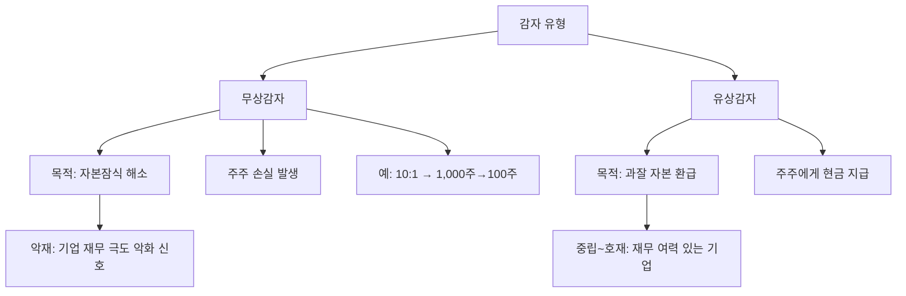

# 감자 뜻 — 주식 수를 강제로 줄이는 것

## 한 줄 정의

감자(減資)는 발행주식 수를 줄여 자본금을 감소시키는 것으로, 무상감자(주주 손실)와 유상감자(주주에게 환급)로 나뉩니다.

## 아주 쉽게 말하면

무상감자: "여러분 주식 10주를 1주로 합칩니다. 보상은 없습니다." → 적자 기업의 자본 정리
유상감자: "주식을 돌려주시면 돈으로 돌려드립니다." → 자본이 과도한 기업의 현금 환급

## 왜 중요한가

무상감자는 대부분 자본잠식 해소 목적으로, 기업 재무가 극도로 악화됐다는 신호입니다. 투자금의 대부분을 잃을 수 있는 위험 이벤트이므로, 감자 공시가 나오면 즉시 대응이 필요합니다.

## 그림으로 이해하기

## 숫자로 보는 예시

> ⚠️ 아래 숫자는 개념 설명을 위한 **가상 예시**이며, 실제 투자 데이터가 아닙니다.

JJ기업 (자본잠식 → 무상감자):
- 자본금: 500억 원 (주당 5,000원 × 1,000만주)
- 이익잉여금: -400억 원 (적자 누적)
- 자본 총계: 100억 원 (자본잠식률 80%)
- **5:1 무상감자 실시**
- 감자 후 자본금: 100억 원 (200만주)
- 이익잉여금: 0원 (적자 차감)
- → 자본잠식 해소, 재출발 가능

## 표로 비교하기

| 구분 | 무상감자 | 유상감자 |
|------|---------|---------|
| 주주 보상 | 없음 | 현금 환급 |
| 목적 | 자본잠식 해소 | 과잉 자본 반환 |
| 기업 상태 | 재무 위기 | 재무 건전 |
| 시장 반응 | 극도로 부정적 | 중립~긍정적 |
| 주가 영향 | 급락 (실질 손실) | 배당과 유사 효과 |

## 초보자가 자주 하는 오해

1. **"감자하면 주가가 10배가 되니 괜찮다"**
   → 10:1 감자 후 주가가 이론적으로 10배가 되지만, 보유 주식 수가 1/10로 줄어 총 가치는 변하지 않습니다. 자본잠식 기업이라 실질 가치는 이미 크게 훼손된 상태입니다.

2. **"감자 후 재상장하면 투자 기회다"**
   → 감자로 형식적으로 자본잠식을 해소해도, 사업 구조가 개선되지 않으면 다시 적자가 누적됩니다. 감자 전력이 있는 기업은 추가 감자 위험이 높습니다.

## 고수는 이렇게 봅니다

숙련된 투자자는 무상감자 공시를 '확정 손실'로 처리하고 즉시 매도합니다. 감자 전에 매도하는 것이 최선이며, 자본잠식률이 50%를 넘으면 감자 위험 종목으로 분류합니다.

## 기업분석에서는 이렇게 씁니다

자본잠식률 = (자본금 - 자본총계) ÷ 자본금 × 100을 모니터링합니다. 50% 이상이면 관리종목, 100%(완전자본잠식)이면 상장폐지 사유이므로, 감자를 통해 형식적 잠식을 해소하려는 기업을 조기에 식별합니다.

## 함께 보면 좋은 용어

- [유상증자](./paid-in-capital-increase.md) — 감자 후 재기를 위해 자주 동반
- [자본](../level-03-financial-statements/equity.md) — 감자의 대상
- [자사주 소각](../level-06-events/share-cancellation.md) — 우량기업의 건전한 주식수 감소
- [액면병합](./reverse-stock-split.md) — 감자와 유사하지만 다른 개념
- [부채비율](../level-04-ratios/debt-ratio.md) — 감자 후 재무구조 변화 확인

## 정리

감자는 주식 수를 줄이는 것으로, 무상감자는 적자 기업의 자본 정리(주주 손실), 유상감자는 과잉 자본의 현금 환급입니다. 무상감자 공시는 강력한 위험 신호이므로, 사전에 자본잠식 기업을 피하는 것이 최선입니다.

## 한 줄 요약

> 감자는 '주식 수를 강제로 줄이는 것'이며, 무상감자는 투자금 손실의 확정 신호입니다.

---

이 글은 투자 권유가 아니라 주식 용어와 기업분석 방법을 설명하기 위한 교육 콘텐츠입니다. 특정 종목의 매수·매도 판단은 독자 본인의 책임입니다.

Tags: 감자, 자본감소, 무상감자, 유상감자, 자본잠식
