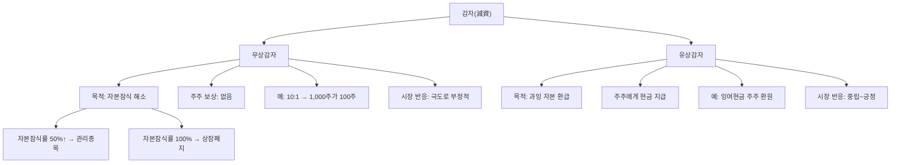

# 감자 뜻 — 주식 수를 강제로 줄이는 것

## 한 줄 정의

감자(減資)는 발행주식 수를 줄여 자본금을 감소시키는 것으로, 무상감자(주주 손실)와 유상감자(주주에게 환급)로 나뉩니다.

## 아주 쉽게 말하면

무상감자: "회사가 빚더미인데 장부를 깨끗이 만들기 위해, 여러분 주식 10주를 1주로 합칩니다. 보상은 없습니다." 주주 입장에서는 실질적으로 돈을 잃는 것입니다.

유상감자: "회사에 현금이 너무 많아서 사업에 다 쓸 수가 없으니, 주식을 돌려주시면 현금으로 돌려드립니다." 주주에게 배당과 유사한 효과입니다.

## 왜 중요한가

무상감자는 대부분 자본잠식 해소 목적으로, 기업 재무가 극도로 악화됐다는 신호입니다. 10:1 감자가 실시되면 1,000주가 100주로 줄어들고 — 이론상 주가는 10배가 되지만 — 총 평가액은 변하지 않으며, 이미 사업이 큰 손실을 본 상태입니다.

투자금의 대부분을 잃을 수 있는 위험 이벤트이므로, 감자 공시가 나오면 즉시 대응이 필요합니다. 한국 시장에서 무상감자는 상장폐지 직전의 "마지막 기회"로 쓰이는 경우가 많습니다.

## 그림으로 이해하기

## 숫자로 보는 예시

> ⚠️ 아래 숫자는 개념 설명을 위한 **가상 예시**이며, 실제 투자 데이터가 아닙니다.

가상의 JJ엔터테인먼트가 누적 적자로 자본잠식에 빠진 상황입니다.

**감자 전 재무 상태:**
- 자본금: 500억 원 (주당 5,000원 × 1,000만 주)
- 이익잉여금: -400억 원 (4년간 적자 누적)
- 자본 총계: 100억 원
- 자본잠식률: (500억 - 100억) ÷ 500억 = **80%** (관리종목 수준)
- 주가: 800원 (액면가 5,000원의 16%)

**5:1 무상감자 실시:**
- 감자 후 자본금: 100억 원 (200만 주 × 5,000원)
- 이익잉여금: 0원 (적자 400억을 자본금 감소분으로 차감)
- 자본 총계: 100억 원 (변동 없음)
- 자본잠식: **해소** (형식적)
- 이론 주가: 800원 × 5 = 4,000원 / 보유 주식: 1,000주 → 200주

**투자자 실질 손익:**
- 투자 원금 (1,000주 × 5,000원 매수): 500만 원
- 감자 후 평가 (200주 × 4,000원): 80만 원
- **실질 손실: -84%** (감자 이전 사업 적자로 이미 발생)

## 표로 비교하기

| 구분 | 무상감자 | 유상감자 | 자사주 소각 |
|------|---------|---------|-----------|
| 주주 보상 | 없음 | 현금 환급 | 간접 (EPS↑) |
| 목적 | 자본잠식 해소 | 과잉 자본 반환 | 주주가치 제고 |
| 기업 상태 | 재무 위기 | 재무 건전 | 재무 우량 |
| 시장 반응 | 극도로 부정적 | 중립~긍정적 | 긍정적 |
| 주가 영향 | 급락 (실질 손실) | 배당과 유사 | 상승 |
| 후속 이벤트 | 유상증자 동반 多 | 없음 | 없음 |

## 초보자가 자주 하는 오해

1. **"감자하면 주가가 10배가 되니 오히려 기회 아닌가?"**
   → 10:1 감자 후 주가가 이론적으로 10배가 되지만, 보유 주식 수가 1/10로 줄어 총 평가액은 동일합니다. 자본잠식 기업이라 실질 가치는 이미 크게 훼손된 상태이며, 감자 후에도 주가가 다시 하락하는 경우가 대부분입니다.

2. **"감자 후 재상장하면 투자 기회다"**
   → 감자로 형식적으로 자본잠식을 해소해도, 사업 구조가 개선되지 않으면 다시 적자가 누적됩니다. 통계적으로 무상감자 이력이 있는 기업의 3년 후 재감자 비율은 상당히 높습니다.

3. **"유상감자도 나쁜 것이다"**
   → 유상감자는 반대입니다. 현금이 과도하게 쌓인 기업이 주주에게 돈을 돌려주는 행위로, 배당과 유사한 긍정적 이벤트입니다. '감자'라는 같은 단어를 쓰지만 성격이 정반대입니다.

4. **"감자 공시 나오면 이미 늦었다"**
   → 공시 후에도 매도 기회가 있습니다. 다만 감자 공시 전에 자본잠식을 예방적으로 탐지하는 것이 최선입니다. 자본잠식률 50%를 넘으면 감자 위험 종목으로 분류해야 합니다.

## 고수는 이렇게 봅니다

숙련된 투자자는 무상감자 공시를 '확정 손실'로 처리하고 즉시 매도합니다. 더 중요한 것은 감자 전에 위험을 감지하는 것입니다:

- **자본잠식률 모니터링**: 분기별 재무제표에서 자본잠식률이 30%를 넘으면 경계, 50%면 매도
- **적자 지속 기간**: 3분기 연속 영업적자면 자본잠식 가능성 점검
- **감자+증자 패키지**: 무상감자 후 유상증자를 동시 발표하는 기업은 "기존 주주 손실 → 새 투자자 유치" 구조
- **감자 비율의 의미**: 10:1은 자본잠식 90%, 5:1은 80% 수준을 시사

## 기업분석에서는 이렇게 씁니다

자본잠식률 = (자본금 - 자본총계) ÷ 자본금 × 100을 모니터링합니다. 50% 이상이면 관리종목, 100%(완전자본잠식)이면 상장폐지 사유입니다.

감자 공시 분석 시 체크포인트:
- 감자 비율에서 역산한 자본잠식 규모
- 감자 후 유상증자 계획 여부 (희석 추가 발생)
- 구조조정 계획의 실행 가능성
- 핵심 사업의 턴어라운드 가능성 (매출 추이, 신규 수주)

## 함께 보면 좋은 용어

- [유상증자](./paid-in-capital-increase.md) — 감자 후 재기를 위해 자주 동반
- [자본](../level-03-financial-statements/equity.md) — 감자의 대상
- [자사주 소각](../level-06-events/share-cancellation.md) — 우량기업의 건전한 주식수 감소
- [액면병합](./reverse-stock-split.md) — 감자와 유사하지만 다른 개념
- [부채비율](../level-04-ratios/debt-ratio.md) — 감자 후 재무구조 변화 확인

## 정리

감자는 주식 수를 줄이는 것으로, 무상감자는 적자 기업의 자본 정리(주주 손실), 유상감자는 과잉 자본의 현금 환급입니다. 무상감자 공시는 강력한 위험 신호이므로, 사전에 자본잠식률을 모니터링하여 위험 종목을 피하는 것이 최선의 전략입니다.

## 한 줄 요약

> 감자는 '주식 수를 강제로 줄이는 것'이며, 무상감자는 투자금 손실의 확정 신호입니다.

---

이 글은 투자 권유가 아니라 주식 용어와 기업분석 방법을 설명하기 위한 교육 콘텐츠입니다. 특정 종목의 매수·매도 판단은 독자 본인의 책임입니다.

Tags: 감자, 자본감소, 무상감자, 유상감자, 자본잠식
