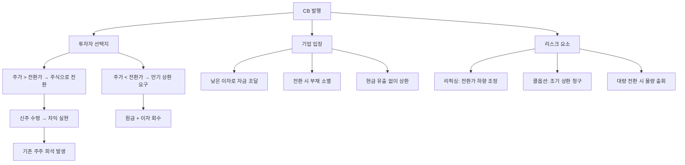

# 전환사채 CB 뜻 — 주식으로 바꿀 수 있는 채권

## 한 줄 정의

전환사채(CB)는 일정 조건에서 주식으로 전환할 수 있는 권리가 붙은 채권으로, 기업은 낮은 이자로 자금을 조달하고 투자자는 주가 상승 시 차익을 노릴 수 있습니다.

## 아주 쉽게 말하면

"100만 원을 빌려주면 이자 3%를 줄게. 그런데 나중에 우리 주가가 올라가면, 그 100만 원을 주식으로 바꿔줄 수도 있어." 채권의 안정성(원금 보장)과 주식의 상승 여력을 동시에 가진 하이브리드 증권입니다. 주가가 안 오르면? 그냥 채권으로 원금+이자를 돌려받으면 됩니다.

## 왜 중요한가

CB가 주식으로 전환되면 발행주식 수가 늘어나 기존 주주의 지분이 희석됩니다. 특히 한국 중소형주에서는 CB 발행이 빈번하며, 전환 시점에 대량 매도 물량이 나와 주가를 누르는 경우가 흔합니다.

기업 입장에서는 일반 채권보다 1~3%p 낮은 이자로 자금을 조달할 수 있어 매력적입니다. 하지만 주가가 상승하면 결국 주식으로 전환되어, "싸게 빌린 대가를 지분으로 지불"하는 구조입니다.

리픽싱(전환가 하향 조정) 조항이 붙은 CB는 주가가 하락할수록 전환 시 발행되는 주식 수가 늘어나, 희석이 더 심해지는 악순환이 발생할 수 있습니다.

## 그림으로 이해하기

## 숫자로 보는 예시

> ⚠️ 아래 숫자는 개념 설명을 위한 **가상 예시**이며, 실제 투자 데이터가 아닙니다.

가상의 CC바이오가 신약 임상 자금 목적으로 CB를 발행한 상황입니다.

**CB 발행 조건:**
- 발행 규모: 100억 원 / 표면이율: 연 1% / 만기: 3년
- 전환가: 10,000원 / 전환 청구 가능 시점: 발행 후 1년
- 리픽싱 조항: 주가가 전환가의 70% 이하로 하락 시, 전환가를 70%까지 하향 조정

**전환 시 희석 계산:**
- 기존 발행주식: 500만 주 / 현재 주가: 15,000원
- 전환 시 신주: 100억 ÷ 10,000 = **100만 주**
- 총 주식: 600만 주 (희석률 20%)
- CB 보유자 차익: 100만 주 × (15,000 - 10,000) = **50억 원**

**리픽싱 발동 시 (주가 7,000원으로 하락):**
- 새 전환가: 10,000 × 70% = 7,000원
- 전환 시 신주: 100억 ÷ 7,000 = **142.8만 주** (기존 대비 43% 증가)
- 희석률: 142.8만 ÷ (500만 + 142.8만) = **22.2%** → 더 큰 희석

## 표로 비교하기

| 항목 | 일반 채권 | 전환사채(CB) | 신주인수권부사채(BW) |
|------|-----------|-------------|-------------------|
| 이자율 | 높음 (5~7%) | 낮음 (1~3%) | 더 낮음 (0~2%) |
| 원금 상환 | 의무 | 전환 안 하면 상환 | 워런트와 무관하게 상환 |
| 주식 전환 | 불가 | 가능 | 별도 대금 납입 필요 |
| 기존 주주 영향 | 없음 | 희석 가능 | 희석 가능 |
| 투자자 수익 구조 | 이자 수익만 | 이자 + 주가차익 | 이자 + 워런트 차익 |
| 분리 매매 | 해당 없음 | 불가 | 가능 |

## 초보자가 자주 하는 오해

1. **"CB 발행은 무조건 악재다"**
   → 자금 용도에 따라 다릅니다. 성장 기업이 R&D나 시설투자 목적으로 CB를 발행하면, 실적 성장이 희석을 상쇄할 수 있습니다. "왜 CB를 발행하는가?"를 먼저 확인하세요.

2. **"전환가가 현재 주가보다 높으면 전환 안 되니 걱정할 필요 없다"**
   → 리픽싱 조항이 있으면 주가 하락 시 전환가도 내려갑니다. 또한 3년 만기 동안 주가가 전환가를 넘을 가능성을 장기적으로 봐야 합니다.

3. **"CB가 전환되면 부채가 줄어드니 좋은 것 아닌가?"**
   → 회계상 부채(CB)가 자본(주식)으로 바뀌므로 부채비율은 개선됩니다. 하지만 기존 주주 입장에서는 지분이 희석되어 주당 가치가 떨어집니다. 부채비율 개선과 EPS 희석을 함께 평가해야 합니다.

4. **"CB 물량이 전환되고 나면 악재 해소다"**
   → 전환 후 보호예수가 없으면 즉시 시장에 매도할 수 있습니다. 전환+매도가 동시에 나오면 주가가 급락합니다. 전환 후 매도 제한 조건을 확인해야 합니다.

## 고수는 이렇게 봅니다

숙련된 투자자는 CB 발행 종목을 분석할 때 네 가지를 핵심으로 봅니다:

첫째, **리픽싱 조항의 유무와 하한선**. 70% 리픽싱이면 최대 43% 추가 희석, 50% 리픽싱이면 최대 100% 추가 희석이 가능합니다.

둘째, **CB 인수자의 정체**. 전략적 투자자(시너지 목적)면 긍정적, 재무적 투자자(차익 목적)면 전환 후 즉시 매도 가능성이 높습니다.

셋째, **전환 가능 시점까지의 잔여 기간**. 1년 이내면 물량 출회 임박, 2년 이상이면 시간적 여유가 있습니다.

넷째, **미전환 CB 잔액 대비 일평균 거래대금**. 이 비율이 10배를 넘으면 시장이 소화하기 어려운 물량입니다.

## 기업분석에서는 이렇게 씁니다

미전환 CB 잔액을 부채에서 잠재 자본으로 재분류하여 희석 EPS를 계산합니다. 최악 시나리오(리픽싱 하한 + 전량 전환)에서의 EPS를 제시하면, 투자자에게 보수적이면서도 현실적인 밸류에이션을 전달할 수 있습니다.

또한 CB 전환 일정표를 만들어 향후 물량 출회 시점을 미리 파악합니다. "1분기에 50억 전환 가능, 3분기에 추가 50억 전환 가능" 식으로 시점별 리스크를 정량화합니다.

## 함께 보면 좋은 용어

- [신주인수권부사채 BW](./bond-with-warrant.md) — CB와 유사하지만 분리 가능한 구조
- [유상증자](./paid-in-capital-increase.md) — 직접 주식을 발행하여 자금 조달
- [EPS](../level-05-valuation/eps.md) — CB 전환 시 희석되는 핵심 지표
- [보호예수](./lock-up.md) — 전환 후 매도 제한이 걸리는 경우
- [감자](./capital-reduction.md) — 주식 수를 줄이는 반대 개념

## 정리

전환사채(CB)는 채권이지만 주식으로 바꿀 수 있는 권리가 붙어 있습니다. 기업은 낮은 이자로 자금을 조달하고, 투자자는 주가 상승 시 차익을 노립니다. 기존 주주 입장에서는 전환 시 지분 희석이 발생하므로, 미전환 CB 잔액·리픽싱 조건·전환 일정을 반드시 확인해야 합니다.

## 한 줄 요약

> 전환사채(CB)는 주식으로 바꿀 수 있는 채권이며, 전환 시 기존 주주의 지분이 희석됩니다.

---

이 글은 투자 권유가 아니라 주식 용어와 기업분석 방법을 설명하기 위한 교육 콘텐츠입니다. 특정 종목의 매수·매도 판단은 독자 본인의 책임입니다.

Tags: 전환사채, 주식전환, 자금조달, 희석효과, 채권투자
