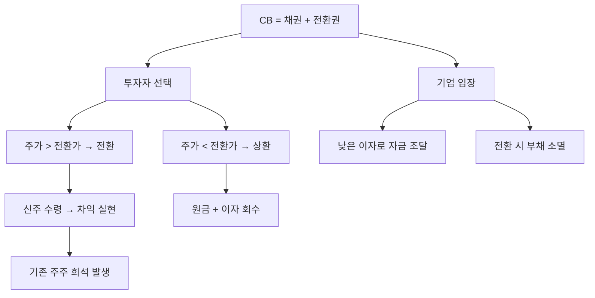

# 전환사채 CB 뜻 — 주식으로 바꿀 수 있는 채권

## 한 줄 정의

전환사채(CB)는 일정 조건에서 주식으로 전환할 수 있는 권리가 붙은 채권입니다.

## 아주 쉽게 말하면

"나중에 원하면 이 빌려준 돈을 주식으로 바꿔줄게"라는 약속이 붙은 채권입니다. 채권의 안정성 + 주식의 상승 가능성을 동시에 노릴 수 있습니다.

## 왜 중요한가

- CB가 주식으로 전환되면 발행주식 수가 늘어나 기존 주주 지분이 희석됩니다
- 전환가액보다 주가가 높으면 CB 보유자가 전환 후 차익 실현할 수 있습니다
- 기업 입장에서는 일반 채권보다 낮은 이자로 자금을 조달할 수 있습니다
- CB 발행 공시는 단기적으로 주가에 악재로 작용하는 경우가 많습니다

## 그림으로 이해하기

## 숫자로 보는 예시

> ⚠️ 아래 숫자는 개념 설명을 위한 **가상 예시**이며, 실제 투자 데이터가 아닙니다.

C기업이 CB 100억 원(전환가 10,000원)을 발행합니다.

- 전환 시 신규 주식: 100억 ÷ 10,000원 = 100만 주
- 기존 발행주식: 500만 주
- 전환 후 총 주식: 600만 주 (희석률 20%)

현재 주가가 15,000원이면 CB 보유자는 전환 후 즉시 50억 원 차익이 가능합니다.

## 표로 비교하기

| 항목 | 일반 채권 | 전환사채(CB) |
|------|-----------|-------------|
| 이자율 | 높음 | 낮음 (전환 프리미엄 반영) |
| 원금 상환 | 의무 | 전환 안 하면 상환 |
| 주식 전환 | 불가 | 가능 |
| 기존 주주 영향 | 없음 | 희석 가능 |
| 투자자 수익 구조 | 이자 수익 | 이자 + 주가 상승 차익 |

## 초보자가 자주 하는 오해

**오해 1: "CB 발행은 무조건 악재다"**

성장 기업이 사업 확장 자금으로 CB를 발행하면, 실적 성장이 희석을 상쇄할 수 있습니다. 자금 용도를 먼저 확인하세요.

**오해 2: "전환가가 현재 주가보다 높으면 안전하다"**

전환가는 리픽싱(하향 조정) 조항이 붙는 경우가 많습니다. 주가가 하락하면 전환가도 내려가 희석이 더 커질 수 있습니다.

## 고수는 이렇게 봅니다

- CB 발행 조건(전환가, 리픽싱 조항, 콜옵션)을 꼼꼼히 확인합니다
- 전환 가능 시점에 맞춰 매도 물량 출회 가능성을 예측합니다
- CB 인수자가 누구인지(전략적 투자자 vs 재무적 투자자)를 봅니다
- 잔여 CB 규모 대비 일일 거래대금을 비교하여 오버행 부담을 측정합니다

## 기업분석에서는 이렇게 씁니다

- 미전환 CB 잔액을 부채에서 잠재 자본으로 재분류하여 희석 EPS를 계산합니다
- CB 자금 용도(운영자금, 시설투자, 타법인 인수)에 따라 성장성을 판단합니다
- 전환 일정표를 만들어 향후 물량 출회 시점을 미리 파악합니다

## 함께 보면 좋은 용어

- [신주인수권부사채 BW](./bond-with-warrant.md): CB와 유사하지만 분리 가능한 구조
- [유상증자](./paid-in-capital-increase.md): 직접 주식을 발행하여 자금 조달
- [EPS](../level-05-valuation/eps.md): CB 전환 시 희석되는 핵심 지표
- [보호예수](./lock-up.md): 전환 후 매도 제한이 걸리는 경우
- [감자](./capital-reduction.md): 주식 수를 줄이는 반대 개념

## 정리

전환사채(CB)는 채권이지만 주식으로 바꿀 수 있는 권리가 붙어 있습니다. 기업은 낮은 이자로 자금을 조달하고, 투자자는 주가 상승 시 차익을 노립니다. 기존 주주 입장에서는 전환 시 지분 희석이 발생하므로, 미전환 CB 잔액과 전환 조건을 반드시 확인해야 합니다.

## 한 줄 요약

> 전환사채(CB)는 주식으로 바꿀 수 있는 채권이며, 전환 시 기존 주주의 지분이 희석됩니다.

---

*면책 조항: 이 글은 투자 권유가 아니라 주식 용어와 기업분석 방법을 설명하기 위한 교육 콘텐츠입니다. 특정 종목의 매수·매도 판단은 독자 본인의 책임입니다.*

Tags: 전환사채, CB, 전환가액, 희석, 메자닌
