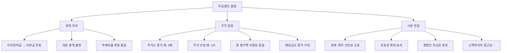

# 무상증자 뜻 — 공짜로 새 주식을 받는 것

## 한 줄 정의

무상증자는 기업이 이익잉여금이나 자본잉여금을 자본금으로 전입해 기존 주주에게 무료로 신주를 배정하는 것입니다.

## 아주 쉽게 말하면

회사가 "그동안 이익을 잘 쌓았으니, 기존 주주에게 주식을 공짜로 나눠줄게"라고 하는 것입니다. 100주를 가진 주주가 100% 무상증자를 받으면 200주가 됩니다. 대신 주가는 절반으로 조정되어, 총 평가액은 이론적으로 동일합니다.

그런데 왜 호재일까요? "우리는 잉여금이 충분히 쌓였고, 앞으로도 잘 될 자신이 있다"는 경영진의 자신감 표현이기 때문입니다.

## 왜 중요한가

무상증자는 이익잉여금이 풍부해야 가능하므로, 재무 건전성의 긍정 신호입니다. 주가가 낮아지면 소액 투자자의 접근성이 좋아지고 거래량이 늘어나 유동성이 개선됩니다.

시장에서는 무상증자를 대체로 호재로 반응합니다. 이론상 총 가치가 변하지 않지만, 실제로는 "경영진 자신감 + 유동성 개선 + 심리적 효과"가 결합되어 주가가 추가 상승하는 경향이 있습니다. 특히 고가주(주당 50만 원 이상)의 무상증자는 접근성 개선 효과가 커서 시장 반응이 강합니다.

## 그림으로 이해하기

## 숫자로 보는 예시

> ⚠️ 아래 숫자는 개념 설명을 위한 **가상 예시**이며, 실제 투자 데이터가 아닙니다.

가상의 II전자가 100% 무상증자(1주당 1주)를 공시한 상황입니다.

**무상증자 전:**
- 발행주식: 1,000만 주 / 주가: 60,000원 / 시총: 6,000억 원
- 이익잉여금: 3,000억 원 / 자본금: 500억 원
- EPS: 6,000원 / 배당금: 주당 2,000원

**무상증자 후 (이론가):**
- 발행주식: 2,000만 주 / 이론 주가: 30,000원 / 시총: 6,000억 원
- 자본금: 1,000억 원 (+500억 전입) / 이익잉여금: 2,500억 원
- EPS: 3,000원 (동일한 이익 ÷ 2배 주식)

**실제 시장 반응 (과거 사례 경향):**
- 공시 당일: +5~10% 상승 (시총 6,300~6,600억)
- 1개월 후: 시총 6,500억 수준 유지 (프리미엄 지속)
- 배당 효과: 주당 배당 유지 시(2,000원) → 2배 주식 보유 → 배당 총액 2배

## 표로 비교하기

| 구분 | 무상증자 | 유상증자 | 액면분할 |
|------|---------|---------|---------|
| 대가 | 없음 (공짜) | 현금 납입 | 없음 |
| 자본 유입 | × | ○ | × |
| 회계 처리 | 잉여금 → 자본금 전입 | 외부 자본 유입 | 액면가 변경 |
| 총 자본 변화 | 불변 | 증가 | 불변 |
| 시장 반응 | 호재 | 대체로 악재 | 호재 |
| 기존 주주 가치 | 불변 (심리적 프리미엄) | 희석 가능 | 불변 |
| 전제 조건 | 잉여금 충분 | 없음 | 이사회 결의 |

## 초보자가 자주 하는 오해

1. **"무상증자면 공짜로 돈을 버는 것이다"**
   → 주식 수는 늘지만 주가가 그만큼 조정되어 이론적 총 가치는 변하지 않습니다. 다만 시장 심리적으로 호재 반응이 나와 주가가 추가 상승하는 "경향"이 있을 뿐, 보장된 수익은 아닙니다.

2. **"무상증자는 아무 기업이나 할 수 있다"**
   → 이익잉여금이나 자본잉여금이 충분해야 합니다. 적자가 누적된 기업은 전입할 잉여금이 없어 무상증자가 불가능합니다. 무상증자를 할 수 있다는 것 자체가 재무 건전성의 증거입니다.

3. **"무상증자 공시 후에 사도 효과가 있다"**
   → 공시 직후 주가가 급등하여 프리미엄이 이미 반영되는 경우가 많습니다. 권리락일 전에 매수해야 신주를 받을 수 있으며, 권리락 이후 주가가 이론가 이하로 빠지는 경우도 있습니다.

4. **"무상증자 비율이 크면 무조건 좋다"**
   → 500% 무상증자처럼 과도한 비율은 오히려 의문을 줄 수 있습니다. 잉여금 규모 대비 적정한 비율인지, 향후 배당 여력이 유지되는지를 함께 봐야 합니다.

## 고수는 이렇게 봅니다

숙련된 투자자는 무상증자를 "경영진이 주가에 자신 있다"는 시그널로 해석합니다.

핵심 체크포인트:
- **잉여금 규모**: 무상증자 후에도 잉여금이 충분히 남는지 (추가 증자 가능성)
- **배당 정책 연속성**: 무상증자 후에도 주당 배당금을 유지하면 실질 배당 증가 효과
- **증자 비율**: 50~100%가 가장 호감도가 높음, 200%+ 이상은 과도
- **타이밍**: 실적 호전기에 하면 "앞으로도 잘 될 것"이라는 강한 신호

## 기업분석에서는 이렇게 씁니다

무상증자 공시 후 이익잉여금 규모를 확인합니다. 잉여금이 자본금 대비 5배 이상이면 추가 무상증자 가능성도 있으며, 이는 주가 지지 요인입니다.

또한 무상증자 후 "주당 배당금 유지 여부"가 핵심 분석 포인트입니다. 증자 전 주당 2,000원 배당 → 증자 후에도 2,000원 유지 = 실질 배당 2배 = 배당수익률 급등 → 강한 호재입니다.

## 함께 보면 좋은 용어

- [유상증자](./paid-in-capital-increase.md) — 돈을 받는 증자 (무상증자와 반대)
- [권리락](../level-06-events/ex-rights.md) — 무상증자 기준일 후 주가 조정
- [액면분할](./stock-split.md) — 무상증자와 유사한 주가 인하 효과
- [이익잉여금](../level-03-financial-statements/equity.md) — 무상증자의 재원
- [자본](../level-03-financial-statements/equity.md) — 무상증자의 회계적 구조

## 정리

무상증자는 잉여금을 자본금으로 전입해 공짜 주식을 배정하는 것입니다. 총 가치는 이론상 변하지 않지만, 재무 건전성 시그널·유동성 개선·배당 증가 기대로 시장에서 호재로 반응하는 경우가 많습니다. 잉여금 규모와 배당 정책 연속성이 핵심 판단 기준입니다.

## 한 줄 요약

> 무상증자는 '잉여금으로 공짜 주식을 주는 것'이며, 재무 건전성과 경영진 자신감의 긍정 신호입니다.

---

이 글은 투자 권유가 아니라 주식 용어와 기업분석 방법을 설명하기 위한 교육 콘텐츠입니다. 특정 종목의 매수·매도 판단은 독자 본인의 책임입니다.

Tags: 무상증자, 이익잉여금, 자본전입, 주식분할효과, 호재
