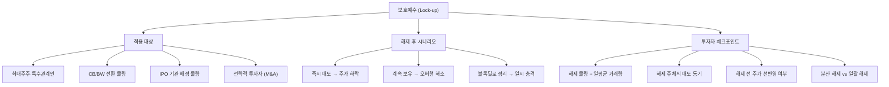

# 보호예수 뜻 — 일정 기간 주식 매도를 금지하는 것

## 한 줄 정의

보호예수(Lock-up)는 특정 주주가 일정 기간 동안 보유 주식을 팔지 못하도록 제한하는 제도로, IPO·CB전환·M&A 후 대량 매도에 의한 주가 급락을 방지합니다.

## 아주 쉽게 말하면

"이 주식은 6개월 동안 절대 못 팝니다"라는 약속입니다. 회사가 상장하거나 CB를 전환할 때, "받자마자 바로 팔아버리면 주가가 폭락하니까, 일정 기간은 묶어두겠다"는 장치입니다. 기간이 끝나면? 그때부터 마음대로 팔 수 있어서 주가가 흔들릴 수 있습니다.

## 왜 중요한가

보호예수 해제일에 대량 매도 물량이 시장에 쏟아질 수 있어 주가 하락 위험이 있습니다. 특히 IPO 직후 6개월~1년 시점에 해제되는 최대주주·기관 물량은 유통주식 대비 수배에 달하는 경우가 있어, 수급에 큰 부담을 줍니다.

투자자 입장에서 보호예수는 "예고된 리스크"입니다. 해제 일정이 공시로 확인 가능하므로, 미리 대비할 수 있는 이벤트입니다. 오버행(잠재 매도 물량) 규모와 해제 주체를 파악하면 리스크를 관리할 수 있습니다.

## 그림으로 이해하기

## 숫자로 보는 예시

> ⚠️ 아래 숫자는 개념 설명을 위한 **가상 예시**이며, 실제 투자 데이터가 아닙니다.

가상의 EE플랫폼이 IPO 후 보호예수가 단계적으로 해제되는 상황입니다.

**IPO 직후 주식 구성:**
- 총 발행주식: 1,000만 주
- 유통 가능: 250만 주 (25%)
- 보호예수: 750만 주 (75%)
- 일평균 거래량: 20만 주

**단계별 해제 일정:**

| 시점 | 해제 물량 | 해제 주체 | 거래량 대비 | 위험도 |
|------|----------|----------|-----------|--------|
| 1개월 | 50만 주 | 기관 (1개월 확약) | 2.5일분 | 낮음 |
| 3개월 | 100만 주 | 기관 (3개월 확약) | 5일분 | 중간 |
| 6개월 | 200만 주 | PE펀드·초기투자자 | 10일분 | 높음 |
| 1년 | 400만 주 | 최대주주·특관 | 20일분 | 매우 높음 |

**6개월 해제 시나리오:**
- 해제 물량 200만 주 = 유통주식의 80%에 해당
- PE펀드 목표 수익률 달성 시 → 블록딜로 전량 매각 가능성
- 주가 영향: 할인율 5~8% 적용 시 단기 -5~8% 조정 예상

## 표로 비교하기

| 보호예수 유형 | 기간 | 대상 | 해제 후 매도 확률 |
|-------------|------|------|-----------------|
| IPO 최대주주 | 6개월~1년 | 최대주주·특수관계인 | 낮음 (경영권 유지) |
| IPO 기관투자자 | 1~6개월 | 수요예측 참여 기관 | 높음 (단기 차익) |
| CB/BW 전환 물량 | 1~6개월 | 전환사채 투자자 | 매우 높음 (차익 실현) |
| 전략적 투자자 | 6개월~2년 | M&A·제3자배정 참여자 | 중간 (목적에 따라) |
| 스톡옵션 행사 | 별도 규정 | 임직원 | 중간 (세금 목적) |

## 초보자가 자주 하는 오해

1. **"보호예수 해제 = 무조건 폭락"**
   → 해제된다고 모든 주주가 즉시 파는 것은 아닙니다. 최대주주는 경영권 유지를 위해 보유하고, 전략적 투자자는 시너지를 위해 계속 보유하는 경우가 많습니다. "누가" 해제되는지가 핵심입니다.

2. **"보호예수 기간에는 주가가 안정적이다"**
   → 보호예수 물량이 많을수록, 해제일에 대한 불안감이 주가에 미리 반영(선반영)됩니다. 해제 2~3주 전부터 주가가 하락하는 "선제적 매도"가 나타나기도 합니다.

3. **"해제 물량이 크면 무조건 피해야 한다"**
   → 해제 후 실제 매도가 일어나지 않거나, 해제 전에 이미 충분히 하락(선반영)했다면 오히려 매수 기회입니다. 해제 후 2~3일 주가가 안정적이면 "오버행 해소 확인"으로 긍정적입니다.

4. **"보호예수 기간이 길수록 좋다"**
   → 기간이 길면 해제 시점이 늦어질 뿐, 오버행 자체가 사라지는 것은 아닙니다. 오히려 오랜 기간 "잠재 매도 물량"이 주가를 억누르는 할인 요인으로 작용합니다.

## 고수는 이렇게 봅니다

숙련된 투자자는 보호예수를 "예고된 이벤트"로 관리합니다:

- **해제 일정표 작성**: 날짜별 해제 물량과 주체를 정리하여 투자 타임라인에 반영
- **해제 주체별 매도 확률 차등 적용**: 최대주주(10%), PE펀드(80%), CB전환(90%)
- **선반영 판단**: 해제 2주 전 주가가 이미 해제 물량 비율만큼 하락했다면 "선반영 완료"
- **블록딜 대비**: 대형 해제 물량은 블록딜로 처리될 가능성이 높으므로, 블록딜 공시 후 대응

## 기업분석에서는 이렇게 씁니다

오버행 분석: 미해제 보호예수 물량을 유통 가능 주식수에서 제외하여 "실질 유통비율"을 계산합니다. 실질 유통비율이 20% 미만이면 수급이 극도로 제한적이며, 해제 시 충격이 클 수 있습니다.

또한 보호예수 해제 일정을 반영한 "향후 6개월 유통주식 증가 스케줄"을 작성하여, 시점별 수급 부담을 정량화합니다. 이를 PER 할인율에 반영하여 적정가치를 보수적으로 산출합니다.

## 함께 보면 좋은 용어

- [블록딜](./block-deal.md) — 보호예수 해제 후 대량 매도 방식
- [유상증자](./paid-in-capital-increase.md) — 신주 발행 후 보호예수가 걸리기도 함
- [전환사채 CB](./convertible-bond.md) — 전환 후 보호예수 대상
- [공개매수](./tender-offer.md) — 대량 지분 취득 후 보호예수 적용
- [시가총액](../level-01-basic/market-cap.md) — 유통 가능 물량과 구분하여 봐야 할 지표

## 정리

보호예수는 특정 주주의 매도를 일정 기간 제한하는 제도입니다. IPO·CB전환·M&A 등에서 적용되며, 해제일에 대량 매도 물량이 시장에 나올 수 있어 주가 하락 요인이 됩니다. 해제 일정·물량 규모·해제 주체를 미리 파악하고, 선반영 여부를 판단하는 것이 핵심입니다.

## 한 줄 요약

> 보호예수는 주식 매도 금지 기간이며, 해제일에 물량 출회로 주가가 흔들릴 수 있는 "예고된 리스크"입니다.

---

이 글은 투자 권유가 아니라 주식 용어와 기업분석 방법을 설명하기 위한 교육 콘텐츠입니다. 특정 종목의 매수·매도 판단은 독자 본인의 책임입니다.

Tags: 보호예수, 락업, 의무보유, 물량출회, 기업공개
