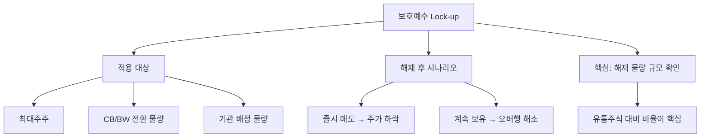

# 보호예수 뜻 — 일정 기간 주식 매도를 금지하는 것

## 한 줄 정의

보호예수(Lock-up)는 특정 주주가 일정 기간 동안 보유 주식을 팔지 못하도록 제한하는 제도입니다.

## 아주 쉽게 말하면

"이 주식은 6개월 동안 절대 못 팝니다"라는 약속입니다. IPO나 CB 전환 후 대량 매도로 주가가 급락하는 것을 막기 위한 장치입니다.

## 왜 중요한가

- 보호예수 해제일에 대량 매도 물량이 나올 수 있어 주가 하락 위험이 있습니다
- IPO 직후 최대주주·기관의 물량이 묶여 있어 단기 수급이 안정됩니다
- 해제 일정은 공시를 통해 미리 확인할 수 있습니다
- 오버행(잠재 매도 물량) 규모가 클수록 주가 부담이 커집니다

## 그림으로 이해하기

## 숫자로 보는 예시

> ⚠️ 아래 숫자는 개념 설명을 위한 **가상 예시**이며, 실제 투자 데이터가 아닙니다.

E기업이 IPO 후 보호예수 해제 일정:

- 총 발행주식: 1,000만 주
- 보호예수 물량: 600만 주 (60%)
- 일평균 거래량: 20만 주
- 해제 물량 ÷ 일평균 거래량 = 30일분 (매도 부담 큼)

해제 물량이 일평균 거래량의 10배 이상이면 시장에서 "오버행 부담"으로 봅니다.

## 표로 비교하기

| 보호예수 유형 | 기간 | 대상 |
|-------------|------|------|
| IPO 최대주주 | 6개월~1년 | 최대주주·특수관계인 |
| IPO 기관투자자 | 1~6개월 | 수요예측 참여 기관 |
| CB/BW 전환 물량 | 1~6개월 | 전환사채 투자자 |
| 전략적 투자자 | 6개월~2년 | M&A·제3자배정 참여자 |
| 스톡옵션 행사 | 별도 규정 | 임직원 |

## 초보자가 자주 하는 오해

**오해 1: "보호예수 해제 = 무조건 폭락"**

해제된다고 모든 주주가 즉시 파는 것은 아닙니다. 최대주주는 경영권 유지를 위해 보유하는 경우가 많습니다.

**오해 2: "보호예수 기간에는 안전하다"**

보호예수 물량이 많을수록, 해제일에 대한 불안감이 주가에 미리 반영(선반영)될 수 있습니다.

## 고수는 이렇게 봅니다

- 해제 일정표를 만들어 날짜별 해제 물량을 정리합니다
- 해제 주체(최대주주 vs 재무적 투자자)에 따라 실제 매도 확률을 다르게 봅니다
- 해제 전 주가가 이미 하락했다면 "선반영 완료"로 판단하기도 합니다
- 해제 물량 대비 일평균 거래대금 비율로 소화 가능성을 측정합니다

## 기업분석에서는 이렇게 씁니다

- 오버행 분석: 미해제 보호예수 물량을 유통가능 주식수에서 제외하여 실질 유통비율을 계산합니다
- 해제 일정을 투자 타임라인에 반영하여 진입 시점을 조절합니다
- CB/BW 전환 후 보호예수 조건을 확인하여 단기 매도 가능 여부를 판단합니다

## 함께 보면 좋은 용어

- [블록딜](./block-deal.md): 보호예수 해제 후 대량 매도 방식
- [유상증자](./paid-in-capital-increase.md): 신주 발행 후 보호예수가 걸리기도 함
- [전환사채 CB](./convertible-bond.md): 전환 후 보호예수 대상
- [공개매수](./tender-offer.md): 대량 지분 취득 후 보호예수 적용
- [시가총액](../level-01-basic/market-cap.md): 유통 가능 물량과 구분하여 봐야 할 지표

## 정리

보호예수는 특정 주주의 매도를 일정 기간 제한하는 제도입니다. IPO·CB전환·M&A 등에서 적용되며, 해제일에 대량 매도 물량이 시장에 나올 수 있어 주가 하락 요인이 됩니다. 해제 일정과 물량 규모를 미리 확인하는 것이 핵심입니다.

## 한 줄 요약

> 보호예수는 주식 매도 금지 기간이며, 해제일에 물량 출회로 주가가 흔들릴 수 있습니다.

---

*면책 조항: 이 글은 투자 권유가 아니라 주식 용어와 기업분석 방법을 설명하기 위한 교육 콘텐츠입니다. 특정 종목의 매수·매도 판단은 독자 본인의 책임입니다.*

Tags: 보호예수, 락업, 의무보유, 물량출회, IPO
