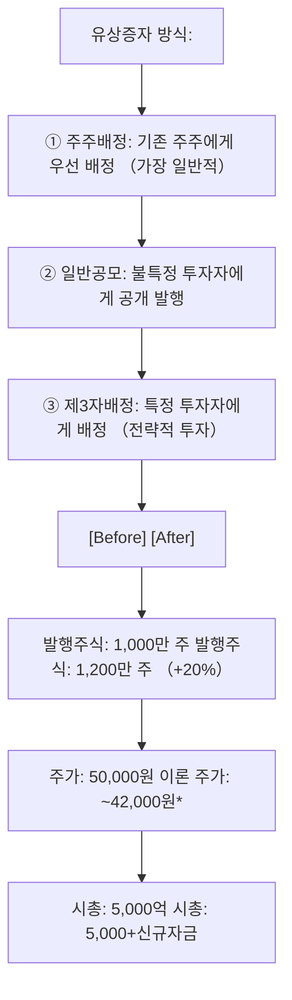

# 유상증자 뜻 — 돈을 받고 새 주식을 발행하는 것

## 한 줄 정의

유상증자는 기업이 투자자에게 돈을 받고 새로운 주식을 발행하는 자본 조달 방식으로, 주식수가 늘어나 기존 주주의 지분이 희석됩니다.

## 아주 쉽게 말하면

피자를 8조각으로 나눠 먹고 있었는데, 새 친구 2명이 돈을 내고 참여해 10조각으로 다시 자릅니다. 기존 사람의 조각이 작아지지만, 피자 자체가 커질 수 있습니다(투자금으로 사업 확장).

## 왜 중요한가

유상증자는 단기적으로 주가에 악재로 해석되는 경우가 많습니다(희석 + 물량 부담). 하지만 조달 자금의 용도가 성장 투자이면 장기적으로 긍정적일 수 있습니다. "왜 증자하는가?"가 투자 판단의 핵심입니다.

## 그림으로 이해하기

## 숫자로 보는 예시

> ⚠️ 아래 숫자는 개념 설명을 위한 **가상 예시**이며, 실제 투자 데이터가 아닙니다.

HH기업 주주배정 유상증자:
- 기존 주식: 1,000만 주, 주가: 50,000원
- 신주 발행: 200만 주 (20% 증자)
- 발행가: 40,000원 (현재가 대비 20% 할인)
- 조달 금액: 200만 × 40,000 = **800억 원**
- 희석 후 이론 주가: (50,000×1,000만 + 40,000×200만) ÷ 1,200만 = **48,333원**

## 표로 비교하기

| 유상증자 목적 | 시장 반응 | 예시 |
|-------------|----------|------|
| 시설투자·R&D | 중립~긍정 | 반도체 공장 증설 |
| 인수합병(M&A) | 중립 | 전략적 사업 확장 |
| 운영자금 | 부정적 | 현금 부족 신호 |
| 부채 상환 | 부정적 | 재무 위기 신호 |
| 신사업 진출 | 불확실 | 성공 여부에 따라 |

## 초보자가 자주 하는 오해

1. **"유상증자는 무조건 악재다"**
   → 목적에 따라 다릅니다. 테슬라, 삼성SDI 등도 대규모 시설투자를 위해 유상증자했고, 장기적으로 주가가 올랐습니다. 핵심은 조달 자금의 투자수익률(ROIC)이 자본비용을 넘느냐입니다.

2. **"신주 발행가가 현재 주가보다 낮으면 손해다"**
   → 할인 발행은 청약 매력도를 높이기 위한 관행입니다. 기존 주주는 신주인수권으로 할인가에 참여할 수 있어, 참여하면 희석 효과를 상쇄할 수 있습니다.

## 고수는 이렇게 봅니다

숙련된 투자자는 '증자 후 ROE 변화'를 시뮬레이션합니다. 자본이 20% 늘었을 때 이익이 20% 이상 늘어날 투자라면 가치 창출, 그 이하면 가치 파괴입니다. 또한 제3자배정은 전략적 파트너 유입으로 긍정적인 경우가 많습니다.

## 기업분석에서는 이렇게 씁니다

유상증자 공시 분석 시: ① 증자 규모(시총 대비 %) ② 발행가 할인율 ③ 자금 사용처 ④ 증자 후 부채비율 변화 ⑤ 기대 수익률을 순서대로 점검합니다. 운영자금 목적의 대규모 증자는 강한 매도 신호입니다.

## 함께 보면 좋은 용어

- [무상증자](./free-capital-increase.md) — 돈 없이 주식만 늘리는 증자
- [권리락](../level-06-events/ex-rights.md) — 증자 기준일 후 주가 조정
- [자본](../level-03-financial-statements/equity.md) — 증자로 증가하는 항목
- [EPS](../level-05-valuation/eps.md) — 주식수 증가로 희석되는 지표
- [전환사채](./convertible-bond.md) — 잠재적 유상증자 효과가 있는 채권

## 정리

유상증자는 돈을 받고 새 주식을 발행하는 자본 조달로, 기존 주주의 지분이 희석됩니다. 자금 용도(성장 투자 vs 운영자금)에 따라 긍정·부정이 갈리며, 증자 후 ROE 변화가 핵심 판단 기준입니다.

## 한 줄 요약

> 유상증자는 '돈 받고 새 주식을 찍는 것'이며, 그 돈으로 가치를 창출할 수 있는지가 핵심입니다.

---

*면책 조항: 이 글은 투자 권유가 아니라 주식 용어와 기업분석 방법을 설명하기 위한 교육 콘텐츠입니다. 특정 종목의 매수·매도 판단은 독자 본인의 책임입니다.*

Tags: 유상증자, 신주발행, 자본조달, 희석, 주주배정
