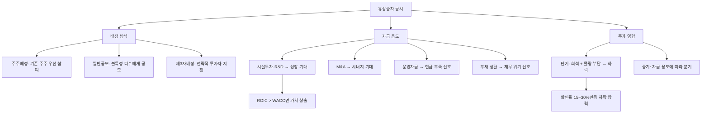

# 유상증자 뜻 — 돈을 받고 새 주식을 발행하는 것

## 한 줄 정의

유상증자는 기업이 투자자에게 돈을 받고 새로운 주식을 발행하는 자본 조달 방식으로, 주식수가 늘어나 기존 주주의 지분이 희석됩니다.

## 아주 쉽게 말하면

피자를 8명이 나눠 먹고 있었는데, 가게 주인이 "새 친구 2명이 돈을 내고 참여할 거야"라고 합니다. 이제 10명이 나눠 먹으니 내 조각이 작아집니다. 하지만 그 돈으로 피자를 더 크게 만들 수 있다면? 결국 내 조각이 오히려 커질 수도 있습니다. "그 돈을 어디에 쓰는가"가 핵심입니다.

## 왜 중요한가

유상증자는 단기적으로 주가에 악재로 해석되는 경우가 많습니다. 이유는 세 가지입니다: ① 주식수 증가로 EPS 희석, ② 발행가가 시장가보다 할인되어 기존 주주 가치 하락, ③ "회사가 돈이 부족한가?"라는 부정적 시그널.

하지만 모든 유상증자가 악재는 아닙니다. 조달 자금으로 높은 수익률의 투자(공장 증설, 유망 M&A)를 하면, 희석을 상쇄하고도 남는 가치를 창출할 수 있습니다. "왜 증자하는가?"와 "그 돈의 ROI가 자본비용을 넘는가?"가 투자 판단의 핵심입니다.

## 그림으로 이해하기

## 숫자로 보는 예시

> ⚠️ 아래 숫자는 개념 설명을 위한 **가상 예시**이며, 실제 투자 데이터가 아닙니다.

가상의 HH반도체가 신규 공장 증설 목적으로 주주배정 유상증자를 공시한 상황입니다.

**증자 전 상태:**
- 발행주식: 1,000만 주 / 주가: 50,000원 / 시총: 5,000억 원
- 순이익: 500억 원 / EPS: 5,000원 / PER: 10배

**유상증자 조건:**
- 신주 발행: 200만 주 (20% 증자)
- 발행가: 40,000원 (현재가 대비 20% 할인)
- 조달 금액: 200만 × 40,000 = **800억 원**
- 자금 용도: 반도체 공장 증설 (2년 후 가동)

**희석 계산:**
- 증자 후 총 주식: 1,200만 주
- 이론적 주가: (5,000억 + 800억) ÷ 1,200만 = **48,333원 (-3.3%)**
- 희석 EPS (이익 동일 가정): 500억 ÷ 1,200만 = 4,167원 (-16.7%)

**2년 후 공장 가동 시 (성공 시나리오):**
- 추가 이익: 300억 원 / 총 이익: 800억 원
- 새 EPS: 800억 ÷ 1,200만 = **6,667원 (+33.3% vs 증자 전)**
- PER 10배 적용 시 주가: 66,670원 (+33.3%)

## 표로 비교하기

| 유상증자 목적 | 시장 반응 | 핵심 판단 기준 |
|-------------|----------|--------------|
| 시설투자·R&D | 중립~긍정 | 투자 ROI > 자본비용? |
| 인수합병(M&A) | 중립 | 인수 대상의 시너지 현실성? |
| 운영자금 | 부정적 | 현금흐름 악화의 구조적 문제? |
| 부채 상환 | 부정적 | 부채 규모가 감당 불가 수준? |
| 신사업 진출 | 불확실 | 신사업의 성공 가능성? |

## 초보자가 자주 하는 오해

1. **"유상증자는 무조건 악재다"**
   → 목적에 따라 완전히 다릅니다. 고성장 기업이 대규모 시설투자를 위해 증자하면 장기적으로 주가가 크게 오르기도 합니다. 핵심은 "조달 자금의 ROIC가 WACC(자본비용)을 넘느냐"입니다.

2. **"발행가가 현재 주가보다 낮으면 기존 주주만 손해다"**
   → 할인 발행은 청약 성공률을 높이기 위한 관행입니다. 기존 주주는 신주인수권을 배정받아 할인가에 참여할 수 있으므로, 참여하면 희석 효과를 상쇄할 수 있습니다.

3. **"제3자배정은 무조건 나쁘다"**
   → 전략적 파트너(글로벌 기업, 핵심 기술 보유사)에 대한 제3자배정은 오히려 호재입니다. 누구에게 배정하는지, 그 파트너와의 시너지가 무엇인지를 봐야 합니다.

4. **"증자 규모가 작으면 괜찮다"**
   → 시총 대비 5% 미만 증자는 영향이 작지만, 빈번한 소규모 증자(연 2~3회)는 "만성적 현금 부족"을 의미하며 이는 더 부정적입니다.

## 고수는 이렇게 봅니다

숙련된 투자자는 '증자 후 ROE 변화'를 시뮬레이션합니다:

- 자본이 20% 늘었을 때 이익이 20% 이상 늘어날 투자라면 → **가치 창출** (매수 기회)
- 이익 증가가 20% 미만이면 → **가치 파괴** (매도 또는 회피)

또한 다음을 체크합니다:
- **증자 후 부채비율 변화**: 부채비율이 크게 개선되면 재무 안정성 긍정 효과
- **신주인수권 매매 가능 여부**: 청약 안 할 거면 신주인수권을 팔아 보상 가능
- **증자 이력**: 3년 내 2회 이상 증자한 기업은 만성적 현금 부족 → 경계

## 기업분석에서는 이렇게 씁니다

유상증자 공시 분석 시 5단계 체크리스트:
1. 증자 규모 (시총 대비 %) — 10% 이상이면 유의미한 희석
2. 발행가 할인율 — 20~30% 할인이 관행, 50%+ 이상은 비정상
3. 자금 사용처 — 구체적 투자 계획 vs 불명확한 "운영자금"
4. 증자 후 부채비율 변화 — 재무구조 개선 여부
5. 기대 ROIC vs WACC — 투자 수익이 자본비용을 넘는지

운영자금 목적의 대규모 증자(시총 20%+)는 강한 주가 하락 요인입니다.

## 함께 보면 좋은 용어

- [무상증자](./free-capital-increase.md) — 돈 없이 주식만 늘리는 증자
- [권리락](../level-06-events/ex-rights.md) — 증자 기준일 후 주가 조정
- [자본](../level-03-financial-statements/equity.md) — 증자로 증가하는 항목
- [EPS](../level-05-valuation/eps.md) — 주식수 증가로 희석되는 지표
- [전환사채](./convertible-bond.md) — 잠재적 유상증자 효과가 있는 채권

## 정리

유상증자는 돈을 받고 새 주식을 발행하는 자본 조달로, 기존 주주의 지분이 희석됩니다. 자금 용도(성장 투자 vs 운영자금)에 따라 긍정·부정이 완전히 갈리며, 증자 후 ROE 변화와 ROIC vs WACC 비교가 핵심 판단 기준입니다.

## 한 줄 요약

> 유상증자는 '돈 받고 새 주식을 찍는 것'이며, 그 돈으로 자본비용 이상의 가치를 창출할 수 있는지가 핵심입니다.

---

이 글은 투자 권유가 아니라 주식 용어와 기업분석 방법을 설명하기 위한 교육 콘텐츠입니다. 특정 종목의 매수·매도 판단은 독자 본인의 책임입니다.

Tags: 유상증자, 신주발행, 자본조달, 희석, 주주배정
