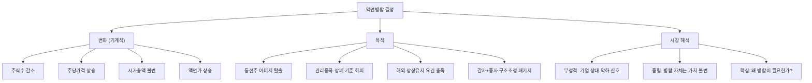

# 액면병합 뜻 — 여러 주를 합쳐 1주로 만드는 것

## 한 줄 정의

액면병합은 여러 주식을 합쳐 1주로 만들어 주당 가격을 높이는 것으로, 기업 가치(시가총액)는 변하지 않습니다.

## 아주 쉽게 말하면

1,000원짜리 사탕 10개를 녹여서 10,000원짜리 큰 사탕 1개로 만드는 겁니다. 총 가치는 같지만 단위가 커집니다. 왜 이렇게 할까요? 1,000원짜리가 너무 싸 보여서 "동전주"라고 무시당하기 때문입니다.

## 왜 중요한가

액면병합은 주가가 지나치게 낮아진 기업(동전주)이 이미지를 개선하거나, 해외 시장에서 상장유지 기준(나스닥 $1 규정 등)을 충족하기 위해 사용합니다.

문제는 "왜 주가가 그렇게 낮아졌는가?"입니다. 대부분 사업 실적이 악화되어 주가가 하락한 기업이 병합을 합니다. 따라서 액면병합 자체는 중립 이벤트이지만, 병합이 필요한 상황이라는 것 자체가 부정적 신호입니다. 병합 후에도 근본적 문제가 해결되지 않으면 주가는 다시 하락합니다.

## 그림으로 이해하기

## 숫자로 보는 예시

> ⚠️ 아래 숫자는 개념 설명을 위한 **가상 예시**이며, 실제 투자 데이터가 아닙니다.

가상의 BB엔터가 주가 하락 후 10:1 액면병합을 실시하는 상황입니다.

**병합 전 상태:**
- 주가: 500원 / 발행주식: 1억 주 / 시총: 500억 원
- 액면가: 100원 / 일평균 거래량: 500만 주
- PER: 적자로 산정 불가

**10:1 병합 후:**
- 주가: 5,000원 / 발행주식: 1,000만 주 / 시총: 500억 원
- 액면가: 1,000원 / 일평균 거래량: 50만 주 (비례 감소)

**투자자 보유 변화:**
- 병합 전: 10,000주 × 500원 = 500만 원
- 병합 후: 1,000주 × 5,000원 = 500만 원 (변동 없음)

**병합 후 6개월 시나리오:**

| 시나리오 | 주가 | 시총 | 해석 |
|---------|------|------|------|
| 사업 회복 | 7,000원 | 700억 | 병합+구조조정 효과 |
| 현상 유지 | 5,000원 | 500억 | 근본 문제 미해결 |
| 재하락 | 2,000원 | 200억 | 병합 무의미, 재감자 위험 |

## 표로 비교하기

| 항목 | 액면병합 | 액면분할 | 무상감자 |
|------|---------|---------|---------|
| 주식수 | 감소 | 증가 | 감소 |
| 주당가격 | 상승 | 하락 | 상승 |
| 시가총액 | 불변 | 불변 | 불변 |
| 기업 상태 | 대체로 부실 | 대체로 우량 | 재무 위기 |
| 시장 반응 | 부정적~중립 | 긍정적 | 극도로 부정적 |
| 주주 손실 | 없음 | 없음 | 있음 (무상감자) |

## 초보자가 자주 하는 오해

1. **"액면병합하면 내 돈이 불어난다"**
   → 10주가 1주가 되지만 1주 가격이 10배이므로 총 평가액은 동일합니다. 내 자산이 늘어나는 것이 절대 아닙니다.

2. **"액면병합은 좋은 소식이다"**
   → 오히려 주가가 너무 낮아 이미지 관리나 상장유지를 위해 하는 경우가 대부분입니다. "왜 병합이 필요할 정도로 주가가 낮아졌는가?"를 먼저 생각하세요.

3. **"병합 후 주가가 비싸 보이니 오를 것이다"**
   → 가격이 높아 보이는 것은 착시입니다. 시가총액과 PER 등 밸류에이션 지표는 동일합니다. 근본적 사업 개선 없이 주가만 올라가지 않습니다.

4. **"감자와 액면병합은 같은 것이다"**
   → 무상감자는 주주에게 보상 없이 주식을 줄이는 것(손실 발생)이지만, 액면병합은 단순히 주식 단위를 합치는 것(손실 없음)입니다. 회계 처리도 완전히 다릅니다.

## 고수는 이렇게 봅니다

숙련된 투자자는 액면병합 자체보다 "병합 전후 맥락"을 봅니다:

- **병합 목적이 "상장유지"면 위험 신호**: 상폐 기준 회피 목적이면 기업 존속 자체가 불확실
- **병합+구조조정 동시 진행**: 감자+병합+유상증자 패키지는 "기존 주주 희생 → 새 출발" 구조
- **병합 후 주가 추이**: 6개월 내 다시 병합 전 수준으로 하락하면 근본 문제 미해결
- **해외 사례**: 나스닥·NYSE에서 $1 미만 방지 목적 병합은 흔하며, 미국 투자자에게는 익숙한 이벤트

## 기업분석에서는 이렇게 씁니다

병합 이력이 있는 기업은 과거 재무 상태가 부실했을 가능성을 점검합니다. 분석 시:

- 병합 공시와 함께 나오는 구조조정 계획의 실현 가능성을 평가
- 병합 후 6개월간 주가·거래량 추이로 시장 신뢰 회복 여부를 판단
- 동종업계 내 병합 이력 없는 기업 대비 밸류에이션 할인율을 적용
- 재병합(2차 병합) 가능성을 적자 추이에서 사전 탐지

## 함께 보면 좋은 용어

- [액면분할](./stock-split.md) — 반대 개념, 주식을 쪼개는 것
- [감자](./capital-reduction.md) — 주식 수를 줄이는 또 다른 방식
- [시가총액](../level-01-basic/market-cap.md) — 병합 전후 변하지 않는 지표
- [유상증자](./paid-in-capital-increase.md) — 병합과 함께 진행되기도 하는 자본 이벤트
- [무상증자](./free-capital-increase.md) — 우량기업의 주식수 증가 (병합과 정반대 맥락)

## 정리

액면병합은 여러 주식을 하나로 합쳐 주당 가격을 높이는 행위입니다. 시가총액은 변하지 않으며, 주가가 지나치게 낮은 기업이 이미지 개선이나 상장유지를 위해 사용합니다. 병합 자체보다 "왜 병합이 필요한 상황인가"를 살펴보는 것이 투자 판단의 핵심입니다.

## 한 줄 요약

> 액면병합은 주식을 합쳐 주당 가격을 높이는 것이지, 기업 가치가 좋아지는 것이 아닙니다.

---

이 글은 투자 권유가 아니라 주식 용어와 기업분석 방법을 설명하기 위한 교육 콘텐츠입니다. 특정 종목의 매수·매도 판단은 독자 본인의 책임입니다.

Tags: 액면병합, 주식병합, 액면가, 관리종목, 주가관리
