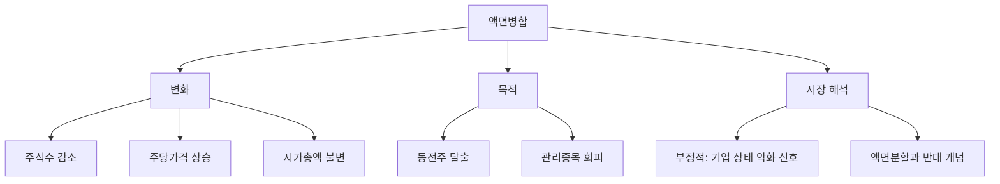

# 액면병합 뜻 — 여러 주를 합쳐 1주로 만드는 것

## 한 줄 정의

액면병합은 여러 주식을 합쳐 1주로 만들어 주당 가격을 높이는 것입니다.

## 아주 쉽게 말하면

1,000원짜리 사탕 10개를 녹여서 10,000원짜리 큰 사탕 1개로 만드는 겁니다. 총 가치는 같지만 단위가 커집니다.

## 왜 중요한가

- 주가가 너무 낮으면(동전주) 투자자 신뢰가 떨어집니다
- 일부 시장에서는 주가 기준 미달 시 상장폐지·관리종목 지정 가능합니다
- 병합 공시는 "회사 상태가 좋지 않다"는 신호로 읽힐 수 있습니다
- 액면분할과 반대 개념이므로 함께 이해하면 좋습니다

## 그림으로 이해하기

## 숫자로 보는 예시

> ⚠️ 아래 숫자는 개념 설명을 위한 **가상 예시**이며, 실제 투자 데이터가 아닙니다.

B기업이 10:1 액면병합을 실시합니다.

- 병합 전: 주가 500원, 발행주식 1억 주, 시가총액 500억 원
- 병합 후: 주가 5,000원, 발행주식 1,000만 주, 시가총액 500억 원

10주를 보유하던 투자자 → 병합 후 1주 보유, 평가금액 동일합니다.

## 표로 비교하기

| 항목 | 병합 전 | 병합 후(10:1) |
|------|---------|---------------|
| 주당 가격 | 500원 | 5,000원 |
| 발행주식수 | 1억 주 | 1,000만 주 |
| 시가총액 | 500억 원 | 500억 원 |
| 액면가 | 100원 | 1,000원 |
| 시장 인식 | 동전주 | 일반 가격대 |

## 초보자가 자주 하는 오해

**오해 1: "액면병합하면 내 돈이 불어난다"**

10주가 1주가 되지만 1주 가격이 10배이므로 총 평가액은 같습니다. 내 자산이 늘어나는 것이 아닙니다.

**오해 2: "액면병합은 좋은 소식이다"**

오히려 주가가 너무 낮아 이미지 관리나 상장유지를 위해 하는 경우가 많습니다. 기업 펀더멘털 확인이 우선입니다.

## 고수는 이렇게 봅니다

- 병합 목적이 "상장유지"인지 "액면 정리"인지 구분합니다
- 병합 후에도 주가가 다시 하락하면 근본적 문제가 있다고 봅니다
- 병합과 함께 감자·증자가 동시 진행되는 구조조정 패키지를 주의합니다
- 해외 시장(나스닥 등)에서 $1 미만 방지 목적 병합은 흔합니다

## 기업분석에서는 이렇게 씁니다

- 병합 이력이 있는 기업은 과거 재무 상태가 부실했을 가능성을 점검합니다
- 병합 공시와 함께 나오는 구조조정 계획을 확인합니다
- 병합 후 6개월 간 주가·거래량 추이로 시장 신뢰 회복 여부를 판단합니다

## 함께 보면 좋은 용어

- [액면분할](./stock-split.md): 반대 개념, 주식을 쪼개는 것
- [감자](./capital-reduction.md): 주식 수를 줄이는 또 다른 방식
- [시가총액](../level-01-basic/market-cap.md): 병합 전후 변하지 않는 지표
- [유상증자](./paid-in-capital-increase.md): 병합과 함께 진행되기도 하는 자본 이벤트

## 정리

액면병합은 여러 주식을 하나로 합쳐 주당 가격을 높이는 행위입니다. 시가총액은 변하지 않으며, 주가가 지나치게 낮은 기업이 이미지 개선이나 상장유지를 위해 사용합니다. 병합 자체보다 "왜 병합이 필요한 상황인가"를 살펴보는 것이 중요합니다.

## 한 줄 요약

> 액면병합은 주식을 합쳐 주당 가격을 높이는 것이지, 기업 가치가 좋아지는 것이 아닙니다.

---

*면책 조항: 이 글은 투자 권유가 아니라 주식 용어와 기업분석 방법을 설명하기 위한 교육 콘텐츠입니다. 특정 종목의 매수·매도 판단은 독자 본인의 책임입니다.*

Tags: 액면병합, 주식병합, 액면가, 관리종목, 주가관리
