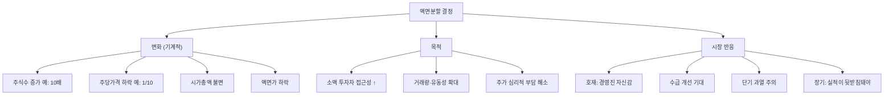

# 액면분할 뜻 — 주식 1주를 여러 주로 쪼개는 것

## 한 줄 정의

액면분할은 기존 주식 1주를 여러 주로 나누어 주당 가격을 낮추는 것으로, 기업 가치(시가총액)는 변하지 않습니다.

## 아주 쉽게 말하면

피자 한 판(100만 원)을 1조각으로 팔면 너무 비싸서 아무도 못 삽니다. 10조각으로 나누면 1조각에 10만 원 — 더 많은 사람이 살 수 있습니다. 피자 전체 크기(기업 가치)는 그대로인데 한 조각 가격만 작아지는 겁니다.

## 왜 중요한가

주가가 너무 높으면 소액 투자자가 1주조차 매수하기 어렵습니다. 분할 후 주당 가격이 낮아지면 거래 접근성이 좋아지고, 거래량이 늘어 유동성이 개선됩니다.

시장에서는 액면분할을 대체로 호재로 반응합니다. 이유는:
- 경영진이 "주가가 충분히 올랐고, 앞으로도 자신 있다"는 시그널
- 소액 투자자 유입 → 수요 증가 → 주가 추가 상승 선순환
- 기관·ETF의 리밸런싱 수요 발생

다만 기업 가치 자체는 1원도 변하지 않으므로, "싸졌다"는 착각에 빠지면 안 됩니다.

## 그림으로 이해하기

## 숫자로 보는 예시

> ⚠️ 아래 숫자는 개념 설명을 위한 **가상 예시**이며, 실제 투자 데이터가 아닙니다.

가상의 AA전자가 10:1 액면분할을 실시하는 상황입니다.

**분할 전:**
- 주가: 100만 원 / 발행주식: 100만 주 / 시총: 1조 원
- 액면가: 5,000원 / 1주 매수 최소 금액: 100만 원
- 일평균 거래량: 5만 주 / 거래대금: 500억 원

**분할 후 (이론가):**
- 주가: 10만 원 / 발행주식: 1,000만 주 / 시총: 1조 원
- 액면가: 500원 / 1주 매수 최소 금액: 10만 원
- 일평균 거래량 기대: 50만 주 이상 (유동성 확대)

**투자자 보유 변화:**
- 분할 전: 1주 × 100만 원 = 100만 원
- 분할 후: 10주 × 10만 원 = 100만 원 (동일)

**실제 시장 반응 (일반적 경향):**
- 분할 공시 당일: +3~8% 상승 (기대감)
- 분할 후 1개월: 거래량 2~5배 증가
- 분할 후 6개월: 실적 성장 동반 시 추가 상승, 아닐 시 제자리

## 표로 비교하기

| 항목 | 분할 전 | 분할 후 (10:1) | 변화율 |
|------|---------|---------------|--------|
| 주당 가격 | 100만 원 | 10만 원 | -90% |
| 발행주식수 | 100만 주 | 1,000만 주 | +900% |
| 시가총액 | 1조 원 | 1조 원 | 0% |
| 액면가 | 5,000원 | 500원 | -90% |
| 1주 매수 비용 | 100만 원 | 10만 원 | -90% |
| EPS | 10,000원 | 1,000원 | -90% |
| PER | 100배 | 100배 | 0% |

## 초보자가 자주 하는 오해

1. **"액면분할하면 주가가 오른다"**
   → 분할 자체로 기업 가치가 증가하지 않습니다. 단기 수급 개선 효과는 있을 수 있지만, 장기적으로 실적이 뒷받침되지 않으면 주가는 제자리입니다. 분할 후 하락한 종목도 많습니다.

2. **"분할 후 주가가 싸니까 저평가다"**
   → 100만 원짜리 1주가 10만 원짜리 10주가 된 것이지, 기업이 저평가된 것이 아닙니다. PER·PBR 등 밸류에이션 지표는 분할 전후 동일합니다.

3. **"분할 비율이 크면 무조건 좋다"**
   → 50:1 분할은 유동성 효과가 크지만, 주가가 너무 낮아지면(수백 원대) 오히려 "동전주" 인식을 줄 수 있습니다. 분할 후 적정 가격대(1만~10만 원)가 되는지 확인하세요.

4. **"액면분할과 무상증자는 같은 것이다"**
   → 효과는 유사하지만 회계 처리가 다릅니다. 액면분할은 액면가를 바꾸는 것이고, 무상증자는 잉여금을 자본금으로 전입하는 것입니다. 무상증자는 잉여금이 필요하지만 액면분할은 잉여금과 무관합니다.

## 고수는 이렇게 봅니다

숙련된 투자자는 액면분할을 "경영진의 자신감 표현"으로 해석하되, 실적으로 검증합니다:

- **분할 타이밍**: 실적 호전기에 하면 강한 긍정 시그널, 주가 정체기에 하면 "인위적 부양" 의심
- **분할 후 거래량 변화**: 2주 내 거래량이 3배 이상 늘면 유동성 효과 성공
- **과거 사례 통계**: 대형주 분할 후 1년 수익률이 시장 평균을 상회하는 경향 (다만 보장 아님)
- **분할과 함께 나오는 정책**: 배당 확대, 자사주 매입 동시 발표 시 시너지 극대화

## 기업분석에서는 이렇게 씁니다

액면분할은 기업의 "주주친화 의지" 신호로 해석합니다. 분석 시:

- 분할 전후 거래대금 변화를 비교하여 유동성 개선 효과를 정량화
- 분할 후 소액 투자자 비중 증가 여부를 수급 데이터로 확인
- 분할과 동시에 발표되는 주주환원 정책(배당 증가, 자사주 매입)의 규모를 평가
- 유사 업종·규모 기업의 과거 분할 사례 후 주가 흐름을 벤치마크

## 함께 보면 좋은 용어

- [액면병합](./reverse-stock-split.md) — 반대 개념, 주식 수를 합치는 것
- [무상증자](./free-capital-increase.md) — 유사한 주가 인하 효과
- [시가총액](../level-01-basic/market-cap.md) — 분할 전후 변하지 않는 핵심 지표
- [PER](../level-05-valuation/per.md) — 분할 후 저평가 여부를 판단하는 지표
- [거래량](../level-01-basic/trading-volume.md) — 분할 효과를 측정하는 지표

## 정리

액면분할은 주식을 여러 조각으로 나누어 주당 가격을 낮추는 행위입니다. 기업 가치(시가총액)는 1원도 변하지 않으며, 거래 접근성과 유동성을 높이려는 목적이 큽니다. 시장에서 호재로 반응하는 경향이 있지만, 장기적으로는 실적 성장이 뒷받침돼야 합니다.

## 한 줄 요약

> 액면분할은 주식을 쪼개 주당 가격을 낮추는 것이지, 기업 가치가 달라지는 것이 아닙니다.

---

이 글은 투자 권유가 아니라 주식 용어와 기업분석 방법을 설명하기 위한 교육 콘텐츠입니다. 특정 종목의 매수·매도 판단은 독자 본인의 책임입니다.

Tags: 액면분할, 주식분할, 액면가, 유통주식수, 주가변동
