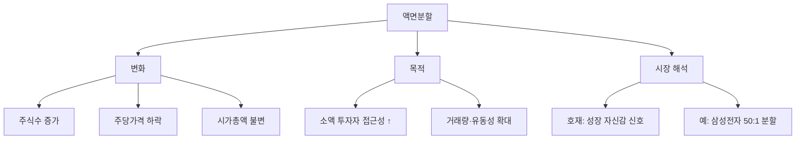

# 액면분할 뜻 — 주식 1주를 여러 주로 쪼개는 것

## 한 줄 정의

액면분할은 기존 주식 1주를 여러 주로 나누어 주당 가격을 낮추는 것입니다.

## 아주 쉽게 말하면

피자 한 판(50만 원)을 8조각으로 나누면 한 조각에 6만 2,500원이 됩니다. 피자 전체 크기(기업 가치)는 그대로인데 한 조각 가격만 작아지는 겁니다.

## 왜 중요한가

- 주가가 너무 높으면 소액 투자자가 1주조차 사기 어렵습니다
- 분할 후 거래량이 늘어나 유동성이 좋아집니다
- 심리적으로 "싸 보이는" 효과가 투자 수요를 끌어올릴 수 있습니다
- 기업 가치 자체는 변하지 않으므로 착각에 빠지면 안 됩니다

## 그림으로 이해하기

## 숫자로 보는 예시

> ⚠️ 아래 숫자는 개념 설명을 위한 **가상 예시**이며, 실제 투자 데이터가 아닙니다.

A기업이 10:1 액면분할을 실시합니다.

- 분할 전: 주가 100만 원, 발행주식 100만 주, 시가총액 1조 원
- 분할 후: 주가 10만 원, 발행주식 1,000만 주, 시가총액 1조 원

투자자가 1주 보유 중이었다면 → 분할 후 10주 보유, 평가금액 동일합니다.

## 표로 비교하기

| 항목 | 분할 전 | 분할 후(10:1) |
|------|---------|---------------|
| 주당 가격 | 100만 원 | 10만 원 |
| 발행주식수 | 100만 주 | 1,000만 주 |
| 시가총액 | 1조 원 | 1조 원 |
| 액면가 | 5,000원 | 500원 |
| 1주 매수 비용 | 100만 원 | 10만 원 |

## 초보자가 자주 하는 오해

**오해 1: "액면분할하면 주가가 오른다"**

분할 자체로 기업 가치가 증가하지 않습니다. 단기 수급 개선 효과는 있을 수 있지만, 장기적으로 실적이 뒷받침되지 않으면 주가는 제자리입니다.

**오해 2: "분할 후 주가가 싸니까 저평가다"**

50만 원짜리 1주가 5만 원짜리 10주가 된 것이지, 기업이 저평가된 것이 아닙니다. PER·PBR 등 밸류에이션 지표로 판단해야 합니다.

## 고수는 이렇게 봅니다

- 분할 공시 직후 단기 유동성 증가 효과를 관찰합니다
- 분할 비율이 클수록(예: 50:1) 소액 투자자 유입 효과가 큽니다
- 분할과 동시에 나오는 IR 메시지(주주친화 정책)도 함께 봅니다
- 과거 분할 사례의 6개월 후 수익률 통계를 참고합니다

## 기업분석에서는 이렇게 씁니다

- 액면분할은 기업의 "주주친화 의지" 신호로 해석합니다
- 분할 전후 거래대금 변화를 비교하여 유동성 개선 여부를 확인합니다
- 분할 후 주가 흐름이 실적 성장과 맞물리는지 추적합니다

## 함께 보면 좋은 용어

- [액면병합](./reverse-stock-split.md): 반대 개념, 주식 수를 합치는 것
- [감자](./capital-reduction.md): 주식 수를 줄이는 또 다른 방식
- [유상증자](./paid-in-capital-increase.md): 새 주식을 발행하는 이벤트
- [시가총액](../level-01-basic/market-cap.md): 분할 전후 변하지 않는 핵심 지표
- [PER](../level-05-valuation/per.md): 분할 후 저평가 여부를 판단하는 지표

## 정리

액면분할은 주식을 여러 조각으로 나누어 주당 가격을 낮추는 행위입니다. 기업 가치(시가총액)는 변하지 않으며, 거래 접근성과 유동성을 높이려는 목적이 큽니다. "싸졌다"는 착각에 빠지지 않도록 밸류에이션 지표를 함께 확인하세요.

## 한 줄 요약

> 액면분할은 주식을 쪼개 주당 가격을 낮추는 것이지, 기업 가치가 달라지는 것이 아닙니다.

---

*면책 조항: 이 글은 투자 권유가 아니라 주식 용어와 기업분석 방법을 설명하기 위한 교육 콘텐츠입니다. 특정 종목의 매수·매도 판단은 독자 본인의 책임입니다.*

Tags: 액면분할, 주식분할, 액면가, 유통주식수, 주가변동
