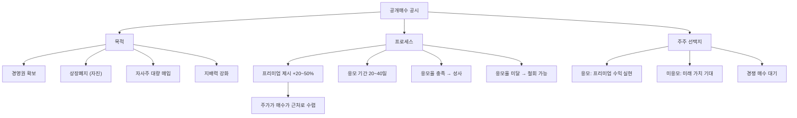

# 공개매수 뜻 — 특정 가격에 주식을 사겠다고 공개 제안하는 것

## 한 줄 정의

공개매수는 특정 기업의 주식을 정해진 가격·기간에 불특정 다수로부터 사겠다고 공개적으로 제안하는 것으로, 경영권 확보나 상장폐지 목적으로 주로 사용됩니다.

## 아주 쉽게 말하면

"여러분이 가진 A회사 주식, 현재 시장가보다 비싸게 사겠습니다. 1주당 5만 원에 사겠으니, 원하시면 응모하세요. 30일 안에 결정해주세요." — 이렇게 공개적으로 선언하는 겁니다. 주로 회사를 인수하려는 쪽에서 진행합니다.

## 왜 중요한가

공개매수 가격은 보통 현재 시장가보다 20~50% 높은 프리미엄을 붙입니다. 공시가 나오면 주가가 매수 제안가 근처까지 급등하며, 보유 주주에게는 프리미엄 수익을 얻을 기회입니다.

한국에서는 의무공개매수 제도 도입 논의가 진행 중이며, 이는 경영권 프리미엄을 소수주주에게도 나누는 제도입니다. 향후 M&A 시장에 큰 영향을 줄 수 있어, 공개매수의 구조를 이해하는 것이 중요합니다.

## 그림으로 이해하기

## 숫자로 보는 예시

> ⚠️ 아래 숫자는 개념 설명을 위한 **가상 예시**이며, 실제 투자 데이터가 아닙니다.

가상의 대기업 GG그룹이 자회사 GG물류의 경영권 강화를 위해 공개매수를 진행하는 상황입니다.

**공개매수 전:**
- GG물류 주가: 40,000원 / 시총: 4,000억 원
- GG그룹 현재 지분: 35% (350만 주)
- 목표 지분: 50% + 1주 (경영권 확보)
- 필요 추가 매수: 150만 주 + 1주

**공개매수 조건:**
- 매수가: 50,000원 (프리미엄 25%)
- 응모 기간: 30일
- 최소 응모 조건: 100만 주 이상 (미달 시 철회)
- 총 소요 자금: 150만 주 × 50,000원 = **750억 원**

**주가 반응:**
- 공시 직후: 40,000원 → 49,000원 (+22.5%) — 매수가에 수렴하되 소폭 할인
- 할인 이유: 성사 불확실성(응모 미달 리스크) 반영

**주주별 판단:**
- 40,000원에 매수한 주주: 응모 시 +25% 프리미엄 수익
- 45,000원에 매수한 주주: 응모 시 +11% 프리미엄 수익
- 장기 투자자: "비상장 전환 후 가치 상승" 기대 시 미응모

## 표로 비교하기

| 항목 | 공개매수 | 장내 매수 | 블록딜 | 제3자배정 |
|------|---------|----------|--------|----------|
| 가격 | 프리미엄 (+20~50%) | 시장가 | 할인가 (-5~10%) | 할인가 |
| 대상 | 불특정 다수 | 매도 호가 | 특정 매도자 | 발행사 |
| 투명성 | 공시 의무 (사전) | 5% 보고 | 사후 공시 | 사전 공시 |
| 목적 | 경영권·상폐 | 지분 확대 | 지분 정리 | 전략 투자 |
| 주가 영향 | 급등 (프리미엄) | 점진적 상승 | 단기 하락 | 중립 |
| 기존 주주 | 프리미엄 수익 기회 | 무관 | 부담 | 희석 |

## 초보자가 자주 하는 오해

1. **"공개매수 공시 후 무조건 응해야 한다"**
   → 응모는 선택입니다. 기업의 미래 가치가 공개매수가보다 높다고 판단하면 응하지 않을 수 있습니다. 다만 상장폐지 목적 공개매수 시 미응모하면 비상장 주식을 보유하게 되어 유동성이 사라집니다.

2. **"공개매수가 나오면 더 오를 수 있으니 기다리자"**
   → 경쟁 매수자가 나타나 가격이 올라가는 경우도 있지만, 드문 사례입니다. 공개매수가 철회되면 주가가 공시 전 수준으로 급락합니다. 프리미엄 수익과 불확실한 추가 수익을 냉정하게 비교하세요.

3. **"공개매수가 = 기업의 적정 가치다"**
   → 공개매수가는 인수자의 협상력, 재무 여력, 전략적 가치 등이 반영된 "거래 가격"이지, 기업의 내재가치와 반드시 일치하지 않습니다. 인수자가 급하면 높게, 여유 있으면 낮게 제시합니다.

4. **"소수주주는 공개매수에서 불리하다"**
   → 의무공개매수 제도가 도입되면, 경영권 프리미엄을 소수주주도 동일하게 받을 수 있습니다. 현행법에서도 공개매수 시 모든 주주에게 동일 가격을 제시해야 하므로, 대주주만 유리한 것은 아닙니다.

## 고수는 이렇게 봅니다

숙련된 투자자는 공개매수를 "이벤트 투자"로 접근합니다:

- **프리미엄 적정성**: 과거 동종업계 M&A 사례 대비 프리미엄 수준 비교 (20% 미만이면 낮음, 40%+ 이상이면 높음)
- **경쟁 매수 가능성**: 다른 인수 후보가 있는지, 인수 대상의 전략적 가치가 높은지 분석
- **성사 조건 충족 확률**: 최소 응모 조건 대비 유통주식 수, 기관 보유 비중 등으로 성사 가능성 추정
- **상장폐지 계획**: 공개매수 후 소수주식 강제매수(Squeeze-out) 절차 계획이 있는지 확인

## 기업분석에서는 이렇게 씁니다

공개매수 가격을 기업의 적정가치 산정 레퍼런스로 활용합니다. 인수자가 제시한 가격에서 시너지 기대치를 역산하면:

- 인수가 - 현재 기업가치 = 인수자가 보는 시너지 가치
- 이 시너지가 합리적인지 검증하여 추가 프리미엄 여지를 판단
- 공개매수 실패 시 주가 하방(공시 전 수준)을 리스크로 반영
- 성공 시 상장폐지 후 비상장 가치(유동성 할인 적용)를 산출

## 함께 보면 좋은 용어

- [블록딜](./block-deal.md) — 대량 매도의 또 다른 방식
- [보호예수](./lock-up.md) — 공개매수 후 인수자에게 적용되기도 함
- [시가총액](../level-01-basic/market-cap.md) — 공개매수 규모 판단 기준
- [유상증자](./paid-in-capital-increase.md) — 지분 변동의 다른 원인
- [PER](../level-05-valuation/per.md) — 공개매수가의 적정성 판단 지표

## 정리

공개매수는 특정 가격에 주식을 대량으로 사겠다고 공개 제안하는 행위입니다. 보통 시장가보다 높은 프리미엄을 붙이며, 경영권 확보나 상장폐지가 목적입니다. 주주는 응모 여부를 선택할 수 있고, 프리미엄 수익과 미래 가치·성사 불확실성을 비교하여 결정합니다.

## 한 줄 요약

> 공개매수는 프리미엄을 붙여 주식을 대량으로 사겠다는 공개 제안이며, 경영권 변동의 핵심 수단입니다.

---

이 글은 투자 권유가 아니라 주식 용어와 기업분석 방법을 설명하기 위한 교육 콘텐츠입니다. 특정 종목의 매수·매도 판단은 독자 본인의 책임입니다.

Tags: 공개매수, 경영권, 프리미엄, 의무공개매수, 인수합병
