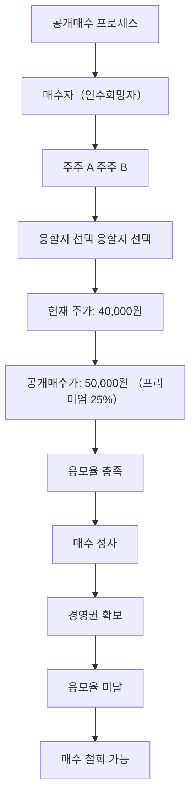

# 공개매수 뜻 — 특정 가격에 주식을 사겠다고 공개 제안하는 것

## 한 줄 정의

공개매수는 특정 기업의 주식을 정해진 가격·기간에 불특정 다수로부터 사겠다고 공개적으로 제안하는 것입니다.

## 아주 쉽게 말하면

"여러분이 가진 A회사 주식, 1주당 5만 원에 사겠습니다. 원하시면 응하세요"라고 공개적으로 선언하는 겁니다. 보통 현재 주가보다 높은 가격(프리미엄)을 제시합니다.

## 왜 중요한가

- 공개매수 가격이 시장가보다 높으면 주가가 그 가격 근처로 급등합니다
- 경영권 확보, 상장폐지, 자사주 매입 등 다양한 목적으로 진행됩니다
- 공개매수 성공 여부에 따라 기업 지배구조가 크게 바뀔 수 있습니다
- 의무공개매수 제도 도입으로 향후 M&A 시장에 영향이 커지고 있습니다

## 그림으로 이해하기

## 숫자로 보는 예시

> ⚠️ 아래 숫자는 개념 설명을 위한 **가상 예시**이며, 실제 투자 데이터가 아닙니다.

G기업 경영권 인수를 위해 공개매수를 진행합니다.

- 현재 주가: 40,000원
- 공개매수 가격: 50,000원 (프리미엄 25%)
- 목표 지분율: 50% + 1주 (경영권 확보)
- 필요 매수 주식: 500만 주
- 총 소요 자금: 2,500억 원

주주가 40,000원에 샀다면 공개매수에 응하면 25% 수익을 확정할 수 있습니다.

## 표로 비교하기

| 항목 | 공개매수 | 장내 매수 | 블록딜 |
|------|---------|----------|--------|
| 가격 | 고정(프리미엄) | 시장가 | 할인가 |
| 대상 | 불특정 다수 | 매도 호가 | 특정 매도자 |
| 투명성 | 공시 의무 | 5% 보고 | 사후 공시 |
| 목적 | 경영권·상폐 | 지분 확대 | 지분 정리 |
| 주가 영향 | 상승(프리미엄) | 점진적 상승 | 단기 하락 |

## 초보자가 자주 하는 오해

**오해 1: "공개매수 공시 후 무조건 응해야 한다"**

응모는 선택입니다. 기업의 미래 가치가 공개매수가보다 높다고 판단하면 응하지 않을 수도 있습니다.

**오해 2: "공개매수가 나오면 더 오를 수 있으니 기다리자"**

경쟁 매수자가 나타나 가격이 올라가는 경우도 있지만, 공개매수가 철회되면 주가가 급락할 수 있습니다. 확정 수익 vs 불확실한 추가 수익을 비교해야 합니다.

## 고수는 이렇게 봅니다

- 공개매수 성사 조건(최소 응모율)을 확인하여 성공 확률을 판단합니다
- 프리미엄 수준이 과거 동종업계 M&A 사례 대비 적절한지 비교합니다
- 경쟁 매수자 등장 가능성을 분석하여 추가 프리미엄 여지를 봅니다
- 공개매수 후 상장폐지 계획이 있는지 확인합니다

## 기업분석에서는 이렇게 씁니다

- 공개매수 가격을 기업의 적정가치 산정 레퍼런스로 활용합니다
- 인수자의 시너지 기대치를 역산하여 기업 가치를 재평가합니다
- 공개매수 실패 시 주가 하방(원래 수준)을 리스크로 반영합니다

## 함께 보면 좋은 용어

- [블록딜](./block-deal.md): 대량 매도의 또 다른 방식
- [보호예수](./lock-up.md): 공개매수 후 인수자에게 적용되기도 함
- [시가총액](../level-01-basic/market-cap.md): 공개매수 규모 판단 기준
- [유상증자](./paid-in-capital-increase.md): 지분 변동의 다른 원인
- [PER](../level-05-valuation/per.md): 공개매수가의 적정성 판단 지표

## 정리

공개매수는 특정 가격에 주식을 대량으로 사겠다고 공개 제안하는 행위입니다. 보통 시장가보다 높은 프리미엄을 붙이며, 경영권 확보나 상장폐지가 목적입니다. 주주는 응모 여부를 선택할 수 있고, 프리미엄 확정 수익과 미래 가치를 비교하여 결정합니다.

## 한 줄 요약

> 공개매수는 프리미엄을 붙여 주식을 대량으로 사겠다는 공개 제안이며, 경영권 변동의 핵심 수단입니다.

---

*면책 조항: 이 글은 투자 권유가 아니라 주식 용어와 기업분석 방법을 설명하기 위한 교육 콘텐츠입니다. 특정 종목의 매수·매도 판단은 독자 본인의 책임입니다.*

Tags: 공개매수, 경영권, 프리미엄, 의무공개매수, M&A
