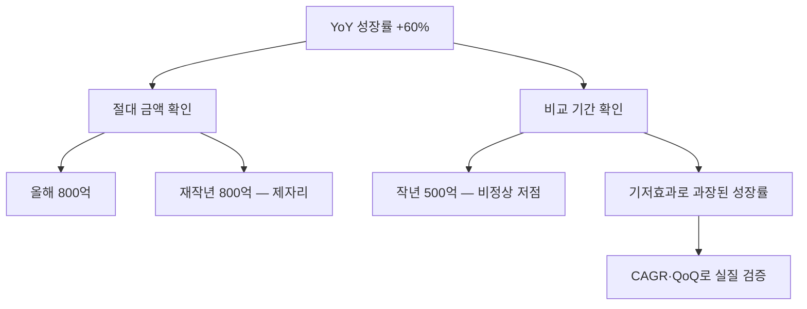

# 기저효과 뜻 — 비교 기준이 낮아서 성장률이 좋아 보이는 것

## 한 줄 정의

기저효과는 전년(비교 기간)의 실적이 비정상적으로 낮거나 높아서, 현재 성장률이 실제보다 과장되거나 축소되어 보이는 현상입니다.

## 아주 쉽게 말하면

작년에 0점을 맞은 학생이 올해 50점을 맞으면 "성적이 무한대로 올랐다"고 할 수 있습니다. 실력이 크게 좋아진 것이 아니라, 비교 기준(작년)이 너무 낮았을 뿐입니다.

## 왜 중요한가

- YoY(전년 대비) 성장률이 높아도 기저효과 때문일 수 있습니다
- 기저효과를 걷어내야 진짜 성장인지 판단할 수 있습니다
- 역기저효과(작년이 너무 좋았던 경우)로 성장률이 나빠 보일 수도 있습니다
- 투자 판단 시 절대 금액과 성장률을 함께 봐야 합니다

## 그림으로 이해하기

## 숫자로 보는 예시

> ⚠️ 아래 숫자는 개념 설명을 위한 **가상 예시**이며, 실제 투자 데이터가 아닙니다.

N기업 분기별 영업이익:

- 2024년 2Q: 1,000억 원 (정상)
- 2025년 2Q: 400억 원 (코로나·공장 셧다운 등 특수 요인)
- 2026년 2Q: 900억 원

YoY 성장률: (900−400)÷400 = +125% → "놀라운 성장!"
실제는 2024년 대비 -10%로, 아직 정상 수준 회복도 못한 상태입니다.

## 표로 비교하기

| 상황 | 기저 | 올해 실적 | YoY 성장률 | 실질 평가 |
|------|------|----------|-----------|----------|
| 낮은 기저 | 작년 부진 | 보통 | 매우 높음 | 과장됨 |
| 높은 기저 | 작년 호황 | 보통 | 마이너스 | 과소 평가 |
| 정상 기저 | 작년 정상 | 성장 | 적정 표시 | 신뢰 가능 |

## 초보자가 자주 하는 오해

**오해 1: "YoY +100%이면 엄청난 성장이다"**

기저(작년 실적)가 비정상적으로 낮았을 수 있습니다. 2~3년 전 수준과 비교하여 실질 성장인지 확인해야 합니다.

**오해 2: "기저효과는 나쁜 것이다"**

기저효과 자체는 중립적입니다. 문제는 이를 무시하고 높은 성장률만 보고 판단하는 것입니다.

## 고수는 이렇게 봅니다

- YoY뿐 아니라 2~3년 CAGR(연평균 성장률)을 함께 봅니다
- QoQ(전분기 대비)를 함께 확인하여 최근 추세를 파악합니다
- 기저효과가 끝나는 분기부터 "진짜 성장률"이 나타나므로 주의합니다
- 역기저효과 구간에서 성장률이 나빠 보여도 절대 실적이 좋으면 긍정적으로 봅니다

## 기업분석에서는 이렇게 씁니다

- 비정상 기간(코로나, 일회성 손실)을 명시하고 정상화 기준으로 재계산합니다
- CAGR 2년·3년 단위로 실질 성장률을 표시합니다
- 기저효과 구간을 주석으로 표기하여 오해를 방지합니다

## 함께 보면 좋은 용어

- [컨센서스](./consensus.md): 기저효과를 반영한 시장 전망
- [턴어라운드](./turnaround.md): 낮은 기저에서 회복하는 과정
- [피크아웃](./peak-out.md): 높은 기저가 만드는 역기저효과
- [어닝서프라이즈](./earnings-surprise.md): 기저효과에 의한 착시 가능
- [마진 개선](./margin-improvement.md): 기저와 무관한 질적 개선 지표

## 정리

기저효과는 비교 기간(전년)의 실적이 비정상적이어서 성장률이 왜곡되는 현상입니다. YoY 성장률만 보면 착각할 수 있으므로, 절대 금액·CAGR·QoQ를 함께 확인하여 실질적인 성장 여부를 판단해야 합니다.

## 한 줄 요약

> 기저효과는 비교 기준이 낮아 성장률이 과장되는 것이며, 절대 실적과 함께 봐야 진짜 성장을 알 수 있습니다.

---

이 글은 투자 권유가 아니라 주식 용어와 기업분석 방법을 설명하기 위한 교육 콘텐츠입니다. 특정 종목의 매수·매도 판단은 독자 본인의 책임입니다.

Tags: 기저효과, 전년대비, 전년동기, 성장률착시, 비교기간
