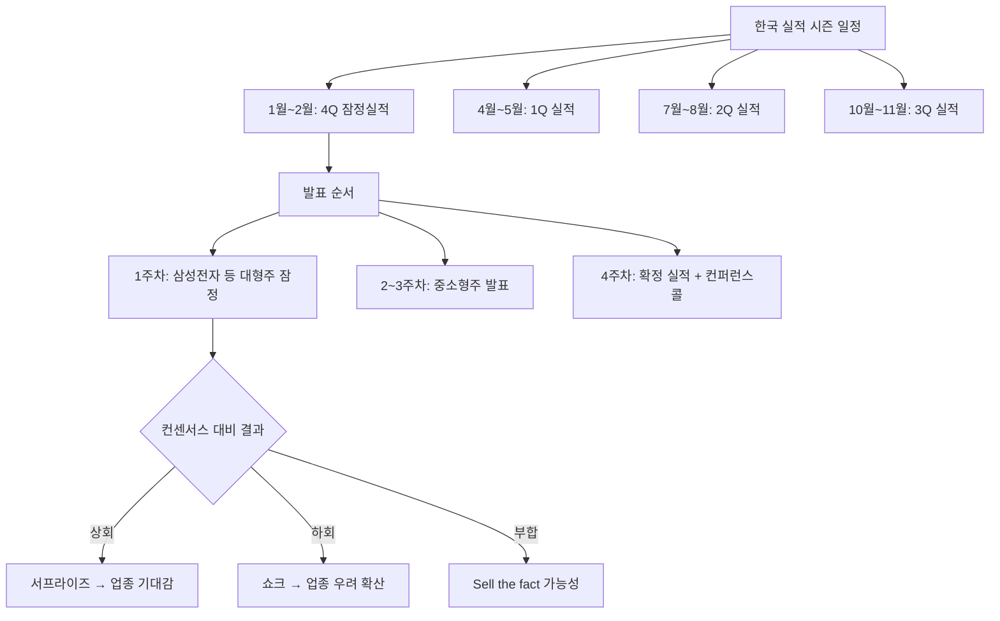

# 실적 시즌 뜻 — 기업들이 분기 실적을 발표하는 시기

## 한 줄 정의

실적 시즌(어닝 시즌)은 상장 기업들이 분기별 재무 성과를 집중적으로 발표하는 기간으로, 주가 변동성이 가장 큰 시기입니다.

## 아주 쉽게 말하면

학교에서 성적표를 나눠주는 날입니다. 2~3주 동안 수백 개 기업이 차례로 성적표(실적)를 공개하며, "기대 이상"인 학생(기업)은 칭찬받고, "기대 이하"인 학생은 혼납니다. 시장이 가장 바빠지고 변동성이 커지는 시기입니다.

## 왜 중요한가

- 실적 시즌에는 주가 변동성이 평소보다 1.5~2배 높아집니다
- 개별 종목뿐 아니라 업종·시장 전체 방향이 결정됩니다
- 컨센서스 대비 결과가 한꺼번에 나오므로 투자 전략 조정이 필요합니다
- 실적 시즌 전후로 포지션을 조절하는 전략(실적 플레이)이 존재합니다
- 먼저 발표하는 대형주가 같은 업종 후발 주자의 방향을 예고합니다

## 그림으로 이해하기

## 숫자로 보는 예시

> ⚠️ 아래 숫자는 개념 설명을 위한 **가상 예시**이며, 실제 투자 데이터가 아닙니다.

가상의 2분기 실적 시즌 시장 현황:

- 코스피 상장사 200개 기업이 3주간 실적 발표
- 서프라이즈 기업 비율: 35% (70개사)
- 쇼크 기업 비율: 25% (50개사)
- 컨센서스 부합: 40% (80개사)
- 실적 시즌 기간 코스피 일평균 변동폭: 1.8% (평소 1.1%의 1.6배)
- 실적 시즌 거래대금: 평소 대비 +30%

**업종별 패턴 예시**:
- IT: 삼성전자 서프라이즈 → 반도체 장비·부품주 동반 +5%
- 화학: 대형 화학사 쇼크 → 동종업체 동반 -3~5% (연좌 효과)

## 표로 비교하기

| 항목 | 실적 시즌 중 | 실적 시즌 외 |
|------|------------|------------|
| 주가 변동성 | 높음 (일변동 1.5~2배) | 보통 |
| 거래량 | 증가 (+20~30%) | 평균 |
| 애널리스트 리포트 | 집중 발간 (일 50건+) | 산발적 (일 10건) |
| 컨센서스 조정 | 활발 (대규모 수정) | 소폭 |
| 투자 전략 | 실적 기반 (서프라이즈 플레이) | 수급·이벤트 기반 |
| 리스크 | 개별 종목 급등락 | 시장 전체 흐름 |

## 초보자가 자주 하는 오해

**오해 1: "실적 시즌에 안 좋은 종목은 바로 팔아야 한다"**

쇼크라도 일시적 요인(환율, 일회성 비용)이면 과매도 구간이 오히려 매수 기회가 되기도 합니다. 쇼크의 원인이 구조적인지 일시적인지 파악이 우선입니다.

**오해 2: "실적 시즌 전에 미리 사놓으면 된다"**

실적이 컨센서스에 못 미치면 급락합니다. "실적 플레이"는 기회인 동시에 양날의 검입니다. 확신 없이 실적 발표 전 큰 비중을 싣는 것은 도박에 가깝습니다.

**오해 3: "모든 기업이 같은 날 발표한다"**

대형주는 분기 마감 후 2~3주 내 잠정실적을 발표하지만, 소형주는 45일까지도 걸립니다. 업종·기업별로 발표 시기가 다르며, 이 시차가 전략적 기회를 만듭니다.

**오해 4: "실적 발표만 보면 된다"**

실적 숫자보다 컨퍼런스콜에서 경영진이 제시하는 가이던스(다음 분기 전망)가 주가에 더 큰 영향을 미치는 경우가 많습니다.

## 고수는 이렇게 봅니다

- 실적 시즌 전에 컨센서스 변화 추이를 점검하여 서프라이즈 가능 종목을 선별합니다
- 먼저 발표하는 대형주 실적으로 업종 전체 방향을 예측합니다 (벨웨더 전략)
- 실적 시즌 중 "어닝 모멘텀"이 강한 종목을 선별하여 추격 매수합니다
- 실적 발표 후 컨퍼런스콜 내용(가이던스·업황 코멘트)까지 반드시 확인합니다
- 실적 시즌 직후 컨센서스 변화를 추적하여 다음 분기 전략을 세웁니다

## 기업분석에서는 이렇게 씁니다

- 분기별 실적 일정표를 만들어 투자 타임라인에 반영합니다
- 업종별 서프라이즈율을 집계하여 섹터 전략에 활용합니다
- 실적 시즌 후 컨센서스 변화 방향으로 다음 분기를 전망합니다
- 과거 실적 시즌의 주가 반응 패턴을 분석하여 시즌 전략을 수립합니다

## 함께 보면 좋은 용어

- [컨센서스](./consensus.md): 실적 시즌에 검증되는 기대치
- [어닝서프라이즈](./earnings-surprise.md): 실적 시즌의 긍정적 이벤트
- [어닝쇼크](./earnings-shock.md): 실적 시즌의 부정적 이벤트
- [가이던스](./guidance.md): 실적과 함께 발표되는 전망
- [피크아웃](./peak-out.md): 실적 시즌에서 확인되는 정점 신호

## 정리

실적 시즌은 상장 기업들이 분기 성과를 집중적으로 발표하는 기간으로, 주가 변동성이 크게 높아집니다. 개별 기업의 서프라이즈·쇼크뿐 아니라 업종 전체의 방향이 결정되는 중요한 시기입니다. 먼저 발표하는 대형주가 업종 방향을 예고하므로, 사전에 컨센서스를 점검하고 발표 순서를 파악하는 것이 실적 시즌 대응의 핵심입니다.

## 한 줄 요약

> 실적 시즌은 기업들이 성적표를 공개하는 시기이며, 주가 변동성이 가장 크고 업종 방향이 결정되는 기간입니다.

---

이 글은 투자 권유가 아니라 주식 용어와 기업분석 방법을 설명하기 위한 교육 콘텐츠입니다. 특정 종목의 매수·매도 판단은 독자 본인의 책임입니다.

Tags: 실적시즌, 분기실적, 어닝시즌, 실적발표, 주가변동성
