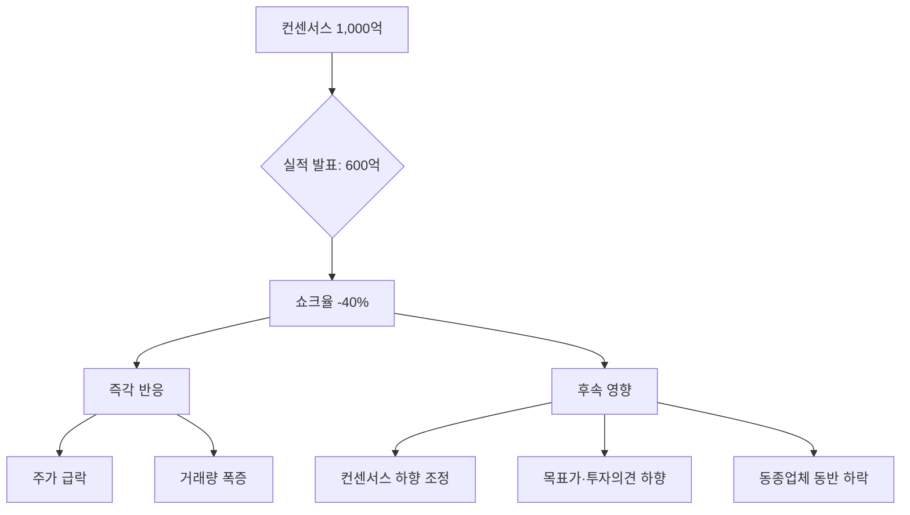

# 어닝쇼크 뜻 — 실적이 시장 기대에 크게 못 미친 것

## 한 줄 정의

어닝쇼크는 기업의 실제 실적이 컨센서스(시장 기대치)를 크게 하회하는 현상입니다.

## 아주 쉽게 말하면

시험에서 80점 예상이었는데 50점을 맞은 것입니다. "이게 뭐야!" 하는 실망감이 주가 급락으로 나타납니다.

## 왜 중요한가

- 어닝쇼크 발생 시 주가가 급락하며, 회복에 수개월이 걸리기도 합니다
- 1회 쇼크는 일시적일 수 있지만, 연속 쇼크는 구조적 문제를 의미합니다
- 쇼크 후 컨센서스가 하향 조정되면 추가 하락 가능성이 있습니다
- 쇼크의 원인이 일시적인지 구조적인지 구분하는 것이 핵심입니다

## 그림으로 이해하기

## 숫자로 보는 예시

> ⚠️ 아래 숫자는 개념 설명을 위한 **가상 예시**이며, 실제 투자 데이터가 아닙니다.

J기업 4분기 실적:

- 컨센서스 영업이익: 800억 원
- 실제 영업이익: 400억 원 (쇼크율 -50%)
- 발표 당일 주가: -15%
- 이후 1개월: 추가 -10% (컨센서스 하향 + 신뢰 하락)

## 표로 비교하기

| 쇼크율 | 시장 반응 | 회복 기간 |
|--------|----------|----------|
| -5~10% | 소폭 부진 | 1~2주 |
| -10~20% | 중간 쇼크 | 1~2개월 |
| -20~50% | 대형 쇼크 | 3~6개월 |
| -50% 이상 또는 적자전환 | 메가 쇼크 | 6개월+ |

## 초보자가 자주 하는 오해

**오해 1: "어닝쇼크 = 저점 매수 기회"**

쇼크 원인이 일시적(재고 평가손, 환율)이면 반등할 수 있지만, 구조적 문제(시장 점유율 하락, 수요 감소)면 추가 하락합니다.

**오해 2: "한 분기 나쁘면 다음 분기는 좋겠지"**

실적 부진의 원인이 해소되지 않으면 연속 쇼크가 발생합니다. 원인 진단 없이 반등을 기대하는 것은 위험합니다.

## 고수는 이렇게 봅니다

- 쇼크 원인을 매출 감소·마진 악화·일회성 비용으로 분해합니다
- "어닝쇼크 + 가이던스 하향"이면 추가 하락 가능성이 높다고 봅니다
- 쇼크 후 경영진 컨퍼런스콜 내용으로 회복 시점을 추정합니다
- 업종 전체의 문제인지, 개별 기업의 문제인지 구분합니다

## 기업분석에서는 이렇게 씁니다

- 쇼크 원인을 일회성 vs 반복성으로 분류하여 추정치를 조정합니다
- 과거 쇼크 이력이 있는 기업은 실적 변동성 할인(디스카운트)을 적용합니다
- 쇼크 후 애널리스트 리포트의 논조 변화를 추적합니다

## 함께 보면 좋은 용어

- [컨센서스](./consensus.md): 쇼크의 기준이 되는 시장 기대치
- [어닝서프라이즈](./earnings-surprise.md): 반대 개념
- [가이던스](./guidance.md): 쇼크와 함께 하향되면 이중 악재
- [피크아웃](./peak-out.md): 실적 정점 후 쇼크가 이어지는 패턴
- [턴어라운드](./turnaround.md): 쇼크 이후 회복 과정

## 정리

어닝쇼크는 실적이 시장 기대를 크게 밑돌 때 발생하며, 주가 급락과 컨센서스 하향을 초래합니다. 핵심은 쇼크의 원인이 일시적인지 구조적인지 판단하는 것이며, 연속 쇼크가 발생하면 기업의 근본적 경쟁력을 재점검해야 합니다.

## 한 줄 요약

> 어닝쇼크는 실적이 기대에 크게 못 미친 것이며, 원인이 구조적이면 추가 하락을 경계해야 합니다.

---

*면책 조항: 이 글은 투자 권유가 아니라 주식 용어와 기업분석 방법을 설명하기 위한 교육 콘텐츠입니다. 특정 종목의 매수·매도 판단은 독자 본인의 책임입니다.*

Tags: 어닝쇼크, 실적부진, 컨센서스, 하향조정, 주가급락
