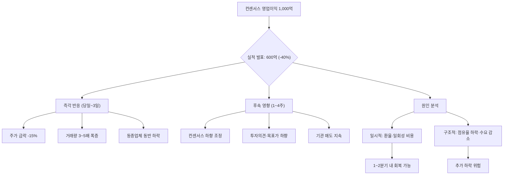

# 어닝쇼크 뜻 — 실적이 시장 기대에 크게 못 미친 것

## 한 줄 정의

어닝쇼크는 기업의 실제 실적이 컨센서스(시장 기대치)를 크게 하회하는 현상으로, 주가 급락과 신뢰 하락을 초래합니다.

## 아주 쉽게 말하면

시험에서 80점 예상이었는데 50점을 맞은 것입니다. "이게 뭐야!" 하는 실망감이 주가 급락으로 나타납니다. 문제는 한 번 실망한 시장이 다음 시험(분기)까지 불신을 유지한다는 점입니다.

## 왜 중요한가

- 어닝쇼크 발생 시 주가가 하루에 -10~20% 급락하기도 합니다
- 1회 쇼크는 일시적일 수 있지만, 연속 쇼크는 구조적 문제의 신호입니다
- 쇼크 후 컨센서스가 하향 조정되면 추가 하락 압력이 생깁니다
- 쇼크의 원인이 일시적인지 구조적인지 구분하는 것이 대응의 핵심입니다
- 동종업체로 쇼크가 전이되는 "연좌 효과"가 존재합니다

## 그림으로 이해하기

## 숫자로 보는 예시

> ⚠️ 아래 숫자는 개념 설명을 위한 **가상 예시**이며, 실제 투자 데이터가 아닙니다.

가상의 J소재 4분기 실적:

- 컨센서스 영업이익: 800억 원 (애널리스트 8명 평균)
- 실제 영업이익: 400억 원 (**쇼크율 -50%**)
- 원인: 중국 경쟁사 저가 공세 → 단가 인하 + 물량 감소 동시 발생

**주가 반응 타임라인**:
- 발표 당일: -15% (장중 하한가 근접)
- 1주 후: 추가 -5% (애널리스트 리포트 하향 발간)
- 1개월 후: 추가 -5% (기관 손절 매물 출회)
- 총 하락: -25% (고점 대비 -40%)

**연좌 효과**: 같은 업종 경쟁사 K소재도 -8% 동반 하락 (아직 실적 미발표인데도)

## 표로 비교하기

| 쇼크율 | 시장 반응 | 회복 기간 | 대응 전략 |
|--------|----------|----------|----------|
| -5~10% | 소폭 부진 | 1~2주 | 원인 확인 후 판단 |
| -10~20% | 중간 쇼크 | 1~2개월 | 추가 하향 가능성 점검 |
| -20~50% | 대형 쇼크 | 3~6개월 | 구조적 문제 여부 판단 |
| -50% 이상 또는 적자전환 | 메가 쇼크 | 6개월+ | 비즈니스 모델 재검토 필요 |

## 초보자가 자주 하는 오해

**오해 1: "어닝쇼크 = 저점 매수 기회"**

쇼크 원인이 일시적(재고 평가손, 환율 일회성)이면 반등할 수 있지만, 구조적 문제(시장 점유율 하락, 산업 구조 변화)면 추가 하락합니다. "싸졌으니 사자"는 위험한 접근입니다.

**오해 2: "한 분기 나쁘면 다음 분기는 좋겠지"**

실적 부진의 원인이 해소되지 않으면 연속 쇼크가 발생합니다. 2~3분기 연속 쇼크는 기업의 근본적 경쟁력 훼손을 의미하며, 회복에 수년이 걸릴 수 있습니다.

**오해 3: "쇼크 후 애널리스트가 목표가를 낮추면 악재 소멸이다"**

컨센서스 하향 조정은 "악재 반영 완료"가 아니라 "추가 하향 가능성의 시작"일 수 있습니다. 첫 번째 하향 후 2~3차 추가 하향이 이어지는 경우가 흔합니다.

**오해 4: "대형주는 어닝쇼크가 나도 금방 회복한다"**

대형주도 구조적 쇼크 앞에서는 장기 하락합니다. 시가총액이 크다고 면역이 있는 것이 아닙니다.

## 고수는 이렇게 봅니다

- 쇼크 원인을 매출 감소·마진 악화·일회성 비용으로 즉시 분해합니다
- "어닝쇼크 + 가이던스 하향"이면 추가 하락 가능성이 높다고 판단합니다
- 쇼크 후 경영진 컨퍼런스콜 내용으로 회복 시점과 대응책을 추정합니다
- 업종 전체의 문제인지, 개별 기업의 문제인지 구분합니다
- 쇼크 후 "적자 축소 → BEP → 흑자 전환" 경로가 보이면 턴어라운드 시점을 탐색합니다

## 기업분석에서는 이렇게 씁니다

- 쇼크 원인을 일회성 vs 반복성으로 분류하여 추정치를 조정합니다
- 과거 쇼크 이력이 있는 기업은 실적 변동성 할인(디스카운트)을 적용합니다
- 쇼크 후 애널리스트 리포트의 논조 변화(투자의견 하향 여부)를 추적합니다
- 쇼크 발생 기업의 회복 사례를 과거 데이터에서 찾아 회복 확률을 추정합니다

## 함께 보면 좋은 용어

- [컨센서스](./consensus.md): 쇼크의 기준이 되는 시장 기대치
- [어닝서프라이즈](./earnings-surprise.md): 반대 개념, 기대를 크게 넘긴 경우
- [가이던스](./guidance.md): 쇼크와 함께 하향되면 이중 악재
- [피크아웃](./peak-out.md): 실적 정점 후 쇼크가 이어지는 패턴
- [턴어라운드](./turnaround.md): 쇼크 이후 회복 과정

## 정리

어닝쇼크는 실적이 시장 기대를 크게 밑돌 때 발생하며, 주가 급락·컨센서스 하향·동종업체 동반 하락을 초래합니다. 핵심은 쇼크의 원인이 일시적인지 구조적인지 판단하는 것입니다. 연속 쇼크가 발생하면 기업의 근본적 경쟁력을 재점검해야 하며, "쌌으니 사자"는 원인 분석 없이는 위험한 접근입니다.

## 한 줄 요약

> 어닝쇼크는 실적이 기대에 크게 못 미친 것이며, 원인이 구조적이면 추가 하락을 경계해야 합니다.

---

이 글은 투자 권유가 아니라 주식 용어와 기업분석 방법을 설명하기 위한 교육 콘텐츠입니다. 특정 종목의 매수·매도 판단은 독자 본인의 책임입니다.

Tags: 어닝쇼크, 실적부진, 컨센서스, 하향조정, 주가급락
