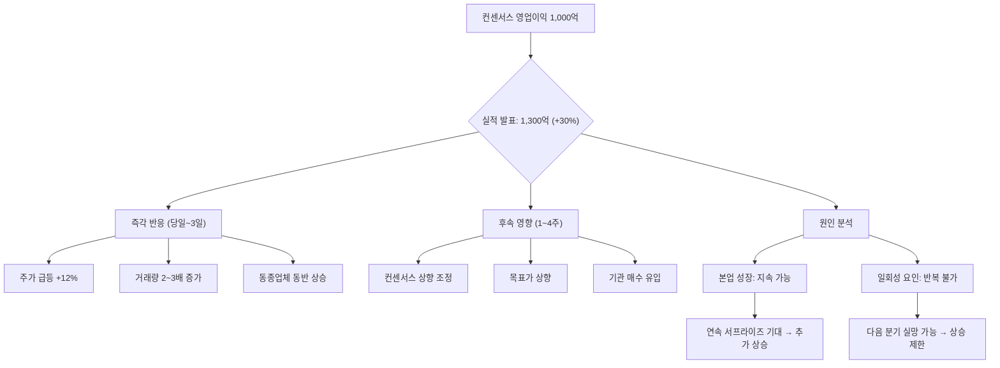

# 어닝서프라이즈 뜻 — 실적이 시장 기대를 크게 넘긴 것

## 한 줄 정의

어닝서프라이즈는 기업의 실제 실적이 컨센서스(시장 기대치)를 크게 상회하는 현상으로, 주가 급등과 밸류에이션 상향의 계기가 됩니다.

## 아주 쉽게 말하면

시험에서 80점 예상이었는데 95점을 맞은 것입니다. "예상보다 훨씬 잘했네!" 하는 놀라움이 주가 상승으로 나타납니다. 중요한 것은 95점이라는 절대 점수가 아니라 "기대보다 15점 높았다"는 사실입니다.

## 왜 중요한가

- 어닝서프라이즈 직후 주가가 +10% 이상 급등하는 경우가 많습니다
- 단순 1회가 아니라 연속 서프라이즈가 나오면 컨센서스 자체가 지속 상향됩니다
- 업종 내 한 기업의 서프라이즈가 동종업체에도 긍정적 기대를 전파합니다
- 서프라이즈 크기뿐 아니라 "지속 가능성"이 주가 반응의 크기를 결정합니다
- 실적 모멘텀 전략의 핵심 시그널입니다

## 그림으로 이해하기

## 숫자로 보는 예시

> ⚠️ 아래 숫자는 개념 설명을 위한 **가상 예시**이며, 실제 투자 데이터가 아닙니다.

가상의 I바이오 3분기 실적:

- 컨센서스 영업이익: 500억 원 (애널리스트 6명 평균)
- 실제 영업이익: 700억 원 (**서프라이즈율 +40%**)
- 원인: 신약 출시 후 처방 건수가 예상의 2배, 마진율도 기존 제품보다 높음

**주가 반응 타임라인**:
- 발표 당일: +12% (장 마감 후 발표 → 다음 날 갭 상승)
- 1주 후: 추가 +5% (애널리스트 목표가 상향 리포트 발간)
- 1개월 후: 추가 +8% (4Q 컨센서스도 대폭 상향)
- 총 상승: +25% (서프라이즈 전 대비)

**연속 서프라이즈 효과**: 만약 4Q에도 서프라이즈가 나오면 → "실적 모멘텀 주" 지위 획득 → PER 멀티플 자체가 상향 (리레이팅)

## 표로 비교하기

| 서프라이즈율 | 시장 반응 강도 | 주가 영향 | 지속 조건 |
|-------------|--------------|----------|----------|
| +5~10% | 소폭 서프라이즈 | +2~5% | 본업이면 긍정 |
| +10~20% | 중간 서프라이즈 | +5~10% | 컨센서스 상향 동반 |
| +20~50% | 대형 서프라이즈 | +10~15% | 연속 가능성이 핵심 |
| +50% 이상 | 메가 서프라이즈 | +15%+ | 구조적 변화 여부 확인 |

## 초보자가 자주 하는 오해

**오해 1: "서프라이즈가 나오면 바로 사야 한다"**

이미 장 마감 후 발표된 경우 다음 날 갭 상승으로 시작합니다. 추격 매수는 단기 고점에 물릴 리스크가 있습니다. 서프라이즈의 지속성을 먼저 판단하고, 눌림목을 기다리는 것이 현명합니다.

**오해 2: "서프라이즈는 항상 좋은 것이다"**

일회성 요인(환차익, 자산매각, 충당금 환입)에 의한 서프라이즈는 다음 분기 반복되지 않습니다. 영업 기반의 서프라이즈인지 확인이 필요합니다. 일회성 서프라이즈 후 다음 분기 쇼크가 나오는 패턴이 흔합니다.

**오해 3: "서프라이즈율이 클수록 무조건 주가가 많이 오른다"**

이미 "위스퍼 넘버"(비공식 기대치)가 컨센서스보다 높았다면, 공식 서프라이즈에도 주가 반응은 제한적입니다. 시장 참여자들이 이미 알고 있었던 서프라이즈는 힘이 약합니다.

**오해 4: "어닝서프라이즈 종목만 따라가면 수익이 난다"**

서프라이즈 발생 시점에 매수하면 이미 상당 부분이 반영된 후입니다. 서프라이즈를 "예측"하여 사전에 포지션을 구축하는 것이 실제 수익 전략입니다.

## 고수는 이렇게 봅니다

- 서프라이즈의 원인(본업 성장 vs 일회성)을 실적 발표 직후 즉시 분해합니다
- 연속 서프라이즈(2분기 이상)가 나오는 기업을 "어닝 모멘텀 주"로 분류합니다
- 서프라이즈 후 컨센서스 상향 폭이 충분한지 확인합니다 (상향 부족 = 추가 서프라이즈 가능)
- 동종 업체의 실적 발표를 기다려 업황 전체를 판단합니다
- 서프라이즈 이후에도 밸류에이션이 합리적인 수준인지 점검합니다

## 기업분석에서는 이렇게 씁니다

- 서프라이즈 원인을 매출 증가·마진 개선·비용 절감으로 분해합니다
- 과거 서프라이즈 이력과 이후 주가 흐름을 백테스트합니다
- 서프라이즈 후 자체 추정치를 조정하여 적정가치를 재산정합니다
- "서프라이즈 후 컨센서스 상향 폭 < 실제 서프라이즈 폭"이면 추가 상향 여지로 판단합니다

## 함께 보면 좋은 용어

- [컨센서스](./consensus.md): 서프라이즈의 기준이 되는 시장 기대치
- [어닝쇼크](./earnings-shock.md): 반대 개념, 기대에 못 미친 경우
- [가이던스](./guidance.md): 회사 자체 전망과의 비교
- [실적 시즌](./earnings-season.md): 서프라이즈가 집중되는 시기
- [마진 개선](./margin-improvement.md): 서프라이즈의 주요 원인 중 하나

## 정리

어닝서프라이즈는 실적이 시장 기대를 크게 넘길 때 발생하며, 주가 급등·컨센서스 상향·동종업체 동반 상승의 계기가 됩니다. 핵심은 일회성인지 구조적 개선인지를 구분하는 것입니다. 연속 서프라이즈가 나오는 기업은 실적 모멘텀이 강한 종목으로 분류되며, PER 멀티플 자체가 상향(리레이팅)될 수 있습니다.

## 한 줄 요약

> 어닝서프라이즈는 실적이 기대를 크게 넘긴 것이며, 지속 가능성 확인이 추격 매수보다 중요합니다.

---

이 글은 투자 권유가 아니라 주식 용어와 기업분석 방법을 설명하기 위한 교육 콘텐츠입니다. 특정 종목의 매수·매도 판단은 독자 본인의 책임입니다.

Tags: 어닝서프라이즈, 실적, 컨센서스, 주가급등, 실적시즌
