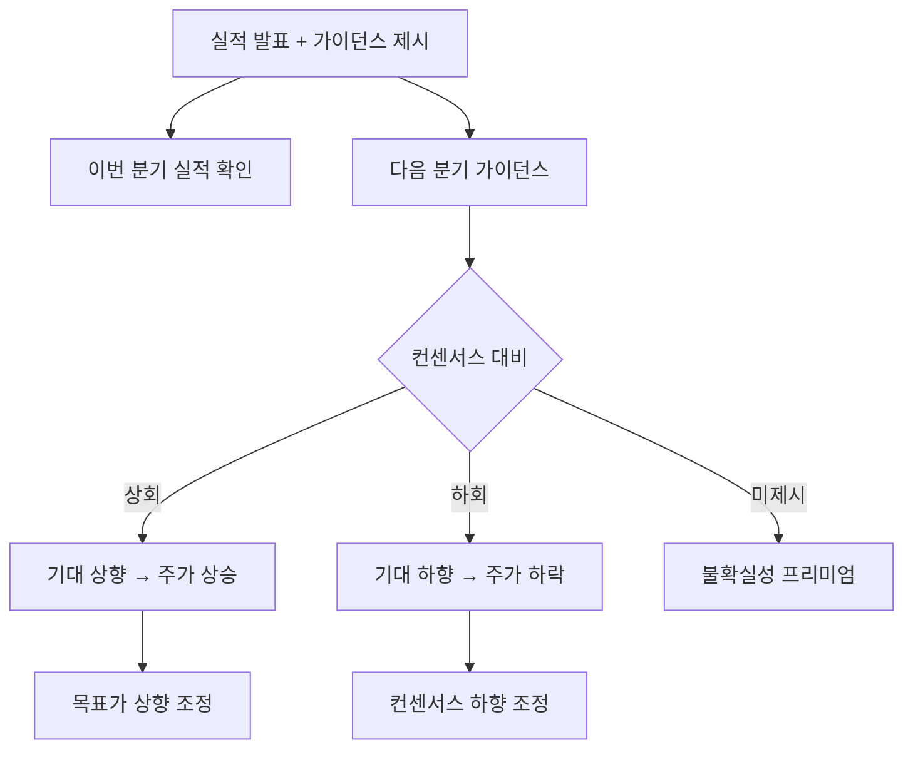

# 가이던스 뜻 — 회사가 직접 제시하는 미래 실적 전망

## 한 줄 정의

가이던스는 기업 경영진이 향후 매출·이익 등의 전망치를 시장에 직접 공개하는 것입니다.

## 아주 쉽게 말하면

학생이 "다음 시험에서 90점 이상 받겠습니다"라고 스스로 선언하는 것입니다. 선생님(애널리스트) 예상이 아니라 본인(회사)이 직접 말하는 목표입니다.

## 왜 중요한가

- 가이던스는 기업 내부 정보에 기반한 전망이므로 신뢰도가 높습니다
- 컨센서스보다 가이던스가 높으면 주가에 긍정적입니다
- 가이던스 하향 조정은 어닝쇼크보다 강한 악재가 될 수 있습니다
- 가이던스를 제시하지 않는 기업은 불확실성 프리미엄이 붙습니다

## 그림으로 이해하기

## 숫자로 보는 예시

> ⚠️ 아래 숫자는 개념 설명을 위한 **가상 예시**이며, 실제 투자 데이터가 아닙니다.

K기업이 연간 가이던스를 제시합니다.

- 연간 매출 가이던스: 2조 원 (전년 대비 +20%)
- 시장 컨센서스: 1.8조 원
- 괴리: 가이던스가 컨센서스보다 +11% 높음
- 결과: 컨센서스 상향 조정 → 목표가 상향 → 주가 상승

## 표로 비교하기

| 항목 | 가이던스 | 컨센서스 |
|------|---------|---------|
| 제시 주체 | 기업 경영진 | 외부 애널리스트 |
| 정보 기반 | 내부 데이터 | 외부 분석 |
| 업데이트 | 분기~연간 | 수시 |
| 법적 구속력 | 없음 (전망) | 없음 |
| 신뢰도 | 높음 (내부 정보) | 중간 |

## 초보자가 자주 하는 오해

**오해 1: "가이던스는 반드시 달성된다"**

가이던스는 목표이지 약속이 아닙니다. 시장 환경 변화로 달성하지 못하는 경우가 흔합니다.

**오해 2: "가이던스를 안 내는 회사는 나쁜 회사다"**

업종 특성상 예측이 어려운 기업(게임, 바이오)은 의도적으로 가이던스를 내지 않기도 합니다.

## 고수는 이렇게 봅니다

- 가이던스의 보수성 정도를 파악합니다 (항상 낮게 제시하는 회사인지)
- 가이던스 달성률 이력으로 경영진 신뢰도를 측정합니다
- 가이던스 범위(상단~하단)가 넓으면 불확실성이 크다고 봅니다
- 분기 중 가이던스 수정(상향/하향)은 강력한 시그널입니다

## 기업분석에서는 이렇게 씁니다

- 가이던스와 자체 추정치를 비교하여 보수적/공격적 여부를 판단합니다
- 과거 가이던스 달성률을 통계내어 현재 가이던스의 신뢰도를 조정합니다
- 가이던스 상향 이력이 있는 기업은 모멘텀 종목으로 분류합니다

## 함께 보면 좋은 용어

- [컨센서스](./consensus.md): 가이던스와 비교되는 외부 전망
- [어닝서프라이즈](./earnings-surprise.md): 가이던스를 넘긴 실적
- [어닝쇼크](./earnings-shock.md): 가이던스에도 못 미친 실적
- [실적 시즌](./earnings-season.md): 가이던스가 발표되는 시기
- [피크아웃](./peak-out.md): 가이던스 하향이 시작되는 시점

## 정리

가이던스는 기업이 직접 발표하는 미래 실적 전망입니다. 컨센서스보다 신뢰도가 높으며, 가이던스의 방향(상향/하향)이 주가 방향을 결정하는 경우가 많습니다. 경영진의 과거 가이던스 달성률을 함께 확인하면 현재 가이던스의 신뢰도를 판단할 수 있습니다.

## 한 줄 요약

> 가이던스는 회사가 직접 제시하는 실적 전망이며, 컨센서스 대비 방향이 주가를 움직입니다.

---

*면책 조항: 이 글은 투자 권유가 아니라 주식 용어와 기업분석 방법을 설명하기 위한 교육 콘텐츠입니다. 특정 종목의 매수·매도 판단은 독자 본인의 책임입니다.*

Tags: 가이던스, 실적전망, 경영진, 컨퍼런스콜, 목표치
