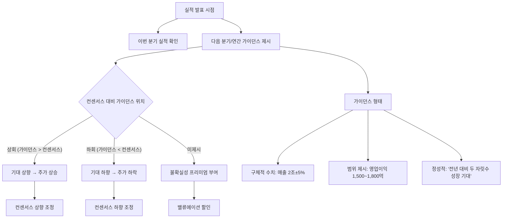

# 가이던스 뜻 — 회사가 직접 제시하는 미래 실적 전망

## 한 줄 정의

가이던스는 기업 경영진이 향후 매출·이익 등의 전망치를 시장에 직접 공개하는 것으로, 내부 정보에 기반한 가장 신뢰도 높은 전망입니다.

## 아주 쉽게 말하면

학생이 "다음 시험에서 90점 이상 받겠습니다"라고 스스로 선언하는 것입니다. 선생님(애널리스트) 예상이 아니라 본인(회사)이 직접 말하는 목표입니다. 그래서 시장은 "이 사람이 직접 말했으니 근거가 있겠지"라고 생각합니다.

## 왜 중요한가

- 가이던스는 기업 내부 데이터(수주잔고, 파이프라인, 계약)에 기반하므로 신뢰도가 높습니다
- 컨센서스보다 가이던스가 높으면 주가에 즉각 긍정적으로 반영됩니다
- 가이던스 하향 조정은 어닝쇼크보다 강한 악재가 될 수 있습니다
- 가이던스를 제시하지 않는 기업은 불확실성 프리미엄(할인)이 붙습니다
- 가이던스 달성률이 경영진 신뢰도를 결정합니다

## 그림으로 이해하기

## 숫자로 보는 예시

> ⚠️ 아래 숫자는 개념 설명을 위한 **가상 예시**이며, 실제 투자 데이터가 아닙니다.

가상의 K전자 연간 가이던스 시나리오:

**시나리오 A: 가이던스 > 컨센서스**
- 연간 매출 가이던스: 2조 원 (전년 대비 +20%)
- 시장 컨센서스: 1.8조 원
- 괴리: 가이던스가 컨센서스보다 **+11%** 높음
- 결과: 컨센서스 즉시 상향 → 주가 +7%

**시나리오 B: 가이던스 하향 조정**
- 기존 가이던스: 매출 2조 원
- 수정 가이던스: 매출 1.7조 원 (**-15% 하향**)
- 이유: "글로벌 수요 둔화로 하반기 전망 불투명"
- 결과: 주가 -12% (이번 분기 실적이 좋았는데도 하락)

**핵심**: 시장은 "지금 실적"보다 "앞으로 실적"(가이던스)에 더 민감하게 반응합니다.

## 표로 비교하기

| 항목 | 가이던스 | 컨센서스 |
|------|---------|---------|
| 제시 주체 | 기업 경영진 | 외부 애널리스트 |
| 정보 기반 | 내부 데이터 (수주·계약) | 외부 분석·추정 |
| 업데이트 | 분기~연간 (컨퍼런스콜) | 수시 (리포트) |
| 법적 구속력 | 없음 (전망 disclaimer 포함) | 없음 |
| 신뢰도 | 높음 (내부 정보 기반) | 중간 (외부 추정) |
| 주가 영향력 | 매우 큼 (즉각 반응) | 점진적 |

## 초보자가 자주 하는 오해

**오해 1: "가이던스는 반드시 달성된다"**

가이던스는 목표이지 약속이 아닙니다. 시장 환경 변화(경기 침체, 환율 급변, 주요 고객사 이탈)로 달성하지 못하는 경우가 흔합니다. 가이던스 달성률은 기업마다 크게 다릅니다.

**오해 2: "가이던스를 안 내는 회사는 나쁜 회사다"**

업종 특성상 예측이 어려운 기업(게임: 흥행 불확실, 바이오: 임상 결과 미확정, 건설: 수주 변동)은 의도적으로 가이던스를 내지 않습니다. 부정확한 가이던스보다는 미제시가 낫습니다.

**오해 3: "가이던스가 보수적이면 실제로는 더 잘 나온다"**

일부 기업은 관행적으로 보수적 가이던스를 제시하지만, 모든 기업이 그런 것은 아닙니다. 과거 달성률 이력을 확인해야 "보수적 경영진"인지 판단할 수 있습니다.

**오해 4: "가이던스 상향 = 이미 주가에 반영됐다"**

가이던스 상향 발표 즉시 주가가 반응하지만, 이후 컨센서스 후속 상향 + 목표가 조정이 이어지면서 추가 상승이 나오는 경우가 많습니다.

## 고수는 이렇게 봅니다

- 가이던스의 보수성 정도를 과거 이력으로 파악합니다 (항상 낮게 → 비트 확률 높음)
- 가이던스 달성률 이력으로 경영진 신뢰도를 정량화합니다
- 가이던스 범위(상단~하단)가 넓으면 불확실성이 크다고 판단합니다
- 분기 중 가이던스 수정(상향/하향)은 매우 강력한 시그널로 봅니다
- 가이던스를 "컨센서스와의 괴리"로 환산하여 투자 판단에 활용합니다

## 기업분석에서는 이렇게 씁니다

- 가이던스와 자체 추정치를 비교하여 경영진의 보수적/공격적 성향을 판단합니다
- 과거 4~8분기 가이던스 달성률을 통계내어 현재 가이던스의 신뢰도를 조정합니다
- 가이던스 상향 이력이 있는 기업은 모멘텀 종목으로 분류합니다
- 가이던스 미제시 기업은 자체 추정치의 불확실성을 넓게 설정합니다

## 함께 보면 좋은 용어

- [컨센서스](./consensus.md): 가이던스와 비교되는 외부 전망
- [어닝서프라이즈](./earnings-surprise.md): 가이던스를 넘긴 실적
- [어닝쇼크](./earnings-shock.md): 가이던스에도 못 미친 실적
- [실적 시즌](./earnings-season.md): 가이던스가 발표되는 시기
- [피크아웃](./peak-out.md): 가이던스 하향이 시작되는 시점

## 정리

가이던스는 기업이 직접 발표하는 미래 실적 전망으로, 내부 데이터에 기반하여 컨센서스보다 신뢰도가 높습니다. 가이던스의 방향(상향/하향)이 주가 방향을 결정하는 경우가 많으며, 특히 분기 중 가이던스 수정은 매우 강력한 시그널입니다. 경영진의 과거 달성률을 확인하면 현재 가이던스의 신뢰도를 판단할 수 있습니다.

## 한 줄 요약

> 가이던스는 회사가 직접 제시하는 실적 전망이며, 컨센서스 대비 방향이 주가를 움직입니다.

---

이 글은 투자 권유가 아니라 주식 용어와 기업분석 방법을 설명하기 위한 교육 콘텐츠입니다. 특정 종목의 매수·매도 판단은 독자 본인의 책임입니다.

Tags: 가이던스, 실적전망, 경영진, 컨퍼런스콜, 목표치
