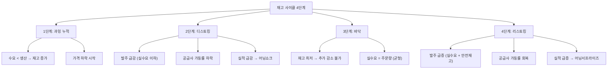

# 재고 조정 뜻 — 쌓인 재고를 줄이거나 다시 채우는 과정

## 한 줄 정의

재고 조정은 기업이 과잉 재고를 줄이거나(디스토킹), 부족한 재고를 다시 채우는(리스토킹) 과정으로, 제조업·반도체 업황 사이클의 핵심 동력입니다.

## 아주 쉽게 말하면

편의점에 음료가 너무 많이 쌓이면 발주를 줄입니다(디스토킹). 재고가 바닥나면 다시 많이 주문합니다(리스토킹). 이 과정이 제조업 전체 공급망에 "채찍 효과"처럼 증폭되어 업황을 좌우합니다.

## 왜 중요한가

- 재고 조정은 반도체·화학·제조업의 업황 사이클을 결정합니다
- 디스토킹 구간에서는 실수요보다 주문이 적어 공급사 실적이 급감합니다
- 리스토킹 구간에서는 실수요 이상으로 주문이 몰려 실적이 급증합니다
- 재고 수준을 추적하면 업황 바닥·정점을 3~6개월 미리 감지할 수 있습니다
- 주가는 재고 조정의 "방향 전환 시점"에 가장 민감하게 반응합니다

## 그림으로 이해하기

## 숫자로 보는 예시

> ⚠️ 아래 숫자는 개념 설명을 위한 **가상 예시**이며, 실제 투자 데이터가 아닙니다.

가상의 반도체 유통사 P메모리의 재고 사이클:

**디스토킹 구간 (2025년 하반기)**:
- 정상 재고: 3개월분 (300억 원 상당)
- 과잉 재고 발생: 6개월분 (600억 원) → 디스토킹 돌입
- 고객사 신규 주문: 평소의 50% 수준으로 급감
- P메모리 매출: 분기 1,000억 → 600억 (-40%)
- 제조사(공급사) 매출도 동반 -30% 감소

**리스토킹 구간 (2026년 상반기)**:
- 재고 정상화 후 수요 회복 감지
- 고객사 주문: 실수요 + 안전재고 확보 = 평소의 150%
- P메모리 매출: 분기 600억 → 1,200억 (+100%)
- 제조사 매출도 +60% 반등

**핵심**: 실수요는 ±20% 변동인데, 재고 효과로 주문량은 ±50~100% 변동합니다 (채찍 효과).

## 표로 비교하기

| 구간 | 재고 상태 | 주문량 | 공급사 실적 | 주가 반응 |
|------|----------|--------|-----------|----------|
| 과잉 누적 | 증가 중 | 실수요 이상 | 호황 막바지 | 피크아웃 경계 |
| 디스토킹 | 감소 중 | 실수요 이하 | 급감 | 하락 (최악 구간) |
| 바닥 | 최저 수준 | 최소 → 균형 | 바닥 | 반등 시작 |
| 리스토킹 | 증가 중 | 실수요 이상 | 급증 | 상승 가속 |

## 초보자가 자주 하는 오해

**오해 1: "재고가 줄고 있으면 좋은 것이다"**

**누구의** 재고인지가 중요합니다. 자사 재고가 줄어드는 것은 긍정적일 수 있지만, 고객사가 디스토킹 중이면 향후 주문이 줄어 오히려 부정적입니다. 공급망 전체의 재고 위치를 봐야 합니다.

**오해 2: "리스토킹은 수요가 폭발한 것이다"**

리스토킹은 실수요 + 안전재고 확보 수요가 합쳐진 것입니다. 실수요만큼의 지속적 주문을 보장하지 않습니다. 리스토킹이 끝나면 주문이 다시 실수요 수준으로 정상화됩니다.

**오해 3: "디스토킹 중이니 투자하면 안 된다"**

주가는 디스토킹 "종료 시점"을 미리 반영합니다. 디스토킹 말기(재고 바닥 근접)에 주가가 먼저 반등하는 경우가 대부분입니다. 최악의 실적 시점이 최고의 매수 시점인 경우가 많습니다.

**오해 4: "반도체만 재고 사이클이 있다"**

화학, 철강, 자동차 부품, 디스플레이 등 모든 제조업에 재고 사이클이 존재합니다. 다만 반도체가 사이클 폭이 가장 크고 주기가 명확해서 대표적으로 언급됩니다.

## 고수는 이렇게 봅니다

- 공급망 내 재고 위치(제조사·유통·최종 고객)별로 분석합니다
- 재고자산회전율 변화(분기별)로 디스토킹/리스토킹 시작 시점을 감지합니다
- 업계 재고 수준 데이터(DRAM 재고주수, 화학 재고율, NAND 비트 출하)를 추적합니다
- 디스토킹 말기에 진입하면 "최악을 지나는 중"이라 판단하고 매수를 검토합니다
- 리스토킹 후반에는 "기대가 과열됐는지" 점검합니다

## 기업분석에서는 이렇게 씁니다

- 분기별 재고자산 변화와 매출 변화를 함께 그래프로 분석합니다
- 업종별 재고 사이클 길이(반도체: 4~6분기, 화학: 2~3분기)를 적용합니다
- 고객사 재고 수준 데이터로 향후 주문 전망을 추정합니다
- 재고/매출 비율(재고주수)을 동종업체 간 비교합니다

## 함께 보면 좋은 용어

- [피크아웃](./peak-out.md): 재고 과잉 후 실적 정점
- [턴어라운드](./turnaround.md): 디스토킹 완료 후 회복
- [기저효과](./base-effect.md): 디스토킹 기간의 낮은 기저가 리스토킹 시 YoY 폭증
- [컨센서스](./consensus.md): 재고 사이클을 반영한 실적 전망
- [마진 개선](./margin-improvement.md): 리스토킹 시 가동률 상승으로 마진 회복

## 정리

재고 조정은 기업이 과잉 재고를 줄이거나(디스토킹) 부족한 재고를 채우는(리스토킹) 과정으로, 제조업·반도체 업황의 핵심 변수입니다. 실수요 변동보다 재고 효과(채찍 효과)로 인해 주문량 변동이 훨씬 크게 증폭되며, 주가는 재고 사이클의 "방향 전환 시점"에 가장 민감하게 반응합니다. 디스토킹 말기가 투자 기회, 리스토킹 후반이 리스크 관리 시점입니다.

## 한 줄 요약

> 재고 조정은 쌓인 재고를 줄이거나 채우는 과정이며, 제조업 사이클의 핵심 동력이자 투자 타이밍의 열쇠입니다.

---

이 글은 투자 권유가 아니라 주식 용어와 기업분석 방법을 설명하기 위한 교육 콘텐츠입니다. 특정 종목의 매수·매도 판단은 독자 본인의 책임입니다.

Tags: 재고조정, 재고순환, 반도체사이클, 디스토킹, 리스토킹
