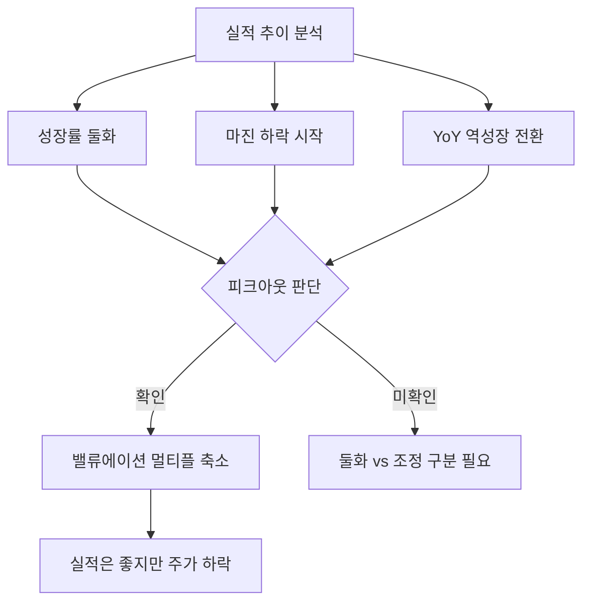

# 피크아웃 뜻 — 실적이 정점을 지나 하락하기 시작하는 것

## 한 줄 정의

피크아웃은 기업이나 업종의 실적(매출·이익)이 최고점을 찍고 하향 추세로 전환되는 시점입니다.

## 아주 쉽게 말하면

롤러코스터가 가장 높은 꼭대기를 지나 내려가기 시작하는 순간입니다. 아직 높은 위치에 있지만, 방향은 이미 아래를 향하고 있습니다.

## 왜 중요한가

- 주가는 실적 정점보다 3~6개월 먼저 반응(선반영)합니다
- 피크아웃이 확인되면 밸류에이션 멀티플이 축소됩니다
- "실적은 좋은데 주가가 빠지는" 현상의 주요 원인입니다
- 업종 사이클의 전환점을 포착하는 핵심 개념입니다

## 그림으로 이해하기

## 숫자로 보는 예시

> ⚠️ 아래 숫자는 개념 설명을 위한 **가상 예시**이며, 실제 투자 데이터가 아닙니다.

L기업 분기별 영업이익 추이:

- 1Q: 800억 → 2Q: 1,000억 → 3Q: 1,200억(★피크) → 4Q: 1,100억 → 1Q: 900억
- 주가 정점: 2Q 말 (실적 피크 1분기 전)
- 3Q 실적 발표 시 "역대 최대 실적"이지만 4Q 가이던스 하향 → 주가 하락

## 표로 비교하기

| 구간 | 실적 추세 | 주가 반응 | 시장 심리 |
|------|----------|----------|----------|
| 성장 가속 | 전분기 대비 ↑↑ | 급등 | 낙관 |
| 성장 둔화 | 여전히 ↑ 이지만 폭 감소 | 횡보~하락 | 불안 |
| 피크아웃 | 전분기 대비 ↓ 전환 | 하락 가속 | 비관 |
| 바닥 | 감소폭 축소 | 반등 시도 | 반신반의 |

## 초보자가 자주 하는 오해

**오해 1: "역대 최대 실적인데 왜 주가가 빠지지?"**

주가는 미래를 반영합니다. 현재가 최고점이고 앞으로 줄어들 것이 보이면 주가는 미리 빠집니다.

**오해 2: "피크아웃 = 기업이 망한다"**

피크아웃은 사이클의 자연스러운 현상입니다. 대부분의 기업은 다음 사이클에서 또 성장합니다. 영구적 하락과 순환적 하락을 구분해야 합니다.

## 고수는 이렇게 봅니다

- 분기 영업이익 증가율(QoQ)이 둔화되는 시점을 감지합니다
- 가이던스 하향 + 마진 축소가 동시에 나타나면 피크아웃을 확정합니다
- 피크아웃 확인 시 포지션 축소 또는 비중을 줄입니다
- 피크아웃 후 "바닥 신호"를 기다려 재진입 시점을 탐색합니다

## 기업분석에서는 이렇게 씁니다

- 분기별 성장률 추이 그래프를 만들어 둔화 시점을 시각화합니다
- 동종 업체들의 실적 추이를 비교하여 업종 전체 피크아웃인지 확인합니다
- 피크아웃 구간에서는 PER 멀티플 하향을 밸류에이션에 반영합니다

## 함께 보면 좋은 용어

- [턴어라운드](./turnaround.md): 피크아웃의 반대, 바닥에서 회복
- [컨센서스](./consensus.md): 피크아웃 시 하향 조정되는 전망
- [가이던스](./guidance.md): 피크아웃 신호를 보내는 경영진 메시지
- [기저효과](./base-effect.md): 피크 후 높은 기저가 성장률을 눌림
- [마진 개선](./margin-improvement.md): 피크아웃과 반대로 이익률이 좋아지는 신호

## 정리

피크아웃은 실적이 최고점을 찍고 하향하는 전환점입니다. 주가는 실적 정점보다 먼저 반응하므로, "실적은 좋은데 주가가 빠지는" 현상이 발생합니다. 성장률 둔화와 가이던스 하향을 조기에 감지하는 것이 피크아웃 대응의 핵심입니다.

## 한 줄 요약

> 피크아웃은 실적 정점 후 하락 전환이며, 주가는 실적보다 먼저 꺾입니다.

---

*면책 조항: 이 글은 투자 권유가 아니라 주식 용어와 기업분석 방법을 설명하기 위한 교육 콘텐츠입니다. 특정 종목의 매수·매도 판단은 독자 본인의 책임입니다.*

Tags: 피크아웃, 실적정점, 성장둔화, 사이클, 주가선반영
