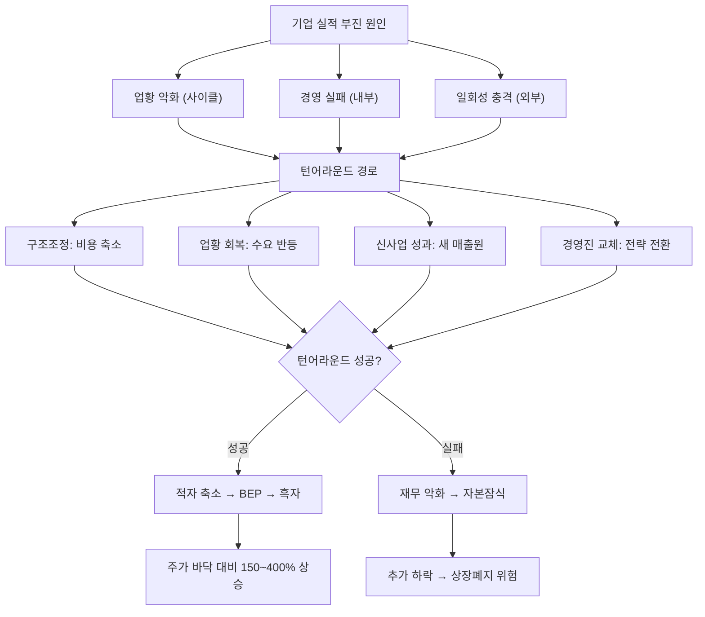

# 턴어라운드 뜻 — 부진하던 기업이 다시 실적을 회복하는 것

## 한 줄 정의

턴어라운드는 적자 또는 실적 부진 상태의 기업이 다시 흑자나 성장 궤도로 돌아오는 과정으로, 주가는 실적 확인 전에 기대감으로 먼저 반응합니다.

## 아주 쉽게 말하면

성적이 계속 떨어지다가 다시 올라가기 시작하는 것입니다. "이 학생 이제 살아나는구나!"라고 선생님들이 인식하는 순간, 기대감이 먼저 생깁니다. 기업도 마찬가지로, 실적 회복 "확인" 전에 "기대"로 주가가 먼저 움직입니다.

## 왜 중요한가

- 턴어라운드 초기에 투자하면 큰 수익을 얻을 수 있습니다 (바닥 대비 2~5배)
- 주가는 실적 회복이 확인되기 전, 기대감 단계에서 먼저 움직입니다
- 모든 부진 기업이 턴어라운드에 성공하는 것은 아닙니다 (실패 시 상장폐지)
- 턴어라운드 여부 판단이 가치투자의 핵심 역량 중 하나입니다
- 턴어라운드 종목은 "불확실성 → 확실성" 전환 과정에서 밸류에이션이 급격히 상향됩니다

## 그림으로 이해하기

## 숫자로 보는 예시

> ⚠️ 아래 숫자는 개념 설명을 위한 **가상 예시**이며, 실제 투자 데이터가 아닙니다.

가상의 M조선 분기별 영업이익과 주가 추이:

| 분기 | 영업이익 | 상태 | 주가 |
|------|---------|------|------|
| 1Q | -200억 | 적자 최대 | 15,000원 (바닥) |
| 2Q | -100억 | 적자 축소 | 22,000원 ↑ |
| 3Q | +50억 | 흑자 전환 (BEP 돌파) | 32,000원 ↑↑ |
| 4Q | +200억 | 이익 성장 | 40,000원 |
| 1Q' | +350억 | 정상화 | 45,000원 |

**핵심 타이밍**:
- 주가 바닥: 1Q (적자 최대 시점) — 가장 공포스러운 순간이 바닥
- 주가 반등 시작: 2Q 초 (적자 축소 첫 신호 감지)
- 턴어라운드 확인: 3Q (흑자 전환)
- 1Q 바닥 대비 1Q' 주가: **+200%**

**실패 시나리오**: 만약 2Q에도 적자가 -200억으로 유지되고, 수주 잔고도 감소한다면 → 턴어라운드 실패 판단 → 추가 하락 -30~50%

## 표로 비교하기

| 턴어라운드 단계 | 실적 상태 | 주가 반응 | 투자 전략 | 리스크 |
|---------------|----------|----------|----------|--------|
| 0단계: 위기 | 적자 확대 | 하락 가속 | 관망 | 상장폐지 |
| 1단계: 적자 축소 | 아직 적자이나 폭 감소 | 바닥 탐색·반등 | 소량 관찰 매수 | 재악화 가능 |
| 2단계: 흑자 전환 | BEP 돌파 | 본격 상승 | 비중 확대 | 일시적 흑자 가능 |
| 3단계: 이익 성장 | 흑자 확대 | 가속 상승 | 보유 | 기대감 과열 |
| 4단계: 정상화 | 안정적 이익 | 상승 둔화 | 차익 실현 검토 | 밸류에이션 부담 |

## 초보자가 자주 하는 오해

**오해 1: "적자 기업은 다 턴어라운드한다"**

턴어라운드 실패 → 상장폐지되는 기업도 많습니다. 회복 가능한 원인(사이클 저점, 구조조정 효과)과 불가능한 원인(시장 소멸, 기술 낙후)을 구분해야 합니다.

**오해 2: "흑자 전환하면 바로 사야 한다"**

흑자 전환이 이미 주가에 선반영된 경우가 대부분입니다. 시장은 "적자 축소" 단계에서 기대감으로 주가를 올립니다. 흑자 확인 시점에는 이미 바닥 대비 +100% 이상 올라 있을 수 있습니다.

**오해 3: "CEO가 바뀌면 턴어라운드한다"**

경영진 교체는 턴어라운드의 필요조건일 뿐 충분조건은 아닙니다. 신임 CEO의 전략·실행력·업황 등 복합 요인이 맞아야 합니다.

**오해 4: "주가가 많이 빠졌으니 턴어라운드 기대할 수 있다"**

주가 하락폭이 크다고 반등이 보장되지 않습니다. "싸졌다"와 "회복한다"는 별개의 문제입니다. 회복의 구체적 경로(비용 축소, 수주 회복, 신사업)가 보여야 합니다.

## 고수는 이렇게 봅니다

- 턴어라운드 원인(비용 절감, 신제품 성과, 업황 회복, M&A)을 구분합니다
- 적자 축소 속도와 마진 개선 추세로 흑자 전환 시점을 추정합니다
- 경영진 교체·구조조정·신사업 진출이 동반되는지 확인합니다
- 동종업체 대비 회복 속도를 비교하여 리더 종목을 선별합니다
- "최악의 분기"가 지나면 "뉴스는 나쁘지만 방향은 좋다"로 판단합니다

## 기업분석에서는 이렇게 씁니다

- 손익분기점(BEP) 매출을 계산하여 흑자 전환 시점을 추정합니다
- 비용 구조 변화(고정비 축소, 변동비 개선, 사업부 매각)를 분석합니다
- 턴어라운드 기업의 적정 밸류에이션은 12개월 선행 이익 또는 정상화 이익 기준으로 산정합니다
- 과거 턴어라운드 성공 사례의 주가 패턴(바닥→정상화 기간)을 참고합니다

## 함께 보면 좋은 용어

- [피크아웃](./peak-out.md): 턴어라운드의 반대, 실적 하락 전환
- [어닝쇼크](./earnings-shock.md): 턴어라운드 전 단계에서 발생하는 충격
- [마진 개선](./margin-improvement.md): 턴어라운드의 핵심 선행 신호
- [기저효과](./base-effect.md): 턴어라운드 시 YoY 성장률을 높여주는 요인
- [컨센서스](./consensus.md): 턴어라운드 기업의 상향 조정 추이

## 정리

턴어라운드는 부진했던 기업이 실적을 회복하는 과정으로, 적자 축소 → BEP 돌파 → 흑자 확대 순으로 진행됩니다. 주가는 실적 확인 전에 기대감으로 먼저 반등하므로, 가장 공포스러운 "적자 최대" 시점이 역설적으로 최고의 매수 기회입니다. 다만 모든 적자 기업이 회복하는 것은 아니므로, 회복 경로의 구체성(구조조정 효과, 수주 회복, 신사업 매출)을 반드시 확인해야 합니다.

## 한 줄 요약

> 턴어라운드는 부진한 기업이 다시 살아나는 것이며, 주가는 실적 확인 전에 먼저 반응하므로 "적자 축소" 시점에 주목해야 합니다.

---

이 글은 투자 권유가 아니라 주식 용어와 기업분석 방법을 설명하기 위한 교육 콘텐츠입니다. 특정 종목의 매수·매도 판단은 독자 본인의 책임입니다.

Tags: 턴어라운드, 적자전환, 흑자전환, 구조조정, 실적회복
