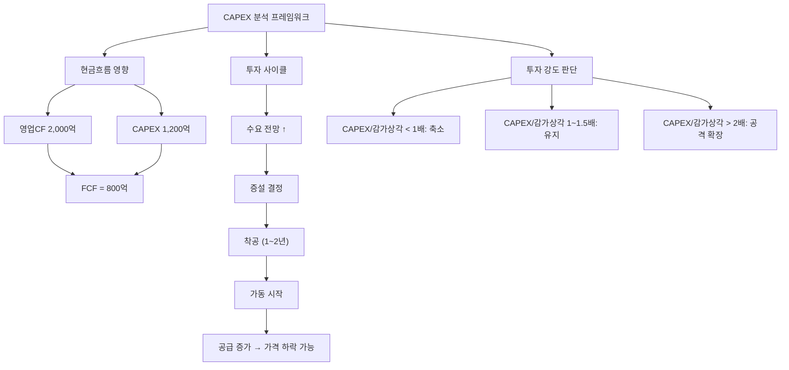

# CAPEX 뜻 — 기업이 미래를 위해 쓰는 설비투자 비용

## 한 줄 정의

CAPEX(Capital Expenditure)는 기업이 공장·설비·장비 등 유형자산을 취득하거나 확충하는 데 지출하는 자본적 투자 비용입니다.

## 아주 쉽게 말하면

치킨집을 하나 더 열려면 보증금, 튀김기, 인테리어 비용이 필요하죠. 이처럼 기업이 "미래에 더 많이 벌기 위해 지금 공장을 짓거나 기계를 사는 데 쓰는 돈"이 CAPEX입니다. 투자를 많이 한다는 것은 미래 성장을 준비한다는 뜻이지만, 가게가 너무 많아지면 서로 경쟁하듯 공급과잉의 위험도 함께 따라옵니다.

## 왜 중요한가

- CAPEX 확대는 기업이 미래 수요 증가를 예상한다는 신호입니다
- 과도한 CAPEX는 공급과잉을 초래하여 업황 악화의 원인이 됩니다
- CAPEX와 감가상각비 비율로 투자 강도를 판단할 수 있습니다
- 현금흐름에서 CAPEX를 빼면 FCF(잉여현금흐름)를 계산할 수 있습니다
- 동종업체 전체 CAPEX 합계가 향후 3년간 공급량을 결정합니다

## 그림으로 이해하기

## 숫자로 보는 예시

> ⚠️ 아래 숫자는 개념 설명을 위한 **가상 예시**이며, 실제 투자 데이터가 아닙니다.

가상 기업 "한빛소재"의 3개년 CAPEX 분석:

| 연도 | 영업CF | CAPEX | FCF | 감가상각비 | CAPEX/감가상각 |
|------|--------|-------|-----|-----------|--------------|
| 2023년 | 2,000억 | 800억 | 1,200억 | 700억 | 1.1배 (유지) |
| 2024년 | 2,500억 | 2,200억 | 300억 | 750억 | 2.9배 (공격 확장) |
| 2025년(E) | 3,000억 | 1,000억 | 2,000억 | 1,100억 | 0.9배 (투자 마무리) |

2024년 한빛소재는 신규 공장에 2,200억을 투자했습니다. FCF가 300억으로 급감했지만, 2025년 공장 가동이 시작되면 영업CF가 늘고 CAPEX는 줄어 FCF가 2,000억으로 급증합니다. 이 시점이 주주환원(배당·자사주) 여력이 커지는 구간입니다.

## 표로 비교하기

| CAPEX/감가상각비 | 의미 | 투자 판단 | 업종 예시 |
|-----------------|------|----------|----------|
| 0.5배 이하 | 투자 축소 (설비 노후화) | 성장 포기? or 사이클 바닥? | 불황기 화학사 |
| 0.8~1.2배 | 유지 투자 | 현상 유지, 안정적 FCF | 식품·유틸리티 |
| 1.5~2.0배 | 적극 투자 | 성장 기대, 단기 FCF 감소 | 2차전지 소재 |
| 2.0배 이상 | 공격적 확장 | 공급과잉 주의 필요 | 호황기 반도체 |

## 초보자가 자주 하는 오해

**오해 1: "CAPEX가 크면 무조건 좋다"**

수요 없이 과잉 투자하면 공급과잉→가격하락→적자로 이어집니다. 2018년 중국 반도체 업체들의 동시 증설이 2019년 DRAM 가격 폭락을 초래한 것이 대표적 예시입니다.

**오해 2: "CAPEX는 비용이니까 줄이는 게 좋다"**

CAPEX를 줄이면 단기 현금흐름은 좋아지지만, 미래 성장동력을 잃을 수 있습니다. 설비가 노후화되면 생산성이 떨어지고 결국 경쟁력을 상실합니다.

**오해 3: "CAPEX가 줄면 실적이 나빠진다"**

오히려 CAPEX 피크를 지나면 감가상각비는 일정한데 매출은 늘어나 이익이 급증하는 구간이 옵니다. 이를 "수확기"라고 부릅니다.

**오해 4: "모든 CAPEX는 동일하다"**

유지 CAPEX(기존 설비 교체)와 성장 CAPEX(신규 증설)는 의미가 완전히 다릅니다. 성장 CAPEX만 미래 매출 증가에 기여합니다.

## 고수는 이렇게 봅니다

- 업종 전체 CAPEX 합계로 향후 2~3년 공급 변화를 예측합니다
- CAPEX 회수 기간(투자금 ÷ 연간 이익 증가분)을 계산하여 투자 효율을 봅니다
- 경쟁사 대비 CAPEX 규모로 시장점유율 변화를 전망합니다
- CAPEX peak를 지나면 FCF가 급증하여 주주환원 여력이 커진다고 봅니다
- 유지 CAPEX와 성장 CAPEX를 분리하여 진짜 성장 투자 규모를 파악합니다

## 기업분석에서는 이렇게 씁니다

- DCF 모델에서 CAPEX를 차감하여 FCF를 산출합니다
- CAPEX 계획(공시, IR자료)으로 향후 2~3년 생산능력을 추정합니다
- 동종업체 CAPEX 합계로 업종 공급 증가율을 전망합니다
- CAPEX 집행 시점과 가동 시점의 시차(1.5~2년)를 반영하여 실적을 추정합니다

## 함께 보면 좋은 용어

- [반도체 사이클](./semiconductor-cycle.md): CAPEX가 사이클을 만드는 대표 업종
- [시클리컬](./cyclical.md): CAPEX 과잉이 하락을 부르는 구조
- [수주잔고](./order-backlog.md): CAPEX를 집행하는 발주 기업의 지표
- [영업현금흐름](../level-03-financial-statements/cash-flow.md): CAPEX의 재원

## 정리

CAPEX는 기업이 미래 성장을 위해 투자하는 설비 자본 지출입니다. 적절한 CAPEX는 성장의 신호이지만, 과도한 CAPEX는 공급과잉의 원인이 됩니다. CAPEX/감가상각비 비율로 투자 강도를 판단하고, 업종 전체 투자 규모로 공급 방향을 예측하며, CAPEX 피크 이후 FCF 급증 구간이 주주 가치 상승의 타이밍입니다.

## 한 줄 요약

> CAPEX는 미래 성장을 위한 설비투자이며, 과하면 공급과잉, 부족하면 성장 둔화의 신호입니다.

---

이 글은 투자 권유가 아니라 주식 용어와 기업분석 방법을 설명하기 위한 교육 콘텐츠입니다. 특정 종목의 매수·매도 판단은 독자 본인의 책임입니다.

Tags: 설비투자, 자본적지출, 감가상각, 성장투자, 기업분석
