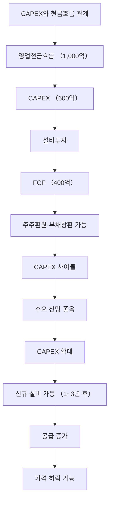

# CAPEX 뜻 — 기업이 미래를 위해 쓰는 설비투자 비용

## 한 줄 정의

CAPEX(Capital Expenditure)는 기업이 공장·설비·장비 등 유형자산을 취득하거나 확충하는 데 지출하는 자본적 투자 비용입니다.

## 아주 쉽게 말하면

"미래에 더 많이 벌기 위해 지금 공장을 짓거나 기계를 사는 데 쓰는 돈"입니다. 투자를 많이 한다는 것은 미래 성장을 준비한다는 뜻입니다.

## 왜 중요한가

- CAPEX 확대는 기업이 미래 수요 증가를 예상한다는 신호입니다
- 과도한 CAPEX는 공급과잉을 초래하여 업황 악화의 원인이 됩니다
- CAPEX와 감가상각비 비율로 투자 강도를 판단할 수 있습니다
- 현금흐름에서 CAPEX를 빼면 FCF(잉여현금흐름)를 계산할 수 있습니다

## 그림으로 이해하기

## 숫자로 보는 예시

> ⚠️ 아래 숫자는 개념 설명을 위한 **가상 예시**이며, 실제 투자 데이터가 아닙니다.

G기업의 CAPEX 분석:

- 연간 영업현금흐름: 2,000억 원
- CAPEX: 1,500억 원 (투자 강도 75%)
- 감가상각비: 800억 원
- CAPEX/감가상각비 = 1.9배 (공격적 투자, 생산능력 확대 중)
- FCF = 2,000 - 1,500 = 500억 원

CAPEX/감가상각비가 1배 이하면 유지 수준, 2배 이상이면 공격적 확장입니다.

## 표로 비교하기

| CAPEX/감가상각비 | 의미 | 투자 판단 |
|-----------------|------|----------|
| 0.5배 이하 | 투자 축소 (설비 노후화) | 성장 포기? or 사이클 바닥? |
| 0.8~1.2배 | 유지 투자 | 현상 유지 |
| 1.5~2.0배 | 적극 투자 | 성장 기대 |
| 2.0배 이상 | 공격적 확장 | 공급과잉 주의 |

## 초보자가 자주 하는 오해

**오해 1: "CAPEX가 크면 무조건 좋다"**

수요 없이 과잉 투자하면 공급과잉→가격하락→적자로 이어집니다. 수요 전망 대비 적절한 CAPEX인지가 중요합니다.

**오해 2: "CAPEX는 비용이니까 줄이는 게 좋다"**

CAPEX를 줄이면 단기 현금흐름은 좋아지지만, 미래 성장동력을 잃을 수 있습니다. 균형이 핵심입니다.

## 고수는 이렇게 봅니다

- 업종 전체 CAPEX 합계로 향후 공급 변화를 예측합니다
- CAPEX 회수 기간(투자금 ÷ 연간 이익 증가분)을 계산합니다
- 경쟁사 대비 CAPEX 규모로 시장점유율 변화를 전망합니다
- CAPEX peak를 지나면 FCF가 급증하여 주주환원 여력이 커진다고 봅니다

## 기업분석에서는 이렇게 씁니다

- DCF 모델에서 CAPEX를 차감하여 FCF를 산출합니다
- CAPEX 계획(공시, IR자료)으로 향후 2~3년 생산능력을 추정합니다
- 동종업체 CAPEX 합계로 업종 공급 증가율을 전망합니다

## 함께 보면 좋은 용어

- [반도체 사이클](./semiconductor-cycle.md): CAPEX가 사이클을 만드는 대표 업종
- [시클리컬](./cyclical.md): CAPEX 과잉이 하락을 부르는 구조
- [수주잔고](./order-backlog.md): CAPEX를 집행하는 발주 기업의 지표
- [영업현금흐름](../level-03-financial-statements/cash-flow.md): CAPEX의 재원

## 정리

CAPEX는 기업이 미래 성장을 위해 투자하는 설비 자본 지출입니다. 적절한 CAPEX는 성장의 신호이지만, 과도한 CAPEX는 공급과잉의 원인이 됩니다. CAPEX/감가상각비 비율, 업종 전체 투자 규모, FCF 영향을 종합적으로 분석해야 합니다.

## 한 줄 요약

> CAPEX는 미래 성장을 위한 설비투자이며, 과하면 공급과잉, 부족하면 성장 둔화의 신호입니다.

---

*면책 조항: 이 글은 투자 권유가 아니라 주식 용어와 기업분석 방법을 설명하기 위한 교육 콘텐츠입니다. 특정 종목의 매수·매도 판단은 독자 본인의 책임입니다.*

Tags: CAPEX, 설비투자, 감가상각, 자본지출, 성장투자
