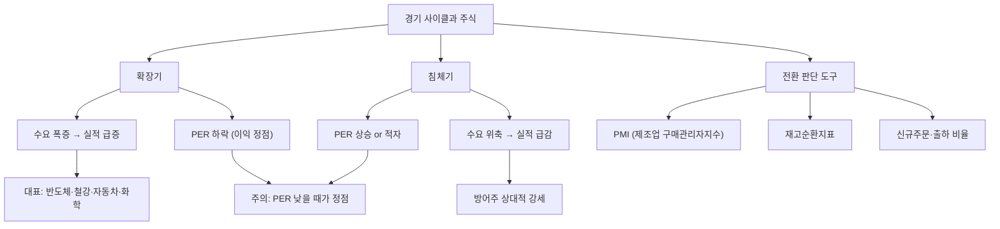

# 경기민감주 뜻 — 경기 흐름에 따라 실적이 크게 변하는 주식

## 한 줄 정의

경기민감주는 경기 확장기에 실적이 급증하고 침체기에 급감하는, 경기 사이클에 민감한 업종의 주식입니다.

## 아주 쉽게 말하면

경기가 좋으면 돈을 많이 벌고, 나쁘면 크게 줄어드는 기업입니다. 사람들이 돈이 넉넉하면 차를 바꾸고 집을 짓지만, 돈이 빠듯하면 미루는 것처럼, 이런 "미룰 수 있는 소비"와 연결된 기업들이 경기민감주입니다. 자동차, 반도체, 철강, 건설 등이 대표적입니다.

## 왜 중요한가

- 경기 사이클 판단이 투자 타이밍의 핵심입니다
- 경기민감주는 PER이 낮을 때가 오히려 "비싼" 시점일 수 있습니다
- 경기 회복 초기에 투자하면 큰 수익을, 후기에 투자하면 큰 손실을 볼 수 있습니다
- 방어주와 반대 개념으로 포트폴리오 배분에 중요합니다
- PMI, 재고지수 등 선행지표로 경기 전환점을 미리 감지할 수 있습니다

## 그림으로 이해하기

## 숫자로 보는 예시

> ⚠️ 아래 숫자는 개념 설명을 위한 **가상 예시**이며, 실제 투자 데이터가 아닙니다.

가상 기업 "한국철강" 4년간 실적 변동:

| 연도 | 경기 국면 | 영업이익 | PER | 주가 |
|------|----------|---------|-----|------|
| 2022 | 호황 정점 | 5,000억 | 4배 | 50,000원 |
| 2023 | 침체 진입 | 1,500억 | 10배 | 30,000원 |
| 2024 | 침체 바닥 | 300억 (적자 근접) | 50배 | 18,000원 |
| 2025 | 회복 초기 | 2,000억 | 8배 | 40,000원 |

2022년 PER 4배 → "싸 보이지만" 이미 이익 정점이었습니다. 2024년 PER 50배 → "비싸 보이지만" 실적 바닥이었고, 이후 주가가 2배 이상 반등했습니다. 이것이 경기민감주의 "PER 역설"입니다.

## 표로 비교하기

| 업종 | 경기민감도 | 대표 특성 | 선행지표 |
|------|----------|----------|----------|
| 반도체 | 매우 높음 | 메모리 가격에 따라 급등락 | DRAM 계약가 |
| 철강·화학 | 높음 | 원자재·수요에 연동 | 중국 PMI |
| 자동차 | 높음 | 소비 심리에 민감 | 소비자신뢰지수 |
| 건설·조선 | 높음 | 수주 사이클 존재 | 건축허가·수주 |
| 은행 | 중간 | 금리·대출에 연동 | 기준금리 |
| 음식료·통신 | 낮음 | 방어주 성격 | — |

## 초보자가 자주 하는 오해

**오해 1: "PER이 낮으니까 싸다"**

경기민감주는 이익이 최고일 때 PER이 가장 낮습니다. 이때가 오히려 매도 시점일 수 있습니다. 반대로 PER이 높거나 적자일 때가 매수 시점일 수 있습니다.

**오해 2: "경기민감주는 위험하니까 피해야 한다"**

사이클을 이해하고 타이밍을 맞추면 가장 큰 수익을 얻을 수 있는 종목입니다. 핵심은 "언제 사고 언제 파느냐"입니다.

**오해 3: "경기지표 하나만 보면 된다"**

GDP, PMI, 재고지수, 소비자신뢰지수 등 여러 지표를 교차 확인해야 합니다. 단일 지표에 의존하면 노이즈에 속을 수 있습니다.

**오해 4: "경기민감주는 다 같이 움직인다"**

반도체와 조선은 사이클 길이도, 움직이는 시점도 다릅니다. 업종별로 개별 사이클을 파악해야 합니다.

## 고수는 이렇게 봅니다

- PER이 아닌 PBR·EV/EBITDA로 밸류에이션합니다 (이익 변동이 크므로)
- 경기 선행지표(PMI, 재고지수)로 사이클 위치를 판단합니다
- 업황 바닥에서 매수, 호황기에 매도하는 역발상 전략을 씁니다
- 감가상각비 대비 CAPEX 비율로 투자 사이클을 봅니다
- 업종 가동률이 80% 이하로 내려갈 때를 바닥 신호로 봅니다

## 기업분석에서는 이렇게 씁니다

- 정상 이익(mid-cycle earnings)을 기준으로 밸류에이션합니다
- 과거 사이클 고점·저점 실적을 참고하여 현재 위치를 추정합니다
- 업종 재고 수준, 가동률, 가격 추이로 사이클 단계를 진단합니다
- 경기 전환점에서 업종 로테이션(방어주 ↔ 경기민감주)을 실행합니다

## 함께 보면 좋은 용어

- [방어주](./defensive-stock.md): 경기민감주의 반대 개념
- [시클리컬](./cyclical.md): 경기민감주의 영어 표현
- [반도체 사이클](./semiconductor-cycle.md): 대표적 경기민감 사이클
- [피크아웃](../level-08-industry-macro/peak-out.md): 경기민감주의 정점 신호
- [재고 조정](../level-08-industry-macro/inventory-adjustment.md): 사이클의 핵심 변수

## 정리

경기민감주는 경기 사이클에 따라 실적이 크게 변하는 주식입니다. 일반적인 "PER 낮으면 싸다" 논리가 통하지 않으며, 사이클 위치를 판단하는 것이 투자의 핵심입니다. PMI·재고지수 등 선행지표로 전환점을 포착하고, 바닥에서 사고 정점에서 파는 역발상 접근이 필요합니다.

## 한 줄 요약

> 경기민감주는 경기와 함께 등락하며, PER이 낮을 때가 오히려 정점일 수 있습니다.

---

이 글은 투자 권유가 아니라 주식 용어와 기업분석 방법을 설명하기 위한 교육 콘텐츠입니다. 특정 종목의 매수·매도 판단은 독자 본인의 책임입니다.

Tags: 경기민감주, 경기순환, 시클리컬, 업황, 매크로
