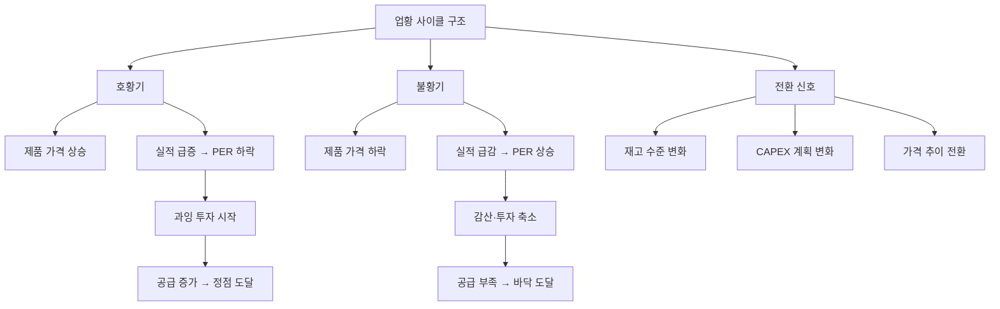

# 시클리컬 뜻 — 업황 사이클에 따라 실적이 반복적으로 등락하는 기업

## 한 줄 정의

시클리컬(Cyclical)은 경기나 업황의 순환 주기에 따라 호황과 불황을 반복하는 산업·기업을 지칭하는 용어입니다.

## 아주 쉽게 말하면

계절처럼 "좋을 때 → 나쁠 때 → 다시 좋을 때"가 반복되는 사업입니다. 여름에 아이스크림이 잘 팔리고 겨울에 안 팔리듯, 시클리컬 기업은 업황이 좋을 때 돈을 크게 벌고 나쁠 때 적자까지 볼 수 있습니다. 다만 계절과 달리 사이클 길이가 3~10년으로 길고, 정확한 시기를 예측하기 어렵다는 차이가 있습니다.

## 왜 중요한가

- 시클리컬 기업은 사이클 위치에 따라 투자 전략이 완전히 달라집니다
- 호황기에 PER이 낮아 보이고, 불황기에 PER이 높아 보이는 역설이 있습니다
- 사이클 길이(반도체 3~4년, 조선 7~10년)가 업종마다 다릅니다
- 사이클 바닥과 정점을 식별하는 것이 시클리컬 분석의 핵심입니다
- "이번엔 다르다"는 시클리컬 투자에서 가장 위험한 말입니다

## 그림으로 이해하기

## 숫자로 보는 예시

> ⚠️ 아래 숫자는 개념 설명을 위한 **가상 예시**이며, 실제 투자 데이터가 아닙니다.

가상 기업 "대한화학"의 사이클별 실적 추이:

| 사이클 단계 | 제품 가격(톤당) | 영업이익률 | PER | 주가 |
|-----------|--------------|----------|-----|------|
| 바닥 (2022) | 80만 원 | -3% (적자) | 적자 | 25,000원 |
| 회복 (2023) | 120만 원 | 12% | 15배 | 45,000원 |
| 호황 (2024) | 200만 원 | 35% | 5배 | 70,000원 |
| 정점 (2025) | 180만 원 | 28% | 6배 | 55,000원 |
| 하락 (2026E) | 100만 원 | 5% | 30배 | 35,000원 |

주목할 점: PER이 5배로 "싸 보이는" 2024년이 실제로는 사이클 정점 근처입니다. PER이 높거나 적자인 2022년이 오히려 매수 기회였습니다. 이것이 시클리컬 특유의 "PER 역설"입니다.

## 표로 비교하기

| 업종 | 사이클 길이 | 핵심 변수 | 정점 신호 |
|------|-----------|----------|----------|
| 반도체(메모리) | 3~4년 | DRAM/NAND 가격, 재고 | 동시 증설 발표 |
| 조선 | 7~10년 | 신조선가, 수주 | 수주 폭증 후 인도 시작 |
| 화학·정유 | 3~5년 | 유가, 스프레드 | 신규 크래커 가동 |
| 철강 | 3~5년 | 중국 수요, 가격 | 재고 급증 |
| 건설 | 5~7년 | 금리, 분양 | 미분양 증가 |
| 해운 | 3~5년 | 운임(BDI 등) | 신조 발주 급증 |

## 초보자가 자주 하는 오해

**오해 1: "이번엔 사이클이 없을 거야(슈퍼사이클)"**

모든 시클리컬 산업에는 결국 사이클이 옵니다. "이번엔 다르다"는 역사적으로 가장 위험한 말입니다. 2021년 해운 슈퍼사이클도 2023년에 정상화됐습니다.

**오해 2: "시클리컬은 도박이다"**

사이클을 이해하면 가장 예측 가능한 투자 대상이 됩니다. 계절을 아는 농부처럼 사이클을 아는 투자자는 수확할 수 있습니다.

**오해 3: "실적이 좋으면 주가도 오른다"**

시클리컬은 실적 정점에서 주가가 하락하기 시작합니다. 시장은 "앞으로 나빠질 것"을 먼저 반영하기 때문입니다.

**오해 4: "적자 기업은 투자하면 안 된다"**

시클리컬의 바닥에서는 적자가 오히려 반등의 전조일 수 있습니다. 모두가 포기할 때가 사이클 회복의 시작점입니다.

## 고수는 이렇게 봅니다

- 가격(제품가·원자재가) 추이로 사이클 위치를 판단합니다
- 업종 CAPEX 사이클(과잉투자 → 공급과잉 → 투자축소 → 공급부족)을 추적합니다
- PBR 밴드로 시클리컬 기업의 밸류에이션을 합니다 (PER은 부적절)
- 사이클 저점에서 "모두가 비관적일 때" 매수하는 역발상을 실행합니다
- 재고주수(weeks of inventory) 변화로 전환점을 조기 감지합니다

## 기업분석에서는 이렇게 씁니다

- 과거 2~3개 사이클의 고점·저점 실적을 기록하여 범위를 설정합니다
- 정상화 이익(mid-cycle earnings)을 기준으로 적정 주가를 산출합니다
- 공급 측 데이터(신규 설비, 증설 계획)로 향후 공급과잉 여부를 예측합니다
- 업종 가동률 추이로 현재 사이클 위치를 정량적으로 판단합니다

## 함께 보면 좋은 용어

- [경기민감주](./cyclical-stock.md): 시클리컬의 한국어 표현
- [반도체 사이클](./semiconductor-cycle.md): 대표적 시클리컬 업종
- [피크아웃](../level-08-industry-macro/peak-out.md): 사이클 정점 후 하락
- [턴어라운드](../level-08-industry-macro/turnaround.md): 사이클 바닥 후 회복
- [재고 조정](../level-08-industry-macro/inventory-adjustment.md): 사이클을 만드는 핵심 변수

## 정리

시클리컬은 업황 사이클에 따라 호황과 불황을 반복하는 산업입니다. PER이 아닌 PBR·정상화 이익으로 밸류에이션하며, 사이클 위치를 파악하는 것이 분석의 출발점입니다. 호황기에 PER이 낮고 불황기에 PER이 높은 "역설"을 이해하면 시클리컬 투자의 핵심을 잡은 것입니다.

## 한 줄 요약

> 시클리컬은 업황이 순환하는 산업이며, 사이클 위치를 파악하는 것이 분석의 핵심입니다.

---

이 글은 투자 권유가 아니라 주식 용어와 기업분석 방법을 설명하기 위한 교육 콘텐츠입니다. 특정 종목의 매수·매도 판단은 독자 본인의 책임입니다.

Tags: 시클리컬, 사이클, 업황순환, 경기순환, 시황
