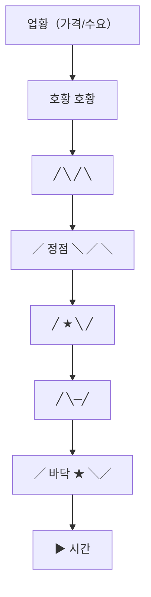

# 시클리컬 뜻 — 업황 사이클에 따라 실적이 반복적으로 등락하는 기업

## 한 줄 정의

시클리컬(Cyclical)은 경기나 업황의 순환 주기에 따라 호황과 불황을 반복하는 산업·기업을 지칭하는 용어입니다.

## 아주 쉽게 말하면

계절처럼 "좋을 때 → 나쁠 때 → 다시 좋을 때"가 반복되는 사업입니다. 여름이 지나면 겨울이 오고, 다시 여름이 오듯이 실적도 순환합니다.

## 왜 중요한가

- 시클리컬 기업은 사이클 위치에 따라 투자 전략이 완전히 달라집니다
- 호황기에 PER이 낮아 보이고, 불황기에 PER이 높아 보이는 역설이 있습니다
- 사이클 길이(반도체 3~4년, 조선 7~10년)가 업종마다 다릅니다
- 사이클 바닥에서 매수해 정점 전에 매도하는 것이 이상적입니다

## 그림으로 이해하기

## 숫자로 보는 예시

> ⚠️ 아래 숫자는 개념 설명을 위한 **가상 예시**이며, 실제 투자 데이터가 아닙니다.

반도체(DRAM) 사이클 예시:

| 사이클 단계 | DRAM 가격 | 기업 영업이익률 | 주가 반응 |
|------------|----------|--------------|----------|
| 바닥 | GB당 $2 | -5% (적자) | 저점 |
| 회복 | GB당 $4 | 15% | 급등 |
| 정점 | GB당 $8 | 50% | 고점 |
| 하락 | GB당 $3 | 5% | 급락 |

## 표로 비교하기

| 업종 | 사이클 길이 | 핵심 변수 |
|------|-----------|----------|
| 반도체(메모리) | 3~4년 | DRAM/NAND 가격, 재고 |
| 조선 | 7~10년 | 신조선가, 수주 |
| 화학·정유 | 3~5년 | 유가, 스프레드 |
| 철강 | 3~5년 | 중국 수요, 가격 |
| 건설 | 5~7년 | 금리, 분양 |
| 해운 | 3~5년 | 운임(BDI 등) |

## 초보자가 자주 하는 오해

**오해 1: "이번엔 사이클이 없을 거야(슈퍼사이클)"**

모든 시클리컬 산업에는 결국 사이클이 옵니다. "이번엔 다르다"는 역사적으로 가장 위험한 말입니다.

**오해 2: "시클리컬은 도박이다"**

사이클을 이해하면 가장 예측 가능한 투자 대상이 됩니다. 계절을 아는 농부처럼 사이클을 아는 투자자는 수확할 수 있습니다.

## 고수는 이렇게 봅니다

- 가격(제품가·원자재가) 추이로 사이클 위치를 판단합니다
- 업종 CAPEX 사이클(과잉투자 → 공급과잉 → 투자축소 → 공급부족)을 추적합니다
- PBR 밴드로 시클리컬 기업의 밸류에이션을 합니다 (PER은 부적절)
- 사이클 저점에서 "모두가 비관적일 때" 매수하는 역발상을 실행합니다

## 기업분석에서는 이렇게 씁니다

- 과거 2~3개 사이클의 고점·저점 실적을 기록하여 범위를 설정합니다
- 정상화 이익(mid-cycle earnings)을 기준으로 적정 주가를 산출합니다
- 공급 측 데이터(신규 설비, 증설 계획)로 향후 공급과잉 여부를 예측합니다

## 함께 보면 좋은 용어

- [경기민감주](./cyclical-stock.md): 시클리컬의 한국어 표현
- [반도체 사이클](./semiconductor-cycle.md): 대표적 시클리컬 업종
- [피크아웃](../level-08-industry-macro/peak-out.md): 사이클 정점 후 하락
- [턴어라운드](../level-08-industry-macro/turnaround.md): 사이클 바닥 후 회복
- [재고 조정](../level-08-industry-macro/inventory-adjustment.md): 사이클을 만드는 핵심 변수

## 정리

시클리컬은 업황 사이클에 따라 호황과 불황을 반복하는 산업입니다. PER이 아닌 PBR·정상화 이익으로 밸류에이션하며, 사이클 바닥에서 매수해 정점 전에 매도하는 전략이 핵심입니다. 업종별 사이클 길이와 핵심 변수를 파악하는 것이 시클리컬 투자의 출발점입니다.

## 한 줄 요약

> 시클리컬은 업황이 순환하는 산업이며, 사이클 위치를 아는 것이 투자 성패를 결정합니다.

---

*면책 조항: 이 글은 투자 권유가 아니라 주식 용어와 기업분석 방법을 설명하기 위한 교육 콘텐츠입니다. 특정 종목의 매수·매도 판단은 독자 본인의 책임입니다.*

Tags: 시클리컬, 사이클, 업황순환, 경기순환, 시황
