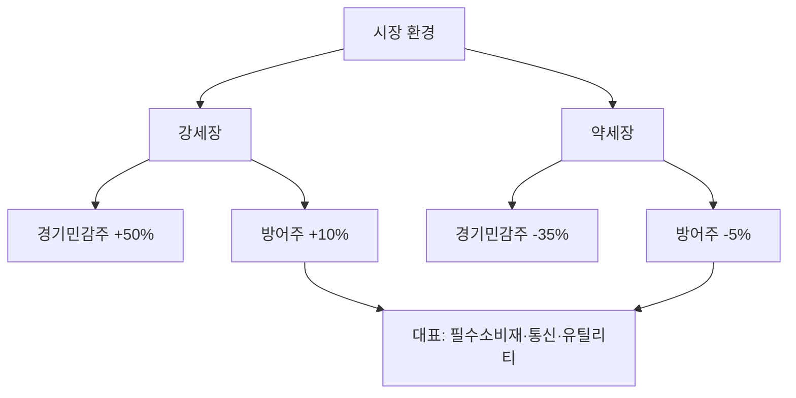

# 방어주 뜻 — 경기 침체에도 실적이 안정적인 주식

## 한 줄 정의

방어주는 경기 변동과 관계없이 비교적 안정적인 매출·이익을 유지하는 업종의 주식입니다.

## 아주 쉽게 말하면

경기가 나빠도 사람들이 밥은 먹고, 전기는 쓰고, 통신은 하니까 실적이 크게 줄지 않는 기업들입니다.

## 왜 중요한가

- 경기 침체기에 포트폴리오 손실을 줄여주는 역할을 합니다
- 안정적 배당으로 꾸준한 현금흐름을 제공합니다
- 시장 하락 시 상대적으로 덜 빠져 "방어" 역할을 합니다
- 반대로 강세장에서는 시장 수익률을 따라가지 못하는 단점이 있습니다

## 그림으로 이해하기

## 숫자로 보는 예시

> ⚠️ 아래 숫자는 개념 설명을 위한 **가상 예시**이며, 실제 투자 데이터가 아닙니다.

방어주 E기업(음식료) vs 경기민감주 F기업(화학):

| 연도 | E기업 영업이익 | F기업 영업이익 |
|------|-------------|-------------|
| 호황기 | 500억 | 3,000억 |
| 침체기 | 450억 (-10%) | 800억 (-73%) |
| 회복기 | 520억 | 2,500억 |

E기업은 변동폭이 작고, F기업은 경기에 따라 급등락합니다.

## 표로 비교하기

| 대표 방어주 업종 | 이유 | 특징 |
|---------------|------|------|
| 음식료 | 경기와 무관하게 소비 | 안정적 매출 |
| 통신 | 필수 서비스 | 높은 배당 |
| 유틸리티(전기·가스) | 필수재 | 규제 산업, 안정 |
| 의약품 | 질병은 경기를 타지 않음 | 연구개발 리스크 |
| 생활용품 | 일상 필수품 | 브랜드 파워 |

## 초보자가 자주 하는 오해

**오해 1: "방어주는 절대 안 빠진다"**

시장 전체가 폭락하면 방어주도 하락합니다. 다만 하락폭이 상대적으로 작을 뿐입니다.

**오해 2: "방어주만 사면 안전하다"**

상승장에서 수익률이 크게 뒤처져 기회비용이 발생합니다. 경기민감주와 적절히 배분하는 것이 중요합니다.

## 고수는 이렇게 봅니다

- 경기 후반·불확실성 확대 시 방어주 비중을 높입니다
- 배당수익률과 이익 안정성을 함께 평가합니다
- 방어주 내에서도 성장성이 있는 종목(고령화 수혜 등)을 선별합니다
- 시장 베타(β)가 0.5 이하인 종목을 방어주로 분류합니다

## 기업분석에서는 이렇게 씁니다

- 과거 경기 침체기(2008, 2020) 실적 변동폭을 측정합니다
- 배당 지속성(연속 배당 연수)을 확인합니다
- 시장 대비 상관관계(베타)를 계산하여 방어력을 수치화합니다

## 함께 보면 좋은 용어

- [경기민감주](./cyclical-stock.md): 방어주의 반대 개념
- [배당](../level-06-events/dividend.md): 방어주의 주요 매력
- [배당수익률](../level-06-events/dividend-yield.md): 방어주 선별 기준
- [포트폴리오](../level-10-company-analysis/portfolio.md): 방어주를 배분하는 전체 그림
- [분산투자](../level-10-company-analysis/diversification.md): 방어주 편입의 목적

## 정리

방어주는 경기 변동에 관계없이 안정적 실적을 유지하는 업종의 주식입니다. 하락장에서 손실을 줄여주지만, 상승장에서는 수익률이 제한됩니다. 포트폴리오에서 안정성을 담당하는 역할로 활용하며, 경기 상황에 따라 비중을 조절합니다.

## 한 줄 요약

> 방어주는 경기 침체에도 실적이 안정적인 주식이며, 포트폴리오의 안전판 역할을 합니다.

---

*면책 조항: 이 글은 투자 권유가 아니라 주식 용어와 기업분석 방법을 설명하기 위한 교육 콘텐츠입니다. 특정 종목의 매수·매도 판단은 독자 본인의 책임입니다.*

Tags: 방어주, 필수소비재, 통신주, 유틸리티, 안정배당
