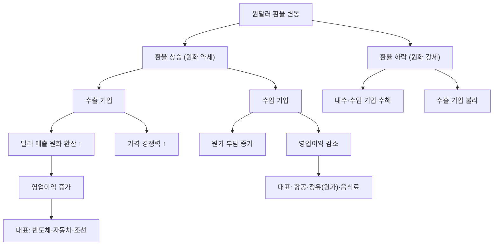

# 환율 수혜주 뜻 — 원화 약세(환율 상승) 시 이익이 늘어나는 주식

## 한 줄 정의

환율 수혜주는 원달러 환율이 상승(원화 약세)할 때 수출 매출이 늘어나거나 환차익이 발생하여 이익이 증가하는 주식입니다.

## 아주 쉽게 말하면

미국에 물건을 팔아서 달러로 받는 회사를 생각해보세요. 환율이 1,200원일 때 $100를 받으면 12만 원이지만, 환율이 1,400원이 되면 같은 $100이 14만 원이 됩니다. 물건을 만드는 비용(원화)은 그대로인데 매출(달러)의 원화 가치가 올라가니 이익이 커집니다. 이런 구조의 기업이 환율 수혜주입니다.

## 왜 중요한가

- 한국은 수출 비중이 높아 환율이 많은 기업 실적에 영향을 줍니다
- 환율 10원 변동에 주요 기업 영업이익이 수백억 원 변합니다
- 환율 수혜주와 환율 피해주를 구분하면 매크로 대응이 가능합니다
- 원화 강세 시에는 반대로 내수·수입 기업이 수혜를 받습니다
- 환율은 분기 실적의 어닝서프라이즈/쇼크 원인이 되는 경우가 많습니다

## 그림으로 이해하기

## 숫자로 보는 예시

> ⚠️ 아래 숫자는 개념 설명을 위한 **가상 예시**이며, 실제 투자 데이터가 아닙니다.

가상 수출 기업 "글로벌전자"의 환율 민감도 분석:

| 항목 | 환율 1,200원 | 환율 1,300원 | 환율 1,400원 |
|------|------------|------------|------------|
| 수출 매출($10억) | 1.2조 원 | 1.3조 원 | 1.4조 원 |
| 원화 비용(고정) | 0.8조 원 | 0.8조 원 | 0.8조 원 |
| 영업이익 | 4,000억 | 5,000억 | 6,000억 |
| 영업이익률 | 33% | 38% | 43% |

환율이 1,200→1,400원으로 200원(+17%) 오르면, 영업이익은 4,000→6,000억으로 +50% 증가합니다. 매출 원가가 원화 고정인 기업일수록 환율 레버리지가 큽니다.

## 표로 비교하기

| 업종 | 환율 상승 시 | 환율 하락 시 | 메커니즘 | 순 노출도 |
|------|------------|------------|----------|---------|
| 반도체·전자 | 수혜 | 피해 | 달러 매출 높음 | 매우 높음 |
| 자동차 | 수혜 | 피해 | 글로벌 수출 | 높음 |
| 조선 | 수혜 | 피해 | 달러 수주 | 높음 |
| 정유·화학 | 복합적 | 복합적 | 달러 매출 + 달러 원가 | 낮음 |
| 항공 | 피해 | 수혜 | 달러 비용(유류비·리스료) | 높음(역방향) |
| 음식료(내수) | 피해 | 수혜 | 원재료 수입 비용 증가 | 중간 |

## 초보자가 자주 하는 오해

**오해 1: "수출 기업은 환율이 오르면 무조건 좋다"**

원재료를 달러로 수입하는 기업은 매출과 비용 모두 달러이므로, 순 효과가 크지 않을 수 있습니다. 정유사가 대표적입니다. "순수출(달러 매출 - 달러 비용)" 비중을 봐야 합니다.

**오해 2: "환율은 예측할 수 있다"**

환율은 금리, 경상수지, 지정학, 투자 심리 등 수많은 변수가 얽혀 가장 예측하기 어려운 변수 중 하나입니다. 환율에만 기대는 투자는 위험합니다.

**오해 3: "환율이 오르면 수출 기업 주가도 바로 오른다"**

기업이 환헤지를 해놨으면 실제 이익에 즉각 반영되지 않습니다. 헤지 비율과 헤지 환율을 확인해야 실제 영향을 알 수 있습니다.

**오해 4: "달러 강세 = 한국 수출 기업에 항상 좋다"**

환율 급등이 글로벌 경기 침체 때문이라면, 수출 물량 자체가 줄어 환율 효과가 상쇄될 수 있습니다.

## 고수는 이렇게 봅니다

- 기업별 환율 민감도(환율 10원당 영업이익 변화)를 계산합니다
- 환헤지 비율을 확인하여 실제 영향을 추정합니다
- 환율 방향이 아닌 "변동 속도"에 주목합니다 (급변 시 헤지 손실)
- 원화 약세 + 수요 호조가 겹치는 업종에 집중합니다
- 분기 실적 시즌에 환율 효과를 미리 추정하여 서프라이즈를 예측합니다

## 기업분석에서는 이렇게 씁니다

- 환율 시나리오(1,200 / 1,300 / 1,400원)별 이익 추정치를 제시합니다
- 환헤지 잔액과 평균 환율을 확인하여 향후 환차익/손을 계산합니다
- 달러 매출·달러 비용 비중을 분리하여 순 환율 노출도를 산출합니다
- 전년 동기 평균 환율 대비 변동분으로 YoY 환율 효과를 분리합니다

## 함께 보면 좋은 용어

- [금리 민감주](./interest-rate-sensitive.md): 또 다른 매크로 변수 민감 주식
- [경기민감주](./cyclical-stock.md): 수출 기업이 많은 경기민감 업종
- [영업이익률](../level-04-ratios/operating-margin.md): 환율이 직접 영향 주는 지표
- [어닝서프라이즈](../level-08-industry-macro/earnings-surprise.md): 환율 효과로 발생 가능
- [기저효과](../level-08-industry-macro/base-effect.md): 전년 환율과의 비교

## 정리

환율 수혜주는 원화 약세(환율 상승) 시 수출 매출의 원화 환산액이 증가하여 이익이 늘어나는 주식입니다. 핵심은 "순 달러 노출도"로, 달러 매출에서 달러 비용을 뺀 금액이 클수록 환율 수혜가 큽니다. 환헤지 비율, 환율 변동 속도, 글로벌 수요 상황을 종합적으로 판단해야 합니다.

## 한 줄 요약

> 환율 수혜주는 원화가 약해질수록 이익이 늘어나는 수출 기업이며, 순 달러 노출도가 핵심입니다.

---

이 글은 투자 권유가 아니라 주식 용어와 기업분석 방법을 설명하기 위한 교육 콘텐츠입니다. 특정 종목의 매수·매도 판단은 독자 본인의 책임입니다.

Tags: 환율수혜주, 원달러환율, 수출주, 환차익, 매크로
