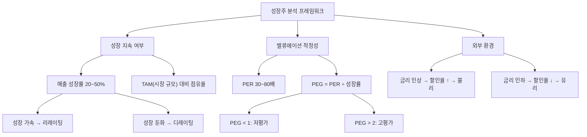

# 성장주 뜻 — 미래 이익 성장에 높은 프리미엄을 받는 주식

## 한 줄 정의

성장주는 매출·이익이 시장 평균보다 빠르게 증가할 것으로 기대되어 높은 밸류에이션을 받는 주식입니다.

## 아주 쉽게 말하면

"지금은 작은 가게지만, 매년 2배씩 커지고 있으니 미래 가치를 보고 비싸게라도 투자하자"라는 논리입니다. 스타트업에 투자하는 것과 비슷하죠. PER 50배가 비싸 보여도 이익이 매년 50% 성장한다면, 2년 후엔 PER 22배가 됩니다. 문제는 성장이 멈추는 순간 "미래 가치"가 증발하면서 주가가 급락한다는 것입니다.

## 왜 중요한가

- 성장주는 PER이 높아도 성장률이 이를 정당화할 수 있습니다
- 성장 기대가 꺾이면(피크아웃) 밸류에이션 급락(디레이팅)이 발생합니다
- 금리 인상기에는 미래 현금흐름 할인율이 높아져 성장주가 불리합니다
- 가치주와 상반되는 투자 스타일로 시장 환경에 따라 우위가 바뀝니다
- 매출 성장의 "질"(수익성 동반 vs 적자 확대)을 구분해야 합니다

## 그림으로 이해하기

## 숫자로 보는 예시

> ⚠️ 아래 숫자는 개념 설명을 위한 **가상 예시**이며, 실제 투자 데이터가 아닙니다.

가상 기업 "클라우드텍" (성장주) vs "한국금융" (가치주) 비교:

| 항목 | 클라우드텍(성장주) | 한국금융(가치주) |
|------|----------------|---------------|
| 현재 EPS | 1,000원 | 5,000원 |
| 연간 이익 성장률 | +45% | +5% |
| 3년 후 예상 EPS | 3,048원 | 5,788원 |
| 현재 PER | 50배 | 8배 |
| 현재 주가 | 50,000원 | 40,000원 |
| PEG | 1.1 (적정) | 1.6 |
| 3년 후 적정가(PER 30배/10배) | 91,440원 (+83%) | 57,880원 (+45%) |

클라우드텍은 PER 50배로 비싸 보이지만, 45% 성장률이 유지되면 3년 후 훨씬 더 큰 수익을 줍니다. 단, 성장률이 20%로 둔화되면? PER이 30→20배로 수축하면서 주가는 오히려 하락할 수 있습니다.

## 표로 비교하기

| 항목 | 성장주 | 가치주 |
|------|--------|--------|
| 매출 성장률 | 20%+ | 0~10% |
| PER 수준 | 30~80배 | 5~15배 |
| 배당 | 낮거나 없음 | 높음 |
| 이익 재투자 | 대부분 재투자 | 주주환원 중심 |
| 리스크 | 성장 둔화 시 급락 | 회복 지연 시 장기 횡보 |
| 유리한 환경 | 저금리, 유동성 풍부 | 고금리, 경기 불황 |
| 핵심 지표 | PEG, PSR, 매출 성장률 | PER, PBR, 배당수익률 |

## 초보자가 자주 하는 오해

**오해 1: "PER이 높으면 비싼 주식이다"**

PER 50배라도 이익이 매년 50% 성장하면 2년 후 PER은 22배가 됩니다. 성장률 대비 PER(PEG)을 봐야 합니다. PEG 1 이하면 성장 대비 저평가입니다.

**오해 2: "성장주는 항상 오른다"**

성장 기대가 꺾이면 PER 수축과 이익 감소가 동시에 일어나 주가가 -50% 이상 폭락할 수 있습니다. 2022년 금리 인상기에 많은 성장주가 -60~80% 하락했습니다.

**오해 3: "매출이 빠르게 늘면 성장주다"**

적자를 감수하고 마케팅비를 쏟아 매출을 늘리는 것은 "질 나쁜 성장"입니다. 매출 성장과 함께 영업이익률도 개선되는 "질 좋은 성장"을 구분해야 합니다.

**오해 4: "금리와 성장주는 관계없다"**

성장주의 가치는 먼 미래 현금흐름의 현재가치입니다. 금리(할인율)가 1% 올라도 이 현재가치는 크게 줄어듭니다. 금리 환경은 성장주 밸류에이션의 핵심 변수입니다.

## 고수는 이렇게 봅니다

- 매출 성장률의 가속/둔화 여부를 분기마다 확인합니다
- TAM(총 시장 규모) 대비 현재 점유율로 성장 여력을 판단합니다
- PEG(PER÷성장률)로 성장 대비 밸류에이션 적정성을 평가합니다
- 금리 환경 변화에 따른 성장주 밸류에이션 민감도를 인지합니다
- "Rule of 40"(매출 성장률 + 영업이익률 ≥ 40%)으로 성장의 질을 판단합니다

## 기업분석에서는 이렇게 씁니다

- DCF(현금흐름할인법)로 미래 성장을 현재 가치로 환산합니다
- 매출 성장률 + 마진 확대 동시 여부로 "질 좋은 성장"을 구분합니다
- 동종 성장주 대비 PER·PSR 비교로 상대적 매력도를 평가합니다
- 고객 획득 비용(CAC) 대비 생애 가치(LTV)로 성장 지속 가능성을 검증합니다

## 함께 보면 좋은 용어

- [가치주](./value-stock.md): 성장주와 반대되는 투자 스타일
- [PER](../level-05-valuation/per.md): 성장주의 높은 밸류에이션 지표
- [PEG](../level-05-valuation/peg.md): 성장률 대비 PER 적정성
- [피크아웃](../level-08-industry-macro/peak-out.md): 성장 둔화 시작점
- [리레이팅](../level-05-valuation/rerating.md): 성장 가속 시 밸류에이션 상향

## 정리

성장주는 미래 이익 성장에 대한 기대로 높은 밸류에이션을 받는 주식입니다. 성장률이 유지되면 높은 PER이 정당화되지만, 성장이 둔화되면 PER 수축과 이익 감소가 동시에 발생하여 급격한 하락이 옵니다. PEG로 적정성을 판단하고, 매출 성장의 질과 금리 환경을 종합적으로 고려해야 합니다.

## 한 줄 요약

> 성장주는 빠른 이익 성장 기대로 비싸 보여도 투자받는 주식이며, 성장 둔화 시 리스크가 큽니다.

---

이 글은 투자 권유가 아니라 주식 용어와 기업분석 방법을 설명하기 위한 교육 콘텐츠입니다. 특정 종목의 매수·매도 판단은 독자 본인의 책임입니다.

Tags: 성장주, 고주가수익비율, 매출성장, 테크주, 밸류에이션
