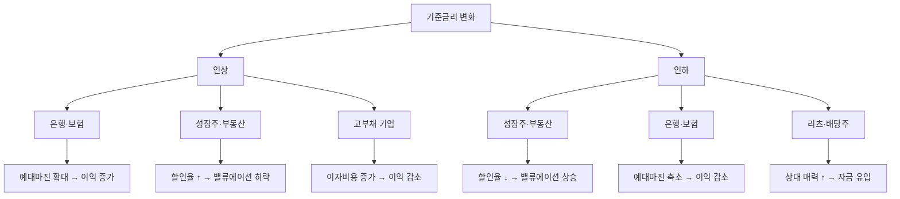

# 금리 민감주 뜻 — 금리 변화에 따라 주가가 크게 반응하는 주식

## 한 줄 정의

금리 민감주는 기준금리나 시장금리의 변화에 따라 실적·밸류에이션이 크게 영향받는 주식입니다.

## 아주 쉽게 말하면

금리는 "돈의 가격"입니다. 돈의 가격이 오르면 돈을 빌려주는 은행은 좋고, 돈을 빌려 쓰는 부동산·성장 기업은 힘들어집니다. 반대로 금리가 내려가면 은행은 수익이 줄고, 빚 쓰는 기업은 이자 부담이 가벼워집니다. 이렇게 금리 방향에 따라 실적과 주가가 크게 갈리는 주식이 금리 민감주입니다.

## 왜 중요한가

- 금리는 거시경제의 핵심 변수로 거의 모든 주식에 영향을 줍니다
- 금리 인상기와 인하기에 유리한 업종이 정반대입니다
- 성장주는 금리에 특히 민감합니다 (미래 현금흐름 할인율 변화)
- 금리 방향을 읽으면 섹터 전략의 큰 그림을 잡을 수 있습니다
- 금리 변화의 "이유"도 중요합니다 (경기 과열 vs 인플레이션 vs 침체)

## 그림으로 이해하기

## 숫자로 보는 예시

> ⚠️ 아래 숫자는 개념 설명을 위한 **가상 예시**이며, 실제 투자 데이터가 아닙니다.

가상 기업 비교 — 기준금리 1%p 인상 시 영향:

| 기업 | 업종 | 이익 변화 | 주가 반응 | 메커니즘 |
|------|------|----------|----------|---------|
| 국민은행 | 은행 | +18% | +12% | NIM 15bp 개선 |
| 클라우드텍 | 성장주(PER 50배) | 이익 동일 | -20% | 할인율 ↑ |
| 한국리츠 | 부동산 | -8% | -12% | 금융비용 증가 |
| 대한보험 | 보험 | +10% | +7% | 운용수익 개선 |
| 빚많은건설 | 건설(부채 300%) | -25% | -18% | 이자비용 급증 |

같은 1%p 인상에도 은행은 이익이 +18% 늘고, 고부채 건설사는 -25% 줄어듭니다. 금리 방향에 따라 포트폴리오 재배치가 필요한 이유입니다.

## 표로 비교하기

| 업종 | 금리 인상 시 | 금리 인하 시 | 메커니즘 | 민감도 |
|------|------------|------------|----------|--------|
| 은행 | 수혜 | 피해 | 예대마진(NIM) 확대/축소 | 높음 |
| 보험 | 수혜 | 피해 | 투자수익률 변화 | 중간 |
| 성장주 | 피해 | 수혜 | 미래 현금흐름 할인율 | 매우 높음 |
| 리츠·부동산 | 피해 | 수혜 | 차입비용·자산가치 | 높음 |
| 건설 | 피해 | 수혜 | 주택 수요·PF | 높음 |
| 배당주 | 상대 매력↓ | 상대 매력↑ | 채권 대비 매력도 | 중간 |

## 초보자가 자주 하는 오해

**오해 1: "금리가 오르면 모든 주식이 내린다"**

은행·보험은 금리 인상 시 수혜를 받습니다. 업종별로 영향이 다르기 때문에 "모든 주식"이라는 일반화는 위험합니다.

**오해 2: "금리 인하 = 무조건 주식 상승"**

금리 인하가 경기 침체 대응이면 실적 악화가 더 크게 작용하여 주가가 하락할 수 있습니다. "왜 인하하는가"가 중요합니다.

**오해 3: "기준금리만 보면 된다"**

시장금리(국채 10년물 등)가 실질적 영향을 줍니다. 기준금리 동결이어도 시장금리가 움직이면 주가가 반응합니다.

**오해 4: "금리 인상이 끝나면 바로 성장주를 사야 한다"**

인상 종료 후에도 고금리가 유지되는 기간에는 실적 악화가 누적됩니다. 실제 인하가 시작되거나 시장이 인하를 선반영할 때가 전환점입니다.

## 고수는 이렇게 봅니다

- 금리 방향(인상 vs 인하)에 따라 섹터 비중을 조절합니다
- 실질금리(명목금리 - 인플레이션)의 변화를 더 중요하게 봅니다
- 금리 변화 속도도 중요합니다: 급격한 인상은 충격, 점진적 인상은 소화 가능
- "금리 인상 막바지" 시점에서 성장주로 로테이션을 준비합니다
- 채권 금리와 배당수익률의 스프레드로 주식 매력도를 판단합니다

## 기업분석에서는 이렇게 씁니다

- 은행: NIM(순이자마진) 민감도 분석으로 금리 1bp당 이익 변화를 추정합니다
- 성장주: DCF 모델의 할인율 시나리오(금리 +1%, -1%)로 적정가치 변동을 계산합니다
- 부채 비율이 높은 기업의 이자비용 변화를 금리 시나리오별로 산출합니다
- 국채 금리와 기업 배당수익률 차이(yield gap)로 주식의 상대 매력도를 평가합니다

## 함께 보면 좋은 용어

- [성장주](./growth-stock.md): 금리 인하 시 수혜
- [가치주](./value-stock.md): 금리 인상기에 상대적 강세
- [환율 수혜주](./exchange-rate-beneficiary.md): 또 다른 매크로 변수 수혜
- [PER](../level-05-valuation/per.md): 금리와 밸류에이션의 관계
- [배당수익률](../level-06-events/dividend-yield.md): 금리와 비교 대상

## 정리

금리 민감주는 금리 변화에 따라 실적·밸류에이션이 크게 영향받는 주식입니다. 금리 인상기에는 은행·보험이 유리하고, 인하기에는 성장주·부동산이 유리합니다. 단순히 금리 방향뿐 아니라 변화 속도, 실질금리, 인상/인하의 이유까지 종합적으로 고려하여 섹터 비중을 조절하는 것이 매크로 투자의 기본입니다.

## 한 줄 요약

> 금리 민감주는 금리 방향에 따라 유불리가 갈리며, 은행·성장주·부동산이 대표적입니다.

---

이 글은 투자 권유가 아니라 주식 용어와 기업분석 방법을 설명하기 위한 교육 콘텐츠입니다. 특정 종목의 매수·매도 판단은 독자 본인의 책임입니다.

Tags: 금리민감주, 금리, 은행주, 성장주, 채권
