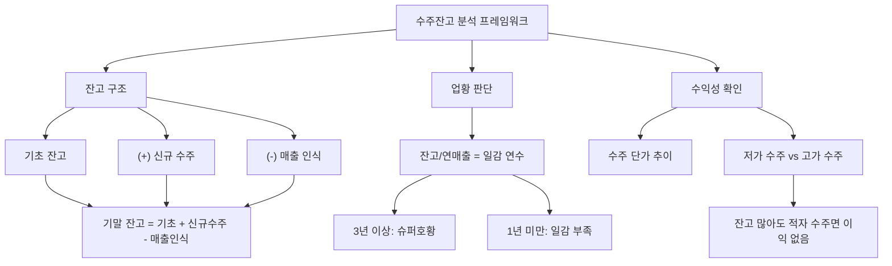

# 수주잔고 뜻 — 아직 수행하지 않은 계약 금액의 합계

## 한 줄 정의

수주잔고(Backlog)는 기업이 수주(계약)했지만 아직 매출로 인식하지 않은 미실현 계약 금액의 총합입니다.

## 아주 쉽게 말하면

식당에 들어온 주문 중 아직 요리를 시작하지 않았거나 만드는 중인 주문의 합계입니다. 주문이 100건 밀려 있다면 "앞으로 할 일이 많다 = 매출이 보장된다"는 뜻이죠. 조선소가 배 30척을 수주했는데 아직 5척만 만들었다면, 나머지 25척분이 수주잔고입니다. 이 잔고가 많을수록 향후 매출이 확실히 보장됩니다.

## 왜 중요한가

- 수주잔고는 향후 1~3년의 매출을 미리 보여주는 선행지표입니다
- 조선·건설·방산·플랜트 등 수주 기반 업종의 핵심 평가 지표입니다
- 수주잔고 증가 = 업황 호조, 감소 = 업황 둔화 신호입니다
- 수주잔고/연매출 비율로 몇 년치 일감이 있는지 파악합니다
- 신규 수주 추이는 업종 사이클의 방향을 알려주는 나침반입니다

## 그림으로 이해하기

## 숫자로 보는 예시

> ⚠️ 아래 숫자는 개념 설명을 위한 **가상 예시**이며, 실제 투자 데이터가 아닙니다.

가상 조선사 "한해중공업" 3개년 수주잔고 분석:

| 항목 | 2023년 | 2024년 | 2025년(E) |
|------|--------|--------|-----------|
| 기초 수주잔고 | 20조 | 25조 | 35조 |
| 신규 수주 | 15조 | 20조 | 18조 |
| 매출 인식 | 10조 | 10조 | 12조 |
| 기말 수주잔고 | 25조 | 35조 | 41조 |
| 잔고/연매출 | 2.5년 | 3.5년 | 3.4년 |
| Book-to-Bill | 1.5배 | 2.0배 | 1.5배 |

Book-to-Bill(신규수주/매출인식)이 1배 이상이면 잔고가 늘어나는 성장 구간입니다. 한해중공업은 2024년 B2B 2.0배로 잔고가 급증하여 3.5년분 일감을 확보했습니다. 이는 향후 3년간 매출이 보장된다는 의미입니다.

## 표로 비교하기

| 수주잔고/연매출 | 의미 | 업황 판단 | 주가 반응 |
|---------------|------|----------|----------|
| 1년 미만 | 일감 부족 | 위험 — 매출 감소 예상 | 하락 압력 |
| 1~2년 | 보통 | 정상 운영 | 중립 |
| 2~3년 | 양호 | 호황 — 안정적 성장 | 상승 기대 |
| 3년 이상 | 풍부 | 슈퍼호황 — 선별 인수 가능 | 프리미엄 |

## 초보자가 자주 하는 오해

**오해 1: "수주잔고가 많으면 당장 매출이 늘어난다"**

수주잔고는 수년에 걸쳐 매출로 인식됩니다. 조선은 건조에 2~3년, 건설은 시공에 3~5년이 걸립니다. 올해 수주가 늘어도 매출 반영은 1~3년 후입니다.

**오해 2: "수주잔고만 보면 된다"**

수주의 수익성(마진율)도 중요합니다. 2015~2016년 조선사들은 잔고가 많았지만, 저가 수주(해양플랜트)로 수조 원의 적자를 기록했습니다.

**오해 3: "신규 수주가 줄면 바로 실적이 나빠진다"**

기존 잔고가 충분하면 당장 매출에는 영향이 없습니다. 문제는 잔고 소진 속도보다 신규 수주가 적은 상태가 2~3년 지속될 때입니다.

**오해 4: "수주 취소는 없다"**

경기 급변이나 발주처 사정으로 수주가 취소·연기될 수 있습니다. 특히 불황기에는 취소율이 급증합니다.

## 고수는 이렇게 봅니다

- 신규 수주 추이(QoQ, YoY)로 업황 방향을 판단합니다
- 수주잔고의 마진율(저가 수주 vs 고가 수주)을 확인합니다
- 수주 취소율·연기율을 모니터링합니다
- 경쟁사 수주잔고 대비 시장점유율 변화를 추적합니다
- Book-to-Bill 비율의 추세로 성장/정체/축소를 구분합니다

## 기업분석에서는 이렇게 씁니다

- 수주잔고를 매출 인식 일정으로 분배하여 향후 매출을 추정합니다
- 수주 단가 추이(신조선가 등)로 미래 마진율을 전망합니다
- Book-to-Bill 비율(신규수주/매출인식)로 성장·정체·축소를 판단합니다
- 발주처별·지역별 잔고 구성을 분석하여 리스크를 평가합니다

## 함께 보면 좋은 용어

- [CAPEX](./capex.md): 수주 기업의 고객사가 집행하는 투자
- [시클리컬](./cyclical.md): 수주 기반 업종의 사이클적 특성
- [매출](../level-03-financial-statements/revenue.md): 수주잔고가 시간에 따라 변하는 결과
- [영업이익률](../level-04-ratios/operating-margin.md): 수주 마진의 핵심 지표
- [턴어라운드](../level-08-industry-macro/turnaround.md): 수주 회복과 함께 나타남

## 정리

수주잔고는 미래 매출이 보장된 계약의 합계로, 수주 기반 업종(조선·건설·방산)의 핵심 지표입니다. 잔고/연매출 비율로 일감 연수를 파악하고, 신규 수주 추이와 Book-to-Bill 비율로 업황 방향을 판단합니다. 단, 수주의 수익성(마진율)과 취소 리스크도 반드시 확인해야 합니다.

## 한 줄 요약

> 수주잔고는 미래 매출이 확정된 일감의 합계이며, 수주 기반 업종의 핵심 선행지표입니다.

---

이 글은 투자 권유가 아니라 주식 용어와 기업분석 방법을 설명하기 위한 교육 콘텐츠입니다. 특정 종목의 매수·매도 판단은 독자 본인의 책임입니다.

Tags: 수주잔고, 수주, 백로그, 조선, 건설
