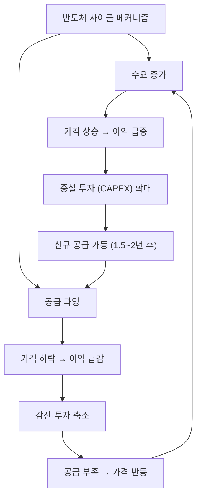

# 반도체 사이클 뜻 — 메모리 반도체 업황이 반복적으로 등락하는 주기

## 한 줄 정의

반도체 사이클은 메모리 반도체(DRAM·NAND)의 공급과 수요 불균형으로 가격·실적이 3~4년 주기로 등락하는 현상입니다.

## 아주 쉽게 말하면

반도체 공장을 다 같이 지으면 물건이 넘쳐서 가격이 폭락하고, 다들 투자를 줄이면 물건이 부족해서 가격이 폭등합니다. 이것이 3~4년마다 반복됩니다.

## 왜 중요한가

- 한국 증시에서 삼성전자·SK하이닉스 비중이 매우 커 시장 전체에 영향을 줍니다
- 사이클 바닥에서 매수하면 2~3배 수익, 정점에서 매수하면 -50% 손실 가능합니다
- DRAM 가격 하나가 수조 원의 영업이익 차이를 만듭니다
- 반도체 사이클은 가장 잘 연구된 시클리컬 중 하나입니다

## 그림으로 이해하기

## 숫자로 보는 예시

> ⚠️ 아래 숫자는 개념 설명을 위한 **가상 예시**이며, 실제 투자 데이터가 아닙니다.

DRAM 가격과 메모리 기업 실적:

| 사이클 단계 | DDR5 8GB 가격 | 영업이익률 | 주가(지수) |
|------------|-------------|-----------|-----------|
| 바닥(감산 중) | $1.5 | -10% | 100 |
| 초기 회복 | $3.0 | 20% | 180 |
| 정점(풀가동) | $6.0 | 55% | 300 |
| 하락 초기 | $4.0 | 30% | 220 |
| 하락 가속 | $2.0 | 0% | 130 |

## 표로 비교하기

| 사이클 위치 | 신호 | 투자 전략 |
|------------|------|----------|
| 바닥 | 감산 발표, 재고 축소 시작 | 매수 검토 |
| 초기 회복 | 가격 반등, 재고 정상화 | 비중 확대 |
| 호황 | 가격 급등, 증설 발표 | 보유 (경계) |
| 정점 | 증설 본격화, 재고 증가 | 비중 축소 |
| 하락 | 가격 하락, 이익 감소 | 관망 |

## 초보자가 자주 하는 오해

**오해 1: "반도체 수요는 계속 늘어나니 사이클이 사라졌다"**

수요가 늘어도 공급이 더 빠르게 증가하면 가격은 하락합니다. 수요 성장 ≠ 사이클 소멸입니다.

**오해 2: "실적이 최고일 때 사야 한다"**

실적 최고점 = 사이클 정점일 가능성이 높습니다. 주가는 이미 정점을 지났을 수 있습니다.

## 고수는 이렇게 봅니다

- DRAM/NAND 계약가(고정가) 월별 추이를 모니터링합니다
- 글로벌 DRAM 재고주수(weeks of inventory)를 추적합니다
- 메이저 3사(삼성·하이닉스·마이크론)의 CAPEX 계획을 분석합니다
- 서버·모바일·PC 수요 비중 변화로 사이클 강도를 예측합니다

## 기업분석에서는 이렇게 씁니다

- 사이클 평균 영업이익률(mid-cycle OPM)로 정상화 이익을 산출합니다
- BIT 성장률(출하량) vs ASP(평균판매가) 분해로 매출을 예측합니다
- PBR 밴드(과거 사이클 저점 PBR)로 밸류에이션 하한선을 설정합니다

## 함께 보면 좋은 용어

- [시클리컬](./cyclical.md): 반도체 사이클의 상위 개념
- [CAPEX](./capex.md): 사이클을 만드는 핵심 변수(설비투자)
- [재고 조정](../level-08-industry-macro/inventory-adjustment.md): 사이클 전환의 트리거
- [피크아웃](../level-08-industry-macro/peak-out.md): 사이클 정점 신호
- [턴어라운드](../level-08-industry-macro/turnaround.md): 사이클 바닥 후 회복

## 정리

반도체 사이클은 공급·수요 불균형으로 메모리 가격과 실적이 3~4년 주기로 등락하는 현상입니다. 증설→공급과잉→감산→공급부족의 패턴이 반복되며, 사이클 위치에 따라 투자 전략이 완전히 달라집니다. DRAM 가격, 재고 수준, CAPEX 계획이 핵심 추적 변수입니다.

## 한 줄 요약

> 반도체 사이클은 3~4년 주기로 공급·수요가 엇갈리며, 바닥에서 사고 정점에서 파는 것이 핵심입니다.

---

이 글은 투자 권유가 아니라 주식 용어와 기업분석 방법을 설명하기 위한 교육 콘텐츠입니다. 특정 종목의 매수·매도 판단은 독자 본인의 책임입니다.

Tags: 반도체사이클, 디램반도체, 메모리, 공급과잉, 업황
