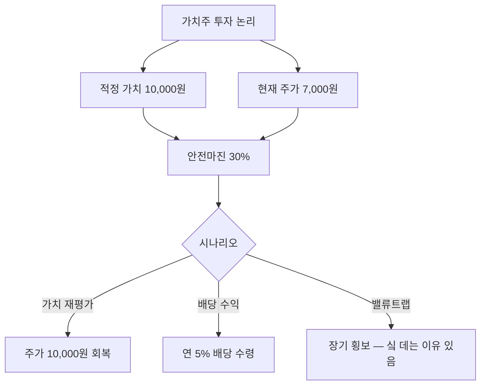

# 가치주 뜻 — 현재 가치 대비 싸게 거래되는 주식

## 한 줄 정의

가치주는 기업의 자산·이익 대비 주가가 낮게 평가되어 있어 "싼" 주식으로 분류되는 종목입니다.

## 아주 쉽게 말하면

10만 원짜리 물건이 7만 원에 팔리고 있는 것입니다. "원래 가치보다 싸니까 사자"라는 논리로 접근합니다.

## 왜 중요한가

- 저평가 해소 시 주가 상승 여력(안전마진)이 존재합니다
- 배당수익률이 높아 하방이 제한되는 경우가 많습니다
- 고금리·경기 불황기에 성장주보다 상대적으로 강합니다
- 단, 싼 데는 이유가 있는 "밸류트랩"을 주의해야 합니다

## 그림으로 이해하기

## 숫자로 보는 예시

> ⚠️ 아래 숫자는 개념 설명을 위한 **가상 예시**이며, 실제 투자 데이터가 아닙니다.

가치주 C기업:

- 주가: 30,000원
- BPS(주당순자산): 50,000원 → PBR 0.6배
- EPS: 5,000원 → PER 6배
- 배당금: 2,000원 → 배당수익률 6.7%
- 업종 평균 PER: 12배

업종 평균 PER로 재평가되면 주가 = 5,000 × 12 = 60,000원 (2배 상승 여력).

## 표로 비교하기

| 항목 | 가치주 | 성장주 |
|------|--------|--------|
| PER | 5~15배 | 30~80배 |
| PBR | 0.5~1.5배 | 3~20배 |
| 배당수익률 | 3~7% | 0~1% |
| 매출 성장률 | 0~10% | 20%+ |
| 하방 리스크 | 상대적 낮음 | 높음 |
| 상방 기대 | 중간 | 높음 |

## 초보자가 자주 하는 오해

**오해 1: "PER이 낮으면 무조건 좋은 투자다"**

PER이 낮은 데는 이유가 있을 수 있습니다(이익 감소 예상, 산업 사양화). "왜 싼지"를 반드시 확인해야 합니다.

**오해 2: "가치주는 안전하다"**

가치주도 실적 악화 시 하락합니다. 저PBR이라도 자산 가치가 훼손되면 더 내려갈 수 있습니다.

## 고수는 이렇게 봅니다

- "싼 이유"가 해소될 수 있는 카탈리스트(촉매)가 있는지 확인합니다
- 배당 성향과 이익 안정성을 함께 봅니다
- 자산가치(PBR)와 이익가치(PER) 모두 싼 종목을 선호합니다
- 가치 함정을 피하기 위해 이익 추세(상향/하향)를 반드시 확인합니다

## 기업분석에서는 이렇게 씁니다

- PER·PBR·배당수익률 3가지를 종합하여 저평가 여부를 판단합니다
- 역사적 밸류에이션 밴드 내 현재 위치를 확인합니다
- 동종업체 대비 할인율과 그 이유를 분석합니다

## 함께 보면 좋은 용어

- [성장주](./growth-stock.md): 가치주와 반대되는 스타일
- [PBR](../level-05-valuation/pbr.md): 자산 대비 저평가 판단
- [PER](../level-05-valuation/per.md): 이익 대비 저평가 판단
- [밸류트랩](../level-10-company-analysis/value-trap.md): 가치주의 함정
- [안전마진](../level-10-company-analysis/margin-of-safety.md): 가치투자의 핵심 개념

## 정리

가치주는 자산·이익 대비 주가가 낮게 평가된 주식입니다. 배당과 안전마진이 장점이지만, "싼 데는 이유가 있다"는 밸류트랩 위험을 항상 경계해야 합니다. 저평가 해소의 촉매가 있는지 확인하는 것이 핵심입니다.

## 한 줄 요약

> 가치주는 현재 가치 대비 싸게 거래되는 주식이며, "왜 싼지"를 아는 것이 투자의 출발점입니다.

---

이 글은 투자 권유가 아니라 주식 용어와 기업분석 방법을 설명하기 위한 교육 콘텐츠입니다. 특정 종목의 매수·매도 판단은 독자 본인의 책임입니다.

Tags: 가치주, 저주가수익비율, 저주가순자산비율, 배당, 밸류투자
