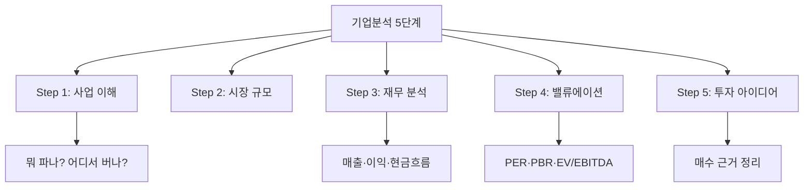

# 기업분석 프레임워크(Company Analysis Framework)

## 한 줄 정의

기업분석 프레임워크는 하나의 기업을 체계적으로 평가하기 위해 정해진 순서와 항목으로 분석하는 구조화된 방법론입니다.

## 아주 쉽게 말하면

"이 회사에 투자해도 되나?"를 판단하기 위한 체크리스트입니다. 정해진 순서대로 따라가면 중요한 것을 빠뜨리지 않습니다.

## 왜 중요한가

- 감이 아닌 구조로 판단하여 일관성을 유지합니다
- 모든 기업에 동일한 기준을 적용할 수 있습니다
- 빠뜨리기 쉬운 리스크를 사전에 점검합니다
- 분석 결과를 축적하면 실력이 복리로 성장합니다

## 그림으로 이해하기

## 숫자로 보는 예시

> ⚠️ 아래 숫자는 개념 설명을 위한 **가상 예시**이며, 실제 투자 데이터가 아닙니다.

| 단계 | 분석 항목 | 체크 예시 |
|------|-----------|-----------|
| 1. 사업 이해 | 매출 구성 | 제품A 60 %, 서비스B 40 % |
| 2. 산업 분석 | 시장 성장률 | 연 15 % 성장 전망 |
| 3. 재무 분석 | 영업이익률 | 18 % (업종 평균 12 %) |
| 4. 밸류에이션 | PER | 현재 14배 (업종 평균 20배) |
| 5. 투자 판단 | 안전마진 | 적정가치 대비 30 % 할인 |

## 표로 비교하기

| 구분 | 프레임워크 사용 | 프레임워크 없음 |
|------|----------------|----------------|
| 분석 범위 | 전체 (사업→산업→재무→가치) | 부분적·편향적 |
| 소요 시간 | 체계적 → 오히려 단축 | 산만 → 시간 낭비 |
| 비교 가능성 | 기업 간 동일 기준 적용 | 기업마다 다른 기준 |
| 리스크 발견 | 체크리스트로 포착 | 놓치기 쉬움 |
| 학습 효과 | 분석할수록 패턴 축적 | 매번 처음부터 |
| 감정 개입 | 구조가 차단 | 쉽게 흔들림 |

## 초보자가 자주 하는 오해

**오해 1: "재무제표만 보면 기업분석이다"**

숫자는 과거입니다. 사업 모델과 산업 전망을 먼저 이해해야 숫자의 의미를 해석할 수 있습니다. 순서가 중요합니다.

**오해 2: "분석을 완벽하게 해야 투자할 수 있다"**

완벽한 분석은 불가능합니다. 핵심 가설 2-3개를 검증하고, 불확실성은 포지션 크기와 분할매수로 관리합니다.

## 고수는 이렇게 봅니다

- 5단계를 30분 안에 빠르게 훑는 "스크리닝"과 수 시간의 "딥다이브"를 구분합니다
- 각 단계에 Kill criteria(탈락 조건)를 설정하여 시간을 절약합니다
- 분석 결과를 노트에 기록하고 실적 발표마다 업데이트합니다
- 같은 산업의 여러 기업을 동시에 분석하여 상대 비교합니다

## 기업분석에서는 이렇게 씁니다

이 프레임워크 자체가 기업분석의 전체 지도입니다:

| 단계 | 핵심 질문 | 참고 용어 |
|------|-----------|-----------|
| 사업 이해 | 이 회사는 어떻게 돈을 버는가? | 매출, 영업이익 |
| 산업 분석 | 시장은 커지고 있는가? 경쟁은? | 산업분석, 경쟁우위 |
| 재무 분석 | 실적이 가설을 뒷받침하는가? | ROE, 영업이익률, FCF |
| 밸류에이션 | 지금 가격이 적정한가? | PER, PBR, DCF |
| 투자 판단 | 얼마에 사고, 언제 팔 것인가? | 안전마진, 손절, 분할매수 |

## 함께 보면 좋은 용어

- [투자 아이디어](./investment-thesis.md) — 프레임워크의 최종 산출물
- [안전마진](./margin-of-safety.md) — 밸류에이션 단계의 핵심 개념
- [손절](./stop-loss.md) — 투자 판단 단계의 리스크 관리
- [분할매수](./dollar-cost-averaging.md) — 투자 판단의 실행 전략
- [포트폴리오](./portfolio.md) — 개별 분석을 전체 자산에 연결하는 틀

## 정리

기업분석 프레임워크는 "사업 → 산업 → 재무 → 밸류에이션 → 투자 판단"의 5단계로 기업을 체계적으로 평가하는 도구입니다. 이 순서를 따르면 초보자도 논리적이고 일관된 투자 판단에 도달할 수 있습니다.

## 한 줄 요약

> 기업분석 프레임워크는 "이 회사에 투자해도 되나?"를 5단계 체크리스트로 답하는 구조화된 방법입니다.

---

*면책 조항: 이 글은 투자 권유가 아니라 주식 용어와 기업분석 방법을 설명하기 위한 교육 콘텐츠입니다. 특정 종목의 매수·매도 판단은 독자 본인의 책임입니다.*

Tags: 기업분석, 프레임워크, 분석순서, 펀더멘털분석, 투자분석
