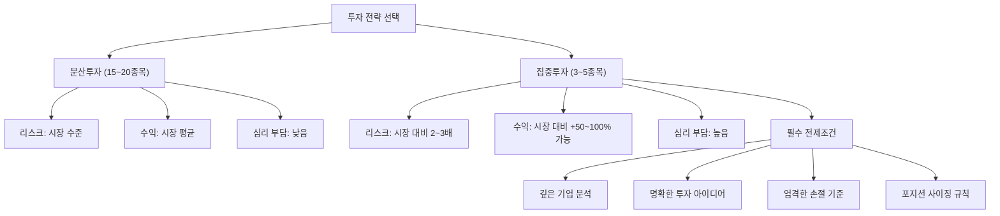

# 집중투자 뜻 — 소수 종목에 큰 비중을 싣는 전략

## 한 줄 정의

집중투자는 높은 확신을 가진 소수의 종목에 투자 비중을 크게 실어 초과 수익을 추구하는 전략입니다.

## 아주 쉽게 말하면

시험에서 전 범위를 얕게 공부하면 평균 점수가 나옵니다. 반면 "이 3개 단원이 무조건 나온다"는 확신이 있으면 그것만 깊이 파서 만점을 노릴 수 있습니다. 하지만 예상이 빗나가면 0점 위험도 있습니다. 집중투자는 이처럼 "확실한 곳에 크게 베팅"하는 접근이며, 맞으면 크게 벌고 틀리면 크게 잃습니다.

## 왜 중요한가

- 분산투자의 반대 전략으로, 시장 평균을 크게 초과하는 수익을 목표로 합니다
- 워런 버핏, 찰리 멍거 등 투자 대가들이 선호하는 방식입니다
- 기업에 대한 깊은 이해와 높은 확신이 전제되어야 합니다
- 집중도가 높을수록 리스크(변동성, 최대 낙폭)도 비례하여 커집니다
- 초보자에게는 일반적으로 권장되지 않는 고급 전략입니다

## 그림으로 이해하기

## 숫자로 보는 예시

> ⚠️ 아래 숫자는 개념 설명을 위한 **가상 예시**이며, 실제 투자 데이터가 아닙니다.

가상 투자자 A(집중) vs B(분산), 1,000만 원 투자:

| 항목 | A (3종목 집중) | B (20종목 분산) |
|------|--------------|----------------|
| 1등 종목 비중/수익 | 45% / +80% | 5% / +80% |
| 1등 종목 기여 | +36% | +4% |
| 2등 종목 비중/수익 | 30% / +20% | 5% / +20% |
| 2등 종목 기여 | +6% | +1% |
| 최악 종목 비중/수익 | 25% / −35% | 5% / −35% |
| 최악 종목 기여 | −8.8% | −1.8% |
| **총 수익률** | **+33.2%** | **+8.2%** |

집중투자 A는 시장을 크게 이겼습니다. 하지만 만약 1등과 최악의 비중이 바뀌었다면? A는 −20%, B는 여전히 +5% 근처입니다.

## 표로 비교하기

| 항목 | 집중투자 | 분산투자 |
|------|---------|---------|
| 종목 수 | 3~5개 | 15~30개 |
| 최대 단일 비중 | 30~50% | 5~10% |
| 기대 수익 | 시장 대비 초과 or 대폭 부족 | 시장 수준 |
| 리스크(변동성) | 높음 (표준편차 30%+) | 중간 (표준편차 15~20%) |
| 최대 낙폭(MDD) | −40~60% 가능 | −20~30% 수준 |
| 필요 역량 | 깊은 기업 분석, 심리 관리 | 넓은 포트폴리오 관리 |
| 적합 투자자 | 전문가, 풀타임 투자자 | 대부분의 개인 투자자 |

## 초보자가 자주 하는 오해

**오해 1: "확신이 있으면 올인해도 된다"**

아무리 확신이 있어도 예상치 못한 사건(회계 사기, 규제 변경, 자연재해)이 발생할 수 있습니다. 한 종목 최대 비중을 30~40%로 제한하는 것이 생존의 기본 원칙입니다.

**오해 2: "버핏도 집중투자하니까 나도 할 수 있다"**

버핏은 수십 년간 수천 개 기업을 분석한 뒤 소수를 고릅니다. 또한 버핏의 "집중"은 3~5개가 아니라 상위 5개 비중이 높은 것이며, 실제로는 수십 개 종목을 보유합니다. 초보자의 "확신"은 대부분 정보 부족에서 오는 착각일 수 있습니다.

**오해 3: "집중투자는 단기 트레이딩이다"**

집중투자와 단기 매매는 전혀 다른 개념입니다. 집중투자는 장기 보유하되 소수 종목에 비중을 싣는 것이고, 단기 매매는 보유 기간의 문제입니다.

## 고수는 이렇게 봅니다

- 확신 수준에 비례하여 비중을 조절합니다 (켈리 기준 참고)
- 1종목 최대 비중을 30~40%로 엄격히 제한합니다
- 집중 종목에 대해 "내가 틀릴 수 있는 시나리오"를 3개 이상 미리 점검합니다
- 집중투자할수록 손절 기준을 더 엄격하게 설정합니다 (자본 보존 최우선)
- 집중과 분산을 이분법으로 보지 않고, 상위 3~5개에 비중을 싣되 나머지로 분산하는 혼합 전략을 씁니다

## 기업분석에서는 이렇게 씁니다

- 투자 아이디어의 확신도를 점수화(1~10)하여 비중을 결정합니다 (9점 이상만 20%+)
- "최악의 경우 얼마나 잃을 수 있는가"를 먼저 계산합니다 (Expected Loss)
- 집중 종목의 분기별 체크리스트를 만들어 지속 보유 여부를 매 분기 점검합니다
- 포지션 사이징 공식: 1회 손절 시 총자산의 최대 2% 손실로 제한

## 함께 보면 좋은 용어

- [분산투자](./diversification.md): 집중투자의 반대 전략
- [포트폴리오](./portfolio.md): 집중 비중을 담는 전체 그림
- [안전마진](./margin-of-safety.md): 집중투자 시 반드시 필요한 버퍼
- [손절](./stop-loss.md): 집중투자의 필수 리스크 관리
- [투자 아이디어](./investment-thesis.md): 집중투자의 근거

## 정리

집중투자는 소수 종목에 큰 비중을 실어 시장 초과 수익을 추구하는 전략입니다. 높은 수익 잠재력이 있지만 리스크도 비례하여 커지므로, 깊은 분석·높은 확신·철저한 리스크 관리(비중 상한, 손절 기준, 포지션 사이징)가 전제되어야 합니다. 초보자는 분산으로 시작하고, 실력이 축적된 후 점진적으로 집중도를 높이는 것이 현명합니다.

## 한 줄 요약

> 집중투자는 확신 높은 소수 종목에 크게 베팅하는 것이며, 분석 깊이와 리스크 관리가 생명입니다.

---

이 글은 투자 권유가 아니라 주식 용어와 기업분석 방법을 설명하기 위한 교육 콘텐츠입니다. 특정 종목의 매수·매도 판단은 독자 본인의 책임입니다.

Tags: 집중투자, 확신투자, 포지션사이징, 고위험고수익, 몰빵
