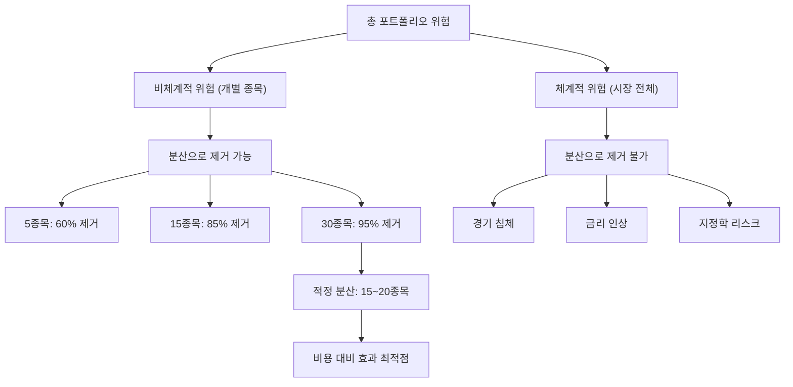

# 분산투자 뜻 — 여러 자산에 나눠 투자하여 위험을 줄이는 것

## 한 줄 정의

분산투자는 여러 종목·업종·자산군에 투자금을 나누어 개별 위험을 줄이는 투자 전략입니다.

## 아주 쉽게 말하면

"달걀을 한 바구니에 담지 마라"는 격언 그대로입니다. 한 바구니를 떨어뜨려도 다른 바구니의 달걀은 무사합니다. 하지만 여기서 핵심은 바구니를 "다른 장소"에 두어야 한다는 것입니다. 같은 테이블 위에 바구니 10개를 놓으면, 테이블이 넘어질 때 전부 깨집니다. 서로 다른 업종·자산군에 나눠야 진짜 분산입니다.

## 왜 중요한가

- 한 종목의 급락이 전체 자산에 미치는 영향을 구조적으로 제한합니다
- 개별 종목 리스크(비체계적 위험)를 제거할 수 있는 유일한 방법입니다
- 장기 수익률의 안정성을 높여 복리 효과를 극대화합니다
- 예측 불가능한 악재(회계 사기, 갑작스러운 규제)로부터 자산을 보호합니다
- 분산 자체는 공짜 — 비용 없이 위험만 줄일 수 있는 "공짜 점심"입니다

## 그림으로 이해하기

## 숫자로 보는 예시

> ⚠️ 아래 숫자는 개념 설명을 위한 **가상 예시**이며, 실제 투자 데이터가 아닙니다.

가상 투자자 이모씨, 1,000만 원 투자 시나리오:

| 시나리오 | 포트폴리오 구성 | A종목 −50% 발생 시 | 전체 영향 |
|---------|---------------|-------------------|----------|
| 올인 | A종목 100% | −500만 원 | −50% |
| 3종목 | A 33%, B 33%, C 33% | −167만 원 + 나머지 +5% | −14% |
| 10종목 | A 10%, 나머지 각 10% | −50만 원 + 나머지 평균 +5% | +0.5% |
| 20종목 | A 5%, 나머지 각 5% | −25만 원 + 나머지 평균 +5% | +2.3% |

핵심: 동일 악재가 발생해도 분산 수준에 따라 전체 결과가 −50%에서 +2.3%까지 차이납니다.

## 표로 비교하기

| 분산 수준 | 종목 수 | 개별 위험 제거율 | 기대 수익 | 관리 난이도 | 실전 적합도 |
|----------|--------|---------------|----------|-----------|-----------|
| 무분산 | 1~2 | 0% | 극단적(+or−) | 쉬움 | 초고위험 |
| 적정 분산 | 10~20 | 80~90% | 중상 | 보통 | 개인 투자자 최적 |
| 과잉 분산 | 30+ | 95%+ | 시장 평균 수렴 | 높음 | ETF가 효율적 |
| ETF/인덱스 | 100+ | 99% | 시장 수익률 | 매우 쉬움 | 패시브 최적 |

## 초보자가 자주 하는 오해

**오해 1: "같은 업종 10개 사면 분산이다"**

반도체 10개를 사면 업종 리스크는 전혀 줄지 않습니다. 반도체 업황이 꺾이면 10개 모두 동시에 하락합니다. 서로 상관관계가 낮은 업종·자산군으로 나눠야 진정한 분산입니다.

**오해 2: "분산하면 수익이 줄어든다"**

분산은 극단적 수익을 포기하는 대신 극단적 손실도 방지합니다. 장기적으로 큰 손실을 피하는 것이 복리 수익률을 지키는 핵심이며, 실제로 리스크 조정 수익률은 분산이 더 높습니다.

**오해 3: "ETF 여러 개 사면 분산 완료"**

같은 지수를 추종하는 ETF 3개를 사면 분산이 아닙니다. 국내주식 ETF + 해외주식 ETF + 채권 ETF처럼 자산군 자체가 달라야 의미 있는 분산입니다.

## 고수는 이렇게 봅니다

- 상관관계가 낮은 자산끼리 조합합니다 (주식+채권, 수출주+내수주, 성장+가치)
- 적정 분산(10~20종목)을 유지하되 과잉 분산은 피합니다 — 30개 이상이면 ETF가 효율적
- 시장 위험(체계적 위험)은 현금 비중이나 인버스 헤지로 관리합니다
- 확신이 높은 종목에는 상대적으로 높은 비중을 허용합니다 (최대 15~20%)
- 글로벌 분산(국가별)까지 고려하여 한국 시장 리스크를 분산합니다

## 기업분석에서는 이렇게 씁니다

- 신규 편입 종목과 기존 보유 종목의 상관계수를 확인합니다 (0.3 이하 선호)
- 업종별 비중 한도를 설정하여 섹터 집중을 방지합니다 (업종 최대 25%)
- 포트폴리오 전체 변동성(표준편차)을 계산하여 리스크를 수치화합니다
- 스트레스 테스트(2008년 금융위기 재현 시)를 돌려 최대 낙폭을 추정합니다

## 함께 보면 좋은 용어

- [집중투자](./concentration.md): 분산의 반대 전략
- [포트폴리오](./portfolio.md): 분산투자의 결과물
- [손절](./stop-loss.md): 분산과 함께 쓰는 리스크 관리 도구
- [방어주](../level-09-strategy-risk/defensive-stock.md): 분산 시 편입하는 안정 자산
- [경기민감주](../level-09-strategy-risk/cyclical-stock.md): 분산 시 조합하는 공격 자산

## 정리

분산투자는 여러 자산에 나누어 투자하여 개별 위험을 줄이는 전략입니다. 15~20종목이면 개별 종목 리스크를 85% 이상 제거할 수 있지만, 시장 전체 위험은 분산으로 제거할 수 없습니다. 상관관계가 낮은 자산끼리 조합하는 것이 효과적인 분산의 핵심이며, "공짜 점심"이라 불리는 유일한 리스크 관리 수단입니다.

## 한 줄 요약

> 분산투자는 여러 자산에 나눠 담아 개별 위험을 줄이는 것이며, "달걀을 한 바구니에 담지 마라"의 실천입니다.

---

이 글은 투자 권유가 아니라 주식 용어와 기업분석 방법을 설명하기 위한 교육 콘텐츠입니다. 특정 종목의 매수·매도 판단은 독자 본인의 책임입니다.

Tags: 분산투자, 리스크관리, 상관관계, 자산배분, 변동성
