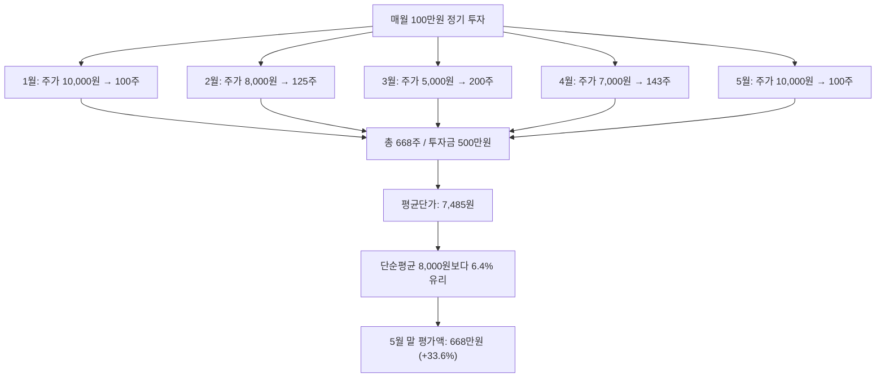

# 분할매수(Dollar Cost Averaging) — 시점의 불확실성을 시간으로 분산하기

## 한 줄 정의

분할매수는 동일 금액을 정기적으로 나누어 투자하여 매수 평균 단가를 평활화하는 전략입니다.

## 아주 쉽게 말하면

마트에서 사과를 살 때, 한 번에 1년치를 사면 그날 가격이 비싸면 큰 손해입니다. 하지만 매주 1만 원어치씩 사면, 비쌀 때는 적게, 쌀 때는 많이 사게 되어 평균 가격이 안정됩니다. 주식도 마찬가지로 "언제가 바닥인지 모르니까, 꾸준히 나눠 사자"는 전략입니다.

## 왜 중요한가

- 타이밍 리스크를 구조적으로 분산합니다 — 최고점 일괄 매수를 방지합니다
- 심리적 부담을 줄입니다 — "지금이 살 때인가?" 고민을 제거합니다
- 주가 변동성이 클수록 평균단가 효과(단가 인하)가 커집니다
- 초보자가 시장에 진입하는 가장 심리적으로 편한 방법입니다
- 급여 생활자의 정기 투자 습관과 자연스럽게 결합됩니다

## 그림으로 이해하기

## 숫자로 보는 예시

> ⚠️ 아래 숫자는 개념 설명을 위한 **가상 예시**이며, 실제 투자 데이터가 아닙니다.

가상 투자자 김모씨, '코리아테크' 분할매수 vs 일시매수 비교:

| 월 | 주가 | 분할매수 (100만원/월) | 매수 수량 |
|----|------|---------------------|-----------|
| 1월 | 10,000원 | 100만원 | 100주 |
| 2월 | 8,000원 | 100만원 | 125주 |
| 3월 | 5,000원 | 100만원 | 200주 |
| 4월 | 7,000원 | 100만원 | 143주 |
| 5월 | 10,000원 | 100만원 | 100주 |
| **합계** | — | **500만원** | **668주** |

- 분할매수 평균단가: 500만 ÷ 668 = **7,485원**
- 5월 말 평가액: 668 × 10,000 = **668만원** (수익률 +33.6%)
- 만약 1월에 500만 원 일시매수: 500주 × 10,000 = **500만원** (수익률 0%)

변동성이 있는 구간에서 분할매수가 일시매수보다 유리한 결과를 보여줍니다.

## 표로 비교하기

| 구분 | 분할매수 (DCA) | 일시매수 (Lump Sum) |
|------|---------------|---------------------|
| 타이밍 리스크 | 분산 (시점 무관) | 집중 (시점 결정적) |
| 심리 부담 | 낮음 (규칙적 실행) | 높음 (판단 필요) |
| 지속 상승장 수익률 | 상대적으로 낮음 | 높음 (초기 진입 유리) |
| 변동장·하락장 방어력 | 강함 (저가 매수 기회) | 약함 |
| 실행 난이도 | 쉬움 (자동화 가능) | 어려움 (시점 판단) |
| 적합 대상 | 초보자·급여 투자자 | 확신 있는 경험자 |
| 평균단가 효과 | 변동성 클수록 유리 | 없음 |

## 초보자가 자주 하는 오해

**오해 1: "분할매수하면 무조건 수익이 난다"**

분할매수는 단가를 평활화할 뿐, 지속 하락하는 종목에서는 손실이 누적됩니다. "좋은 자산(상승 가능성 있는)"을 고르는 것이 전제이며, 분할매수 자체가 수익을 만드는 것은 아닙니다.

**오해 2: "횟수가 많을수록 좋다"**

너무 잘게 나누면 거래 비용이 증가하고, 투자 효과가 희석됩니다. 월 1~2회가 일반적으로 적절하며, 주 1회 이상은 과도합니다.

**오해 3: "분할매수 중인데 떨어지면 추가로 더 사야 한다"**

사전에 정한 규칙(금액, 횟수) 외의 추가 매수는 "물타기"입니다. 분할매수는 감정을 배제한 규칙적 매수이며, 떨어진다고 계획 외로 더 사는 것은 분할매수가 아닙니다.

## 고수는 이렇게 봅니다

- 기본 DCA에 밸류에이션 판단을 결합합니다 (저평가 구간에서 금액 2배)
- 적립 대상을 개별 종목이 아닌 ETF·인덱스로 설정하여 종목 리스크를 제거합니다
- 목표 비중 도달 시 매수를 중단하고 리밸런싱으로 전환합니다
- 하락 시 추가 매수 규칙(예: −20%마다 금액 2배)을 사전에 설정합니다
- 적립 기간 종료 후에는 보유→리밸런싱 단계로 전환합니다

## 기업분석에서는 이렇게 씁니다

분할매수는 기업분석의 불확실성을 관리하는 실행 도구입니다:

- 실적 발표 전후로 나누어 매수하여 어닝 리스크를 분산합니다
- 밸류에이션 구간별로 매수량을 차등 배분합니다 (PER 15 이하 1차, 12 이하 2차)
- 신규 진입 시 "탐색 매수(10%) → 확인 매수(30%) → 확신 매수(60%)" 3단계로 포지션을 구축합니다
- 분할매수 종료 조건(목표 비중 도달, 투자 아이디어 훼손)을 사전에 설정합니다

## 함께 보면 좋은 용어

- [손절](./stop-loss.md): 분할매수에도 손절 기준은 반드시 필요합니다
- [포트폴리오](./portfolio.md): 분할매수는 포트폴리오 구축의 실행 방법
- [안전마진](./margin-of-safety.md): 분할매수 구간을 정하는 밸류에이션 기준
- [투자 아이디어](./investment-thesis.md): 무엇을 분할매수할지 결정하는 근거
- [집중투자](./concentration.md): 분할매수로 집중 포지션을 구축하는 과정

## 정리

분할매수는 "언제 사야 하나"의 고민을 "꾸준히 나눠 사자"로 바꾸는 전략입니다. 타이밍을 맞추려는 욕심을 버리고, 좋은 자산에 규칙적으로 투자하는 습관이 장기 수익의 기반이 됩니다. 단, 분할매수 자체가 수익을 보장하지 않으며, "무엇을" 사느냐가 "어떻게" 사느냐보다 더 중요합니다.

## 한 줄 요약

> 분할매수는 시점의 불확실성을 시간으로 분산하여 평균단가를 유리하게 만드는 전략입니다.

---

이 글은 투자 권유가 아니라 주식 용어와 기업분석 방법을 설명하기 위한 교육 콘텐츠입니다. 특정 종목의 매수·매도 판단은 독자 본인의 책임입니다.

Tags: 분할매수, 적립식투자, 평균단가, 리스크관리, 장기투자
